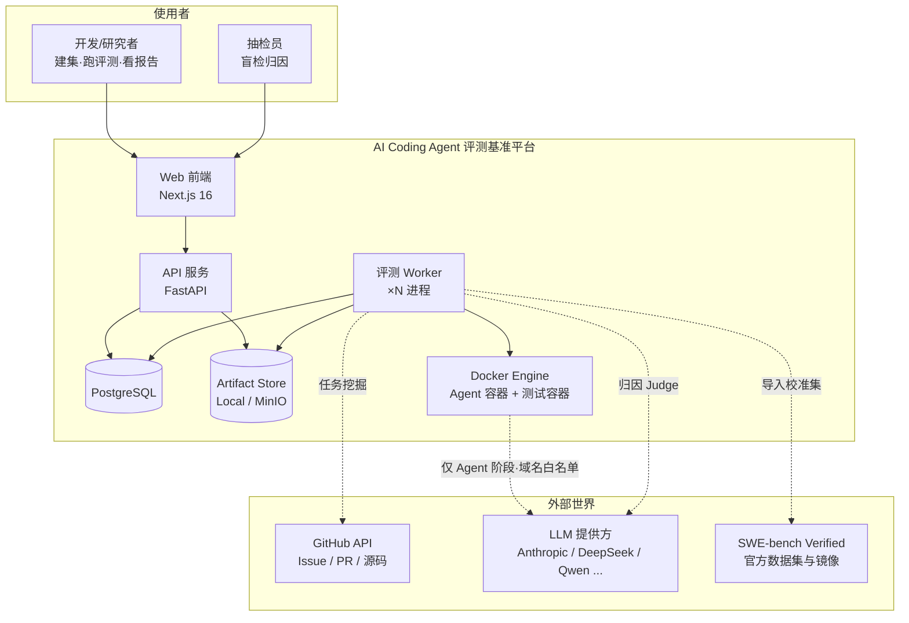
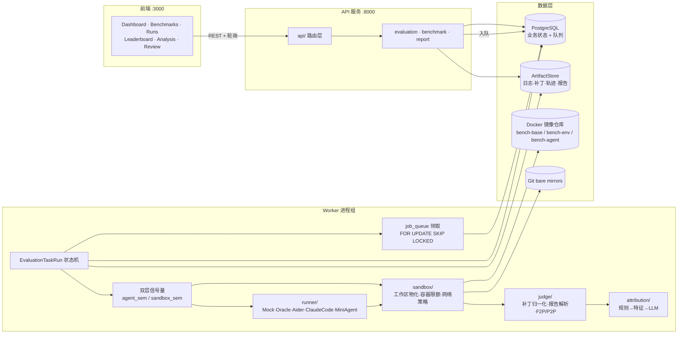
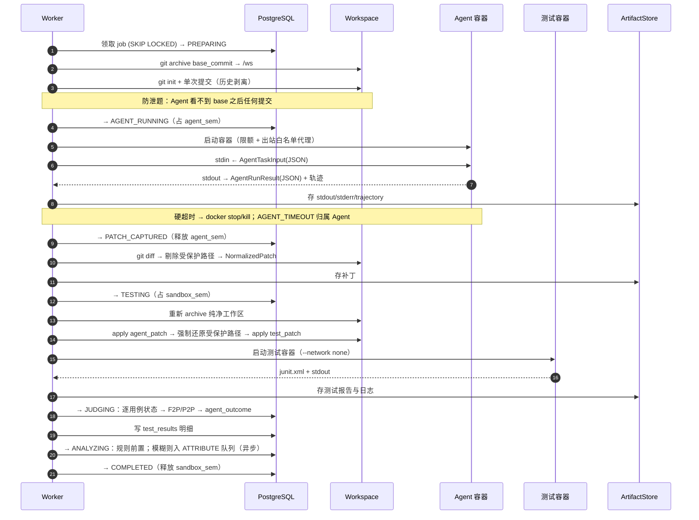
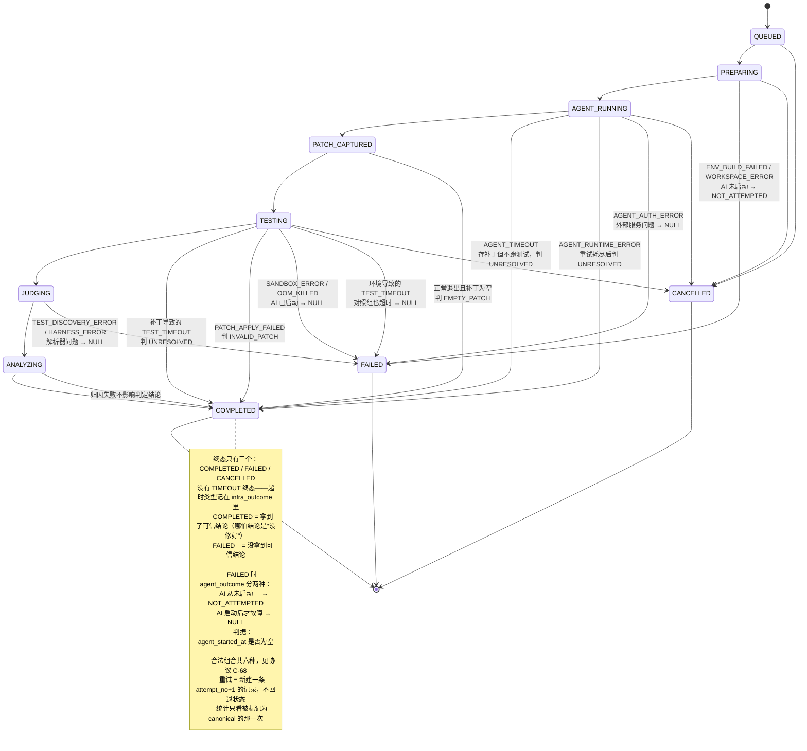
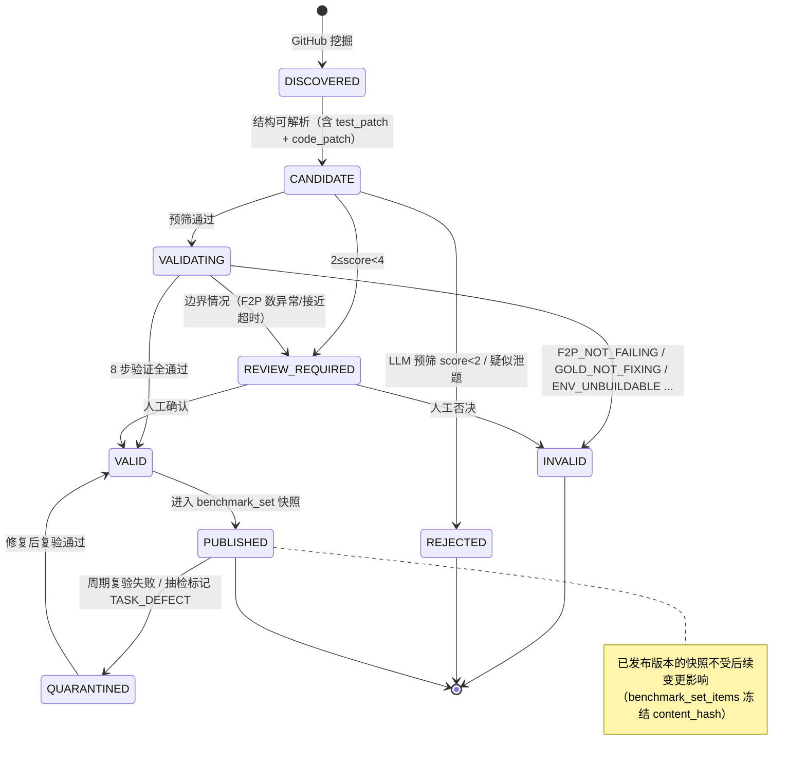

# 20 Target Architecture Diagrams

## 20.1 System Context（系统上下文）

## 20.2 Runtime Architecture（运行时架构）

## 20.3 Evaluation Sequence（单题评测时序）

## 20.4 EvaluationTaskRun State Machine（一次评测的状态流转）

## 20.5 Benchmark Task State Machine（任务生命周期）

