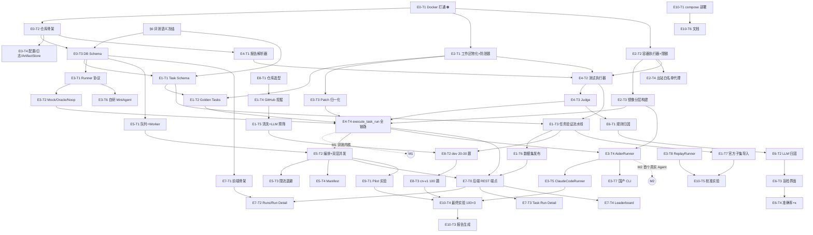

# 21 Initial Epic / Task Tree

**团队假设**：4 人（若实际人数不同，按 §24.6 调整）。
- **A 架构/内核**：sandbox、judge、evaluation 编排
- **B 后端/数据**：DB、API、task builder、挖掘与数据集生产
- **C 算法/Agent**：Runner 适配器、自研 MiniAgent、归因
- **D 前端/报告**：Next.js、排行榜、抽检界面、报告生成

**标注含义**：`P` 优先级 · `C` 复杂度 S/M/L/XL · `E` 估算人日 · `⚙DB` 需迁移 · `🐳` 需 Docker · `🔑` 需 Agent 账号/API · `🌐` 需外部依赖

---

## E0 — Project Foundation（基础设施）

### E0-T1 开发环境与 Docker 打通 ✅ **已完成 2026-09-01**
- **Goal**：本机可用 `docker run`，Python/Node 工具链就绪，确定机器方案
- **Req**：CON-05, CON-07, NFR-08 · **Why**：不解决则 E2 全部无法开工，Week 1 直接停摆
- **Deps**：无 · **Modules**：—
- **Output**：可用 Docker daemon；`docs/env-setup.md`；~~实验机申请单~~ → **结论：无需采购**
- **AC**：~~`docker run --cpus=1 --memory=512m` 成功；`docker info` 显示 cgroup v2；能拉取镜像~~ **全部达成**
- **实际交付**：Docker 29.7.2 / Compose v5.5.0，systemd 托管、开机自启、免 sudo；cgroup v2 + systemd driver、`docker info` 无 warning；`.wslconfig` → 16 vCPU / 11 GiB；dockerd 代理 + registry 镜像源 + 客户端容器代理三处配齐；镜像拉取速率实测 ≈4 MB/s
- **剩余待办**：把手工验证固化为 `scripts/check_env.py`（并入 E0-T2）
- **Risk**：~~中~~ → **已关闭** · **P0 · C:S · E:0.5d · 🐳**

### E0-T2 仓库骨架与工程规范 ✅ 已于 2026-09-02 完成
- **Goal**：monorepo 目录、依赖管理（uv/poetry）、ruff+mypy、pytest、pre-commit、CI、import-linter 边界规则，**以及 §32 的全部版本管理约定**
- **Req**：NFR-05, NFR-07, NFR-08 · **Deps**：E0-T1
- **Output**：可 `make dev` 起 API 与前端骨架；`CONTRIBUTING.md`（含中文注释规范）；`git init` + `.gitignore` + `.env.example`；`main` 分支保护 + 内嵌 DoD 的 PR 模板；commit 规范校验；密钥扫描钩子；`gh` 批量建 Issue 脚本 + Projects 看板
- **AC**：lint/type/test 三条命令全绿；import-linter 规则生效（故意越界的 import 会被拦下）；提交含密钥的测试文件会被钩子拦下；违反 Conventional Commits 的提交被拒
- **详见**：§32 工程流程与版本管理
- **P0 · C:M · E:1.5d**
- **实际交付**（2026-09-02）：`make dev` 同时起后端 :8000 与前端 :3000，前端首页调通 `/api/health`；
  前端类型由 `npm run gen:api` 从后端 OpenAPI 生成，用错字段直接编译不过；
  三条 AC 全部写成了自动化测试（`backend/tests/unit/test_repo_guards.py`，26 条）——
  故意越界的 import 被 import-linter 拦下、六种密钥格式被钩子识别、五种不合规提交信息被拒；
  `scripts/sync_issues.py` 从本任务表生成 GitHub Issue（默认只预览，`--apply` 才写）。
- **仍需人工操作**：GitHub 网页上设 `main` 分支保护；装 `gh` 后跑 `sync_issues.py --apply`；Projects 看板要手建

### E0-T3 数据库 Schema v1 与迁移 ✅ 已于 2026-09-02 完成
- **Goal**：§13 的 17 张表 + 枚举 + 索引落地
- **Req**：FR-03 · **Deps**：E0-T2、**§6 语义冻结**
- **Output**：Alembic 初版迁移；SQLAlchemy 模型；种子数据脚本（agents/agent_configs）
- **AC**：`alembic upgrade head` 在空库成功；`downgrade base` 可回滚；模型与枚举同 §6 完全一致（用一个"枚举一致性"单测锁死）
- **Risk**：低，但**改动代价随时间指数上升** → 必须在 Week 1 定稿
- **P0 · C:M · E:1.5d · ⚙DB**
- **实际交付**（2026-09-02）：17 张表、26 个原生枚举类型、迁移 `0001_initial_schema`；
  46 个测试全绿，其中 31 个是连真库跑的。三处协议约束落到了数据库层面：
  合法组合 CHECK（C-68、C-78）、认定结果部分唯一索引（C-57）、attempt 唯一约束（C-48）。

### E0-T4 配置、日志、制品存储抽象 ✅ 已于 2026-09-03 完成
- **Goal**：Settings（pydantic-settings）、structlog（含 run_id/task_run_id 上下文）、`ArtifactStore` + `LocalArtifactStore`
- **Req**：NFR-06, FR-19 · **Deps**：E0-T2
- **AC**：ArtifactStore 契约测试通过；日志带结构化上下文；敏感值（API Key）在日志中脱敏
- **P0 · C:S · E:1d**
- **实际交付**（2026-09-03）：`infrastructure/config.py`、`infrastructure/logging.py`、
  `storage/{base,local}.py`；新增 88 个测试（合计 165 个全绿）。三条 AC 各自有测试：
  契约测试 39 条（按接口写，E10-T2 接 MinIO 时加一行参数就能复用）、
  上下文测试验证 `bind_run_context` 可嵌套且退出即还原、
  脱敏测试覆盖三条泄漏路径（字段名、Agent 回显的明文、第三方密钥格式）。
  实测结论回填在 §17.4。

---

## E1 — Benchmark Domain & Task Builder

### E1-T1 Task Schema 冻结与校验器 ✅ 已于 2026-09-03 完成
- **Goal**：§7.1 Schema 的 Pydantic 模型 + JSON Schema 导出 + `content_hash` 规范化算法
- **Req**：FR-04 · **Deps**：E0-T3 · **Modules**：`benchmark/`
- **Output**：`TaskDefinition` 模型、`schemas/task.schema.json`、导入/导出 CLI
- **AC**：Golden Task 的 JSON 能双向序列化且 hash 稳定（同内容不同字段序 → 同 hash）；非法任务被明确拒绝并给出可读原因
- **P0 · C:M · E:1d**
- **实际交付**（2026-09-03）：`benchmark/{schema,hashing,patch_paths}.py`、
  `domain/protected_paths.py`（C-42 清单，放 domain 让 benchmark/runner/judge 共用）、
  `python -m cli.task {import,export,schema}`、`schemas/task.schema.json`（生成物，
  `make schema` 重出，CI 查漂移）。新增 131 个测试（合计 298 全绿）。
  拒收 16 类非法任务（DoD 要求 6 类），另有 3 类走人工复核。
  实现时暴露的三处 Schema/DB 不一致已全部处理（issue #60）：§7.1 补入 `p2p_sampling`、
  迁移 0002 给 `benchmark_tasks` 补 `sandbox_pids_limit` 列、`content_hash` 前缀维持两边格式各异；
  详见 `03-benchmark-spec.md` §7.9。

### E1-T2 Golden Tasks（3–5 道人工任务）✅ 已于 2026-09-04 完成
- **Goal**：不依赖挖掘、可在 60 秒内跑完的验证基石
- **Req**：FR-04, MET-05 · **Deps**：E1-T1、E2-T1
- **Output**：`fixtures/golden/` 下 3–5 道任务（含中文 Issue、test_patch、gold_patch），及其 env spec
- **AC**：每道题手工验证 6 步全通过；Oracle 解决率 100%、Noop 解决率 0%
- **Why**：**这是关键路径上唯一不依赖外部世界的输入**，Week 1 内核开发全靠它
- **P0 · C:M · E:1.5d**
- **实际交付**（2026-09-04）：四道题在 `datasets/golden/`，`python -m cli.golden {build,verify,list}`。
  六步验证全过，Oracle 解决率 100%、Noop 解决率 0%，全流程 4.5 秒。
  题目源码用 `base/` + `fix/` 两个目录手写，`build` 造出两提交的上游仓库再按受保护路径
  把修复 PR 的 diff 劈成 `test_patch` 和 `gold_patch` —— 和从真实 PR 派生任务是同一套做法。
  `base_commit` 确定性生成（提交人和时间写死），所以能进版本库；`build --check` 挡源码与 JSON 漂移。
  新增 20 个测试（合计 376 全绿），含两条反向用例证明验证器不是空转。
  落地方式记在 `03-benchmark-spec.md` §8.7。

### E1-T3 Task Validation Pipeline（8 步验证）✅ 已于 2026-09-07 完成
- **Goal**：§7.3 流水线实现 + 证据制品
- **Req**：FR-01, NFR-01 · **Deps**：E1-T1, E2-T2, E4-T2
- **AC**：对 Golden Task 全部判 VALID；对人为构造的 6 种坏任务全部判对应 INVALID reason_code
- **P0 · C:L · E:2d · 🐳**
- **实际交付**（2026-09-07）：`app/evaluation/validation.py` + `python -m cli.validate {run,show}`
  （`make validate-tasks`）。四道 Golden 题全部判 VALID 并落库，人为构造的**七种**坏任务
  各自落到对应 reason code（AC 写 6 种，§7.3 列了 7 个 code，7 个都构造出来了）。
  八步只起**三次**容器：S5 不逐条跑测试，改查 S4 全量报告里每条用例的基线状态。
  跑测试复用 E4-T2 的 `execute_tests`（空补丁 = Noop 哨兵，gold 补丁 = Oracle 哨兵），
  所以验证和正式评测走的是同一条路 —— 这正是协议 C-50 那道发布门槛的逐题证据。
  平台自己出故障时**不下结论**，不动题目状态。新增 44 个测试（26 个不要 Docker、
  12 个真起容器、6 个落库），四道题跑完八步合计 6 秒。
  落地方式和七处实现决策记在 `03-benchmark-spec.md` §7.10。

### E1-T4 GitHub 挖掘器 ✅ 已于 2026-09-09 完成
- **Goal**：GraphQL 批量拉取 merged PR + 关联 Issue → `task_candidates`；缓存与断点续跑
- **Req**：FR-01 · **Deps**：E1-T1 · **Modules**：`benchmark/mining`
- **Output**：`bench mine --repo X --since Y` CLI；候选产出率报表
- **AC**：单仓库能产出 ≥30 条 CANDIDATE；限流下不崩、可续跑；重复运行不产生重复候选
- **Risk**：中（API 限流、关联关系不规范） · **P1 · C:L · E:2d · 🌐**
- **实际交付**（2026-09-09）：`app/benchmark/{mining,gh_cache}.py` +
  `python -m cli.mine {run,report,show}`（`make mine` / `make mine-report`）。
  `pallets/click` 近两年扫过 116 个 merged PR，产出 **80 条候选**（AC 要 ≥30），
  产出率 69.0%，全程只花 26 个 GraphQL 点。重跑一遍"新增 13、更新 67"，
  行数不变 —— 幂等靠 `UNIQUE(repository_id, pr_number)` 的 upsert，
  而且**不覆盖已被 E1-T5 打过分的行**。
  缓存**没建 `gh_cache` 表**，改成 `var/gh-cache/` 文件缓存（GraphQL 没有 ETag、
  `make check` 会清库、它不是评测数据），这是对 §8.4 的一处偏离，理由记在 §8.9。
  实测推翻了 AC 假设的主要风险：配额根本不是瓶颈，**GitHub 的偶发失败才是**
  （13 页里撞了 6 次 `Something went wrong` 加一次代理断连，都已补进重试清单）。
  修掉三种"不报错的丢数据"：窗口超 1000 条不二分、降级响应（`issueCount` 说有
  14 条但 `nodes` 是空的）、窗口收尾数目对不上 —— 第二种真咬了一口，
  修好前 67 条、修好后 80 条。新增 72 个测试（62 个不联网、10 个落库）。
  落地方式和七处实现决策记在 `03-benchmark-spec.md` §8.9。

### E1-T5 候选清洗与 LLM 预筛 ✅ 已于 2026-09-09 完成
- **Goal**：脱敏（去 PR 链接/commit hash/修复代码块）、拆 test_patch/code_patch、抽候选 F2P、LLM 质量打分
- **Req**：FR-01, NFR-04 · **Deps**：E1-T4
- **AC**：脱敏后 Issue 中不含仓库 PR 链接与 40 位 hash（正则断言）；预筛分数分布合理；抽 20 条人工核对一致率 ≥80%
- **P1 · C:M · E:1.5d · 🔑**
- **实际交付**（2026-09-09）：`app/benchmark/{cleaning,prescreen}.py` +
  `app/infrastructure/llm.py` + `python -m cli.prescreen {clean,score,report,export-review}`
  （`make prescreen-clean` / `make prescreen`）。E1-T4 挖的 80 条候选全跑通：
  **清洗 80 条，脱敏后残留泄题 0 条**（AC 第一条，正则断言 + 全量实测），
  劈不出补丁 0 条，共剥掉 38 处链接/哈希/补丁块。
  **打分 80 条**（DeepSeek，温度 0），六个分档都有分布（5 分 47、4 分 14、3 分 1、
  2 分 14、1 分 2、0 分 2），分流 PASS 53 / REVIEW 14 / REJECT 13（AC 第二条）。
  终点是 `PRESCREENED`/`REJECTED`，**不建题目** —— 一道题必须有 P2P，
  而 P2P 只能从验证流水线 S4 的全量报告来（§7.10），那是 E8-T2 的活。
  分流在 §8.4 的分数规则之外加了**泄题一票否决**：12 条泄题里有 3 条模型给了 4 分以上。
  LLM 客户端放 `app/infrastructure/` 是被分层逼的（`app.attribution` 在
  `app.benchmark` 下面一层，E6-T2 要复用）；顺带修了 httpx 默认吃 shell 代理变量
  导致 `socks5h://` 直接 ImportError 的坑。新增 79 个测试（68 个不联网、11 个落库）。
  落地方式和七处实现决策记在 `03-benchmark-spec.md` §8.10。
  **人工核对（AC 第三条）**：分层抽 20 条（6 个分档全覆盖，种子 20260909），
  **一致率 90%（18/20）**，门槛 80%，达标。对照表和统计在
  `datasets/prescreen/review-{2026-09-09.csv,result-2026-09-09.json}`。
  但**两条错的全在 PASS 那一格**（REJECT 5/5 对、REVIEW 4/4 对、PASS 9/11），
  分数差是人评低 8 条 / 持平 12 条 / **高 0 条** —— 模型系统性偏松、从不偏严。
  而 §8.4 让 PASS 直接进 VALIDATING，**PASS 恰好是唯一不经人眼的那一格**。
  漏掉的 #2933 是"修复方案用大白话写在题面里"，正则无形可匹配，
  LLM 是唯一防线而它没认出来。没有当场调 prompt —— 调了的话 90%
  描述的就是一份没人复核过的 prompt，要改就得连着重跑一轮核对。
  这个取舍和三个可用的数（PASS 假通过率 18%、REJECT 误杀率 0%、
  候选→PASS 收率 66%）留给 E8-T2，记在 §8.10 第八~十节。

### E1-T6 数据集版本化与发布 ✅ 已于 2026-09-10 完成
- **Goal**：`benchmark_sets` + `benchmark_set_items` 快照发布、Oracle/Noop 自检门禁
- **Req**：NFR-02, MET-05 · **Deps**：E1-T3, E4-T4 · **Modules**：`benchmark/dataset`
- **Output**：`python -m cli.dataset {stage,gate,publish,show,verify,quarantine}`；
  `datasets/manifests/<slug>@<version>.json`（指纹，入库）
- **AC**（**卡片原本只有第 4 条**，下面九条是 2026-09-10 开工前定的。
  原卡只写了门禁那一半，快照怎么建、版本号怎么定、发布后复验不过怎么隔离都没写）：
  1. `stage` 把某个 `dataset_id` 下全部 `VALID` 的题连同 `content_hash` 冻进
     `benchmark_set_items`，`task_count` 等于实际行数；冻之前重算一遍 `content_hash`，
     和库里那一列对不上就整批拒绝并点名（口径同 §7.9 对 `test_patch_paths` 的"重算不一致则拒收"）
  2. `INVALID` / `REVIEW_REQUIRED` / `QUARANTINED` 一道都不进快照
  3. 版本号 `v1`/`v2`/… 自动递增；当前 VALID 集合和最新已发布版本一样时 `stage` 是空操作
  4. `publish` 之前必须有针对**这一份快照**的 Oracle 和 Noop 实验，三条同时满足才放行：
     两次都 `COMPLETED` 且题数等于快照条数；每道题都有一条 `infra_outcome = SUCCESS`
     的认定结果；Oracle 解决率 100%、Noop 0%（协议 C-50）。不达标拒绝发布并列出具体题号
  5. 快照在门禁跑完之后被改过（摘要变了），旧门禁结果作废，`publish` 拒绝
  6. `PUBLISHED` 的 set，它的 items 不再被任何代码路径修改或删除
  7. 发布产出 `datasets/manifests/<slug>@<version>.json`（指纹，入库）+
     `datasets/exports/<slug>@<version>.jsonl`（完整题目，**不入库**，含 gold_patch），
     字段按 `12-engineering-workflow.md` §32.6
  8. `cli.queue enqueue` 和 `cli.experiment start` 从 `benchmark_set_items` 取题
  9. `verify` 对一个已发布版本逐题比对现库，报三类漂移：内容变了 / 被隔离了 / 题没了
  10. `quarantine` 把题置 `QUARANTINED`，下一版自动排除，已发布版本一行不动
- **不做**（§7.4 那句话的另外两截，理由见 §7.11 第五节）：每周定时复验的调度、
  复验失败自动隔离。见 E9-T5
- **P0 · C:M · E:1d · ⚙DB**
- **实际交付**（2026-09-10）：`app/benchmark/dataset.py` + `python -m cli.dataset`
  （`make dataset-stage` / `dataset-gate` / `dataset-publish` / `dataset-show` / `dataset-verify`）。
  迁移 0005 给 `benchmark_sets` 加了三列（`source_dataset_id` / `snapshot_digest` /
  `publish_evidence`）、给 `benchmark_tasks` 加了一列 `quarantine`，可回滚已实测。
  **`benchmark-dev@v1` 已发布，22 道题**，指纹在 `datasets/manifests/benchmark-dev@v1.json`。
  **先有鸡还是先有蛋的破法**：一行 `benchmark_sets` 不等于"已发布"，发布只由 `status`
  表示；`stage` 冻快照 → `gate` 建两个哨兵实验（快照摘要写进 `run.manifest`）→
  `publish` 重算摘要、三者一致才查门禁。快照在门禁之后被改过，摘要就变了、旧结果作废。
  **门禁是三条不是两条**：除了 Oracle 100% / Noop 0%，还要求每道题都有一条
  `infra_outcome = SUCCESS` 的认定结果 —— 一道题因平台故障没跑成同样不是 `RESOLVED`，
  Noop 那边的"0%"能被这么凑出来。
  **门禁第一次跑就把 benchmark-dev 拦下来了，而且拦得对**（Oracle 21/22 = 95.5%）：
  click 的 `test_echo_via_pager` 整族在容器里有竞态（生成器中途抛异常 vs. 分页器 flush），
  22 道题的 P2P 里有 **1123 条**，实测失败率约 0.16%，一轮门禁期望挂 1.8 条。
  E1-T3 的 S8 复跑 2 遍一条都没测出来。按函数名整族剔掉（`assembly.FLAKY_TEST_FUNCTIONS`）、
  22 道题重新组装之后**门禁一次过**：Oracle 22/22、Noop 0/22、平台故障 0。
  三处实现决定：剔除判据要放在 `assemble()` 而不是只放 `select_p2p()`（缓存那条路
  不走 `select_p2p`，第一版改完"更新 22"而数据一点没变）；函数名要精确相等不能用子串
  （click 有 8 个同前缀函数，误伤 47 条好护栏）；隔离理由不能写进 `raw_definition`
  （`extra="forbid"`，加一个键这道题就再也解析不回来，而且 `content_hash` 算的就是它）。
  **顺手修了一个真 bug**：`cli.queue enqueue` 和 `cli.experiment start` 原来是
  `select id from benchmark_tasks`，根本不看数据集 —— 库里那 9 道人工终审否掉的
  `INVALID` 会被一起投进队列，而 Oracle 在坏题上必然掉出 100%。两处都改成从
  `benchmark_set_items` 取题，并加了 `--version`。
  新增 74 个测试（合计 1565 全绿）。落地方式和十二处实现决策记在 `03-benchmark-spec.md` §7.11。

### E1-T7 SWE-bench Verified 子集导入 ✅ 已于 2026-09-16 完成（抽 75，59 VALID，v2 已发布）
- **Goal**：官方数据集字段映射 + 官方镜像复用 + 固定种子分层抽样
- **Req**：MET-01 · **MET-05** · **Deps**：E1-T1, E2-T2
- **P1 → 升 P0 · C:L · E:2d · 🌐🐳**
- **2026-09-14 升优先级**：E8-T3 第一段探明自建题的天花板在 60 道左右
  （见该卡的实测表），**MET-05 的"≥100 道"这条底线现在只能靠这张卡补齐**。
  §4.1 原文就是这么设计的：「不够 100 道时，用 SWE-bench Verified 官方题目补齐」。
  它不再是"有空再做"，是验收的必经项。
- **AC**（**卡片原本只有一行**，下面 8 条是 2026-09-14 补的）：
  1. 字段映射按 `03-benchmark-spec.md` §8.6 那张表逐项落实：
     `instance_id→task_id`、`repo`、`base_commit`、`problem_statement→issue_body`、
     `patch→gold_patch`、`test_patch`、`FAIL_TO_PASS→fail_to_pass`、
     `PASS_TO_PASS→pass_to_pass`、`environment_setup_commit→environment_id 分桶依据`
  2. 抽样是**固定种子分层随机**（按 repo 分层），同一种子两次抽出同一批题；
     种子和抽样代码进仓库，不是手工挑的名单
  3. 导入 **50 题**，全部过 `cli.validate run` 的八步验证
  4. **Oracle 解决率 = 100%**。这是这张卡真正的目的 ——
     它证明我们的判定引擎对官方任务判得和官方一致（MET-01）
  5. **Noop 解决率 = 0%**。和 Oracle 是一对，缺一个都说明不了问题
  6. 环境优先复用官方镜像 `swebench/sweb.eval.x86_64.<instance_id>`；
     拉不动就退回自建 env spec，**退回了哪几道题要记进导入报告**
  7. 这批题**不混进 `benchmark-cn-v1` 的解决率统计**（§8.6 明写），
     数据集里单独一个 slug，报告里单独一栏
  8. 导入漏斗有分类计数（官方题数 → 抽样后 → 镜像拉得到 → 八步过 → VALID），
     写进 `03-benchmark-spec.md` §8.6 的落地实录，注明日期
- **实施记录（2026-09-15 开工，分支 `feat/E1-T7-swebench-import`）**。
  导入逻辑全在新文件里：`app/benchmark/swebench_import.py`（纯函数：字段映射、离线筛、
  固定种子分层抽样、组装、漏斗）+ `cli/swebench.py`（fetch / screen / sample / estimate /
  pull / mirror / import / report），`assembly.py` 一个分支都没加。`cli.validate run` 加了
  `--dataset` 和 `--scope declared` 两个开关，`ValidationRequest` 多一个 `suite_scope` 字段
  （证据结构版本 1.0 → 1.1）。`make swebench-*` 是快捷方式。落地方式和实测发现记在
  `03-benchmark-spec.md` §8.6 的落地实录。三条实测结论先记在这里：
  1. **判定引擎读不了 django / sympy**（231 + 75 道）：官方测试命令不是 pytest，不出逐用例 junit。
     **沙箱跑不了 requests**（8 道）：测试打 httpbin.org，断网（C-31）下 P2P 在 base 上就挂 52/133。
     池子从 500 缩到 **175**，如实计数；分层抽样在剩下 9 个仓库上做，每个仓库都有份。
  2. **官方镜像能直接用，但要绕三件事**：conda 没激活（测试命令写绝对路径的 python）、
     editable 安装指向 `/testbed`（`env PYTHONPATH=/workspace[/src|/lib]`）、
     编译产物只在 `/testbed`（`pre_test_command` 只拷 git 忽略的文件）。
     `psf__requests-2317` 全链路跑到 S4 证明这条路通：声明的 141 条用例、报告完整、8 条 F2P 全 FAILED。
  3. **真正的墙是网络**：50 个镜像去重后 38.9 GB，这台机器过代理 0.2–6 MB/s 还会整条连接卡死；
     `cli.swebench pull` 带 300 秒无进度即掐断重试，断了重跑接着拉，
     `scripts/swebench_pull_loop.sh` 在后台循环到拉完为止。

  **2026-09-16 实跑记录**：官方镜像拉不动（一夜 2 个），改为**按官方配方本机建**
  （`cli/swebench_build.py` + `app/benchmark/swebench_recipes.py`），47 道建成、2 道官方镜像、
  1 道建不出（astropy-8707）。配方是 2024 年的，今天的工具链换代，改了五处（conda 并行/混频道、
  pip 25 删的开关、setuptools/docutils 版本约束、官方数据里半截的用例 id），全记在
  `03-benchmark-spec.md` §8.6 七点六；每处都在容器里复现过、单测各有一条。
  因为筛子加了"半截 id"这条，池子 175 → 173，同一种子重抽后 sphinx 换了 5 道（§8.6 四）。
  结果：**50 道里 42 VALID、6 REVIEW_REQUIRED（每道原因查清，留人终审）、1 INVALID、1 建不出**。

  **AC 对账（2026-09-16 18:00）**：AC 1 ✅（映射有单测逐项核）；AC 2 ✅（种子 20260915，
  名单进仓库、`sample --check` 对得上；重抽一次已注明）；AC 3 ⚠ 50 道全部走过八步，42 VALID，
  另 8 道各有明确原因（§8.6 八的表）；AC 6 ✅（官方镜像 2 道、官方配方本机建 47 道、退回名单进报告）；
  AC 7 ✅（slug `swebench-verified-subset`，`dataset_id` 同名）；AC 8 ✅（漏斗回填 §8.6 八，带日期）；
  **AC 4 / 5 ✅（19:07）**：旧名单 5 行清掉后冻快照 42 道，Oracle #133 42/42 = 100%、Noop #134 0/42 = 0%，
  `swebench-verified-subset@v1` 已发布（dirty=true，未提交工作区上跑的门禁）。
  **终审（16 日晚）**：6 道 REVIEW 全部否掉，理由进 `datasets/swebench/review-2026-09-16-final-official.csv`，
  导回后库里 42 VALID / 7 INVALID；没有 ACCEPT，v1 快照不用重发。
  和 E8 那边的 41 道合起来是 83 道 VALID，离 MET-05 的 100 还差 17：抽 60（多 10 道，前 50 不动）
  加上终审放行几道能到 90 上下，剩下的缺口另议。

  **2026-09-16 晚：同种子抽到 75，官方 59 VALID，MET-05 到 100**（分支 `feat/E1-T7-swebench-75`，
  细账在 `03-benchmark-spec.md` §8.6 九）。`sample --n 75` 的前 50 道和 n50 名单逐字相同，
  多出的 25 道只新建了 3 个环境层（不是按版本数出来的 7 个：env key 是安装脚本的哈希，脚本一样的
  版本共用一层）、24 个 instance 镜像（astropy-8707 仍建不出）。配方又补了两条"官方那一代 vs 今天"的
  坑：matplotlib 的 FreeType 源码包预先放进它的下载缓存（走代理会卡死）、没有 `setup.py` 的仓库
  把 pip 按回 24（pip 25 删了 `setup.py develop` 的退路）。25 道验完 17 VALID / 7 REVIEW / 1 INVALID；
  其中 3 道靠新加的**逐题 P2P 覆盖清单**（`datasets/swebench/p2p-overrides.json`，
  `app/benchmark/swebench_overrides.py`，只许剔 P2P 不许碰 F2P）剔掉执行器按名字选不中的 4 条官方
  id 后才跑得起来。**v2 门禁：Oracle #135 59/59 = 100%，Noop #136 0/59 = 0%**，已发布
  `swebench-verified-subset@v2`（59 道，清单哈希 `4f5b44b88b46…`，dirty=true），v1 不动。
  **官方 59 + 自建 41 = 100，MET-05 刚好到线，余量 0**：7 道 REVIEW（全是 P2P 在 base 上挂）
  16 日深夜人工终审 0 收 7 否（`review-2026-09-16-n75-official.csv`，已导回，官方题 59 VALID /
  15 INVALID / 0 REVIEW）。新题成活 68%（17/25），比预估的 84% 低，差在 matplotlib（5 道活 1 道）。

  **2026-09-18：同种子抽到 100，v3 发布 75 道，MET-05 到 116**（分支
  `feat/E1-T7-swebench-100`，细账在 `03-benchmark-spec.md` §8.6 十）。n100 复算逐字一致，
  原 n75 的 75 道全部保留、相对顺序不变，新题按仓库插入，不是数组前 75 个位置相同。
  100 抽样 → 98 入库（2 道官方镜像 + 96 道本机按官方配方构建）→ 75 VALID / 23 INVALID；
  astropy-8707 / 8872 无可用镜像。本轮 7 道终审 1 收 6 否，CSV 已导回，sphinx-9711 被接收。
  修复超长 review 单元格导致 CSV 导入崩溃的问题，并有回归测试。
  **Oracle #143 75/75、Noop #144 0/75，0 平台故障，0 次异常 SIGKILL 告警**，Worker 已停止；
  `swebench-verified-subset@v3` 已发布（清单哈希 `6003a0519a52…`，dirty=true），旧版本不动。
  官方 75 + 已发布中文集 41 = **116**，两套解决率分开统计。

  **本轮 AC 逐条对账**：
  1. ✅ 字段映射未变，`test_build_task_maps_every_official_field` 逐项核对。
  2. ✅ 种子 20260915，n100 名单保存为仓库文件，`sample --check` 与复算逐字一致。
  3. ✅ 已发布 75 道通过验证的题，超过 50 道目标；抽样中其余 25 道的失败或拒收原因如实保留。
  4. ✅ Oracle #143：75/75 = 100%。
  5. ✅ Noop #144：0/75 = 0%。
  6. ✅ 2 道官方镜像、96 道按官方配方本机构建，逐题来源名单见 2026-09-18 导入报告。
  7. ✅ 独立 slug `swebench-verified-subset`，发布指纹记录 75 道，未混入中文集解决率。
  8. ✅ 日期、完整漏斗、终审原因、门禁和发布证据已回填 §8.6 十。
  **检查证据（2026-09-18）**：`make check` 退出码 0，ruff 检查及格式通过，mypy 125 个文件无错误，
  4 条模块依赖规则通过，pytest **1992 passed / 2 skipped / 85 deselected**（36.42 秒）；
  跳过的 2 条是适配器不能指定改文件的契约测试，Docker 与真实 Agent 用例按 Makefile 排除。
  测试使用 `bench_test`，检查后开发库 v3 仍为 PUBLISHED、无漂移，旧版本摘要未变。
  以上是实现验收；提交、推送、PR review 和合并仍待后续完成。

### E1-T8 多语言支持：Go（服务"自建中文题"这条降级线）· 2026-09-16 降为 P2
- **Goal**：让挖掘→清洗→建题→判定这条流水线能处理 Go 仓库，
  从而挖到**测试不依赖网络和模型**的中文项目
- **Req**：FR-02 · MET-05 · **Deps**：E1-T4, E1-T5, E4-T1 ·
  **Modules**：`benchmark/{cleaning,assembly}`、`judge/test_ids`、`sandbox/images`
- **P2（2026-09-16 从 P1 降下来）· C:L · E:4.5d · 🐳**
- **为什么降级（2026-09-16，E1-T7 收尾时定的）**：MET-05 的底线是两句话——
  "总共 ≥100"已由 E1-T7 关掉（官方 59 + 自建 41 = 100，余量 0）；本卡只剩"自建中文题 ≥40"
  这一句要服务，而库里 VALID 的中文题最多 8 道（benchmark-dev 2 道 zh + 2 道中英混，golden-v1 4 道），
  差 32 道。本卡 AC 7 只要求 1 道 Go 题进集，本质是可行性探针；Week 3 只剩三天、Week 4 整周是
  最终实验，4.5 天塞不进去，做完也补不齐 32 道。按 §4.1 的条款在报告里如实说明 + §8.5 Plan B
  （人工构造中文 Golden 题）顶上；Week 4 之后有余力再做，AC 1–5 的 2 天时间盒不变。
- **为什么要开这张卡（2026-09-14，E8-T3 第二段查出来的）**：
  MET-05 的降级线要求「自建中文题 ≥40」，而 E8-T3 实测下来**自建中文题不到 15 道**。
  根因是一条结构性冲突，不是环境故障：

  ```
  中文 issue 多的活跃 Python 项目 → 绝大多数是 AI 基础设施
      （xinference / LLaMA-Factory / lmdeploy / sglang）
  这类项目的测试 → 要下模型权重、要起推理服务、有的要 GPU
  评测沙箱 → 协议 C-31 / C-35【必须】断网（否则被测 AI 能去 GitHub 抄补丁）
      ↓
  这些测试永远跑不了
  ```

  实测证据：xorbitsai 探 17 条只过 1 条（6%），9 条「gold 没修好」逐条查过，
  **8/8 都是"要下模型或要起服务"**；LLaMA-Factory 32 份测试补丁里 18 份碰模型加载。
  **给沙箱开网解决不了** —— 开了就没有防作弊，基准本身作废。
  唯一的出路是**换一批测试不碰模型的仓库**，而 Go 生态里的中文大项目
  （TiDB、go-zero、Kratos、beego）正是这种。
- **为什么选 Go 不选 Java**：**依赖冻结**。Go 的 `go mod vendor` 把依赖
  跟着 commit 一起冻在仓库目录里，断网直接能跑；Maven 要预热整个本地仓库，
  而且每个 commit 的依赖树都不一样。E8-T3 在 tortoise-orm 上刚栽过这个跟头
  （镜像装 2026 年的 aiosqlite，2024 年的 `base_commit` 1196 条用例全 ERROR），
  Java 会把这个坑放大十倍。次要理由：Go 的测试识别是一个正则
  （`func TestXxx(t *testing.T)`），Java 要分 JUnit4 / JUnit5 / TestNG 三套。
- **已有的东西一条都不作废**：语言是**每道题自己的属性**，不是数据集的属性
  （`benchmark_sets` 表没有 language 列；语言挂在 `benchmark_tasks.issue_language`
  和 `environment_specs.test_framework` 上）。一个数据集里混多种语言是设计时就支持的。
  `schema.py` 的 `test_framework` 早就声明了
  `Literal["pytest", "unittest", "jest", "gotest", "junit"]`。
- **AC**：
  1. `bench-base:go` 镜像基座建起来，`images/envs/` 的配方格式能表达 Go 环境
  2. `extract_f2p_candidates()` 加 Go 分支：认 `func TestXxx(t *testing.T)`，
     子测试（`t.Run("name", …)`）如实记成候选。**按 `test_framework` 分派，
     不是加 if 判断文件后缀** —— 现有 pytest 那条路一行不改，回归测试全绿
  3. `judge/test_ids.py` 加 Go 的用例 ID 重建（`包路径.TestXxx/子测试名`）
  4. 报告解析走 `gotestsum --junitfile`，复用现有 `report_parser.py`；
     复用不了的地方单独说明为什么
  5. **断网自检**：`go mod vendor` 之后 `go test ./...` 在 `--network none` 下跑通，
     这一条不过就别往下做
  6. 挖 2–3 个中文 Go 仓库，走完挖掘→预筛→探测，出一张和 E8-T3 同格式的漏斗表
  7. **至少 1 道 Go 题跑完八步验证并进数据集**，Oracle 100% / Noop 0%
  8. 中文占比如实标注，和 Python 题**分开统计**
- **时间盒**：AC 1–5 是"能不能做"的前提，**2 天做不出来就停**，
  把结论写进报告走 §8.5 的 Plan B（人工构造中文 Golden 题）。
  AC 6–7 才是产出，成不成要真探过才知道 —— E8-T3 就是在这一步翻的车。

---

## E2 — Sandbox Execution Engine

### E2-T1 工作区物化与防泄题 ✅ 已于 2026-09-04 完成
- **Goal**：bare mirror 管理、`git archive` 物化、历史剥离、`.gitignore` 基线
- **Req**：NFR-02, NFR-04 · **Deps**：E0-T1 · **Modules**：`sandbox/workspace`
- **AC**：物化后 `git log --oneline | wc -l == 1`；`git log --all` 看不到 base 之后的提交；两次物化同一 commit 的目录树哈希一致
- **P0 · C:M · E:1d · 🐳**
- **实际交付**（2026-09-04）：`sandbox/{git_cli,mirror,workspace}.py`。三条 AC 全部达成，
  并且拿到了比 AC 更强的结论：**工作区的树哈希等于上游 commit 的树哈希**（内容、路径、
  权限位一处不差），连 base 提交的 SHA 都是确定的（提交人和时间写死为常量）。
  新增 58 个测试（合计 356 全绿），不需要 Docker，跑完 2 秒。
  三处实现决策记在 `05-sandbox.md` §10.7：基线忽略清单写 `.git/info/exclude` 而不是
  工作区根的 `.gitignore`；base 提交用 `git add -A --force`；物化后自查树哈希，
  `export-ignore` 导致的静默缺文件会被当场拦下。

### E2-T2 容器执行器与资源限额 ✅ 已于 2026-09-04 完成
- **Goal**：`run_in_container()`：CPU/内存/pids/超时/网络策略/env 白名单/非 root/清理
- **Req**：FR-05, FR-06, FR-07, NFR-03 · **Deps**：E0-T1
- **AC**：四条负例测试全过 —— ① 内存炸弹 → OOM_KILLED（**判据用 `docker inspect .State.OOMKilled`，不能用 exit 137——超时强杀的退出码同样是 137**）；② fork 炸弹 → 被 pids 限制拒绝；③ 死循环 → 按时被杀且无残留容器；④ `--network none` 下连接失败
- **前置风险已消除**：四条负例已于 2026-09-01 在本机手工验证全部通过（见 §10.3 实测结论），本任务只需将其固化为 pytest 用例并封装 API，**不再有环境可行性风险**
- **P0 · C:L · E:2d · 🐳**
- **实际交付**（2026-09-04）：`sandbox/container.py`，单一入口 `run_in_container()`。
  四条负例全部固化成 pytest（`tests/sandbox/test_container.py`，带 `docker` 标记，
  `make test-docker` 跑，16 条 12 秒）。除 AC 之外还钉死了三件事：**限额从容器内部读
  cgroup 文件核对**（只验"参数传出去了"挡不住字段名拼错）；**宿主机环境变量不进容器**
  （含 `GITHUB_TOKEN`，进去了就等于把翻原 PR 的钥匙给了被测 AI）；**镜像不在本地直接
  报错不自动拉**（ADR-008）。不需要 Docker 的那一半（白名单、结果分类、日志截断）
  另有 37 条纯函数测试进 `make test`。实现决策记在 `05-sandbox.md` §10.8。

### E2-T3 镜像分层与构建器 ✅ 已于 2026-09-08 完成
- **Goal**：`bench-base` / `bench-env:{environment_id}` / `bench-agent:{env}-{agent}` 三层；digest 记录；`bench images build/gc`
- **Req**：FR-05, MET-02 · **Deps**：E2-T2
- **AC**：同一 env 重复构建命中缓存；digest 写入 `environment_specs`；构建日志落制品；磁盘水位检查生效
- **Why**：**MET-02 的必要条件**（§18.2）
- **P0 · C:L · E:2d · 🐳**
- **实际交付**（2026-09-08）：`app/sandbox/images.py`（纯逻辑）+ `cli/images.py`（落库落制品）
  + `images/base/Dockerfile` + `images/envs/*.json` 七份配方。四条 AC 全部达成：
  同一 env 重跑直接"已是最新，跳过"，`--force` 12 步里 11 步命中层缓存、image id 不变；
  digest / build_status / built_at / build_log_uri 四列写进 `environment_specs`；
  构建日志和依赖锁落在 `envs/{env_id}/builds/{stamp}/`（`artifacts` 表有索引行）；
  水位阈值调到 99% 能当场拦下构建。**第二层不写 Dockerfile，从配方渲染**——
  8 个仓库最多 16 个环境，写 16 份等于改一处公共逻辑要改 16 遍。
  第三层只给现有两份 Agent Dockerfile 换了个 `ARG BASE_IMAGE`，其余一字未动。

  **最要紧的一条是规划里没写的**：env 镜像里躺着一份仓库快照（装依赖要读它的
  `pyproject.toml`），而评测时挂进来的工作区是另一个 commit。要是 `import` 解析到了
  镜像里那一份，**被测 AI 的改动根本不会被执行**——测试照跑、可能全绿，
  Oracle 哨兵却会悄悄掉下去。src 布局的仓库必然中招（sqlfluff、click 都是）。
  处理方式是写一个 `.pth` 前插工作区源码目录，**并且建完当场验一遍**，
  验不过就让构建失败（`05-sandbox.md` §10.9(4)）。反向用例也钉了：
  同一个仓库把 `workspace_source_roots` 写错，构建必须红。

  这道严自查当场抓到两个真问题，都记进了 `03-benchmark-spec.md` §8.8 的坑 ⑩⑪：
  **PEP 735 的 `[dependency-groups]` 对 `pip install -e .` 完全不可见**
  （tortoise-orm 装完一切正常，72 个测试模块 import 失败；要 pip≥25.1 的 `--group`，
  而 `python:3.11-slim` 自带 24.0）；**`git archive` 不导出 git 子模块**
  （pymilvus 因此建不出来，见下面"没做的部分"）。

  新增 51 条不需要 Docker 的用例（进 `make test`）+ 12 条 `docker` 标记的（107 秒）。
  库里加了一个枚举取值（`ArtifactOwnerType.ENVIRONMENT`，迁移 0004，回滚验过）——
  `ArtifactKind.BUILD_LOG` 从 0001 起就有，缺了这个 owner 类型一直没法用。
  端到端证据：四道 Golden 题现在跑在 `bench-env:bench-golden__*` 上判 VALID，
  执行器和验证流水线**一行代码没改**（它们只读 `environment_specs.image_tag`）。

  **顺带改了定档名单**：`milvus-io/pymilvus` 的 env 镜像建不出来，而且有**两条
  互相独立**的原因（§8.8 坑 ⑪⑫）：`pymilvus/grpc_gen/milvus-proto` 是 git 子模块，
  `git archive` 导不出，E2-T1 的树哈希自查必然失败；就算绕过那一条，它的版本号是
  hatchling 的自定义钩子调 setuptools-scm 从 git tag 算的，而工作区按 C-43 只有一个
  合成提交、没有 tag，装的时候直接 `LookupError`，官方那个
  `SETUPTOOLS_SCM_PRETEND_VERSION_FOR_*` 对它还不生效。

  这不只是建镜像的问题：**这个仓库的任何一道题都物化不出工作区**，验证流水线在 S2
  就挂。查过九个仓库只有它带子模块，所以**去掉它，不改物化逻辑**（改了也救不回来，
  第二条还在）。定档变成 8 个仓库 / 4 个国产，仍在 §8.3 范围内但踩在国产下限上，
  §8.8 已回填。物化的报错信息也改了：原来只提 `export-ignore`，会把人引到一个
  根本不存在的 `.gitattributes` 上，现在先认子模块。

  顺带纠正 E8-T1 的一个判断：那几个大仓库"走代理 clone 反复超时"**多数**是 `--mirror`
  的问题，不是仓库大小的问题，`--depth 1` 几秒就下来了 —— 但 sglang（341 MB）和
  xorbitsai（85 MB）连浅克隆都反复断，那两个是真拉不动（§8.8 已回填）。

  **顺带把剩下四个大型国产项目探了一轮**（`03-benchmark-spec.md` §8.8）：查构建元数据
  确认四个都不会踩 pymilvus 那两条坑（分水岭是 setuptools-scm 有没有配 `fallback_version`）；
  并且**真建成了一个** —— `hiyouga/LLaMA-Factory`，10 分 26 秒、镜像 3.42 GB、
  收集到 359 条用例，是第一个真实的大型仓库构建耗时。

  这一轮还修了自己两处报错的账。**一是磁盘大小算错了**：`images.list()` 那个 `Size`
  在 containerd 存储下报的是压缩后的大小，和磁盘实际占用差三四倍（`bench-base` 0.20 对
  0.78 GiB，装了 torch 那个 3.42 对 10.51 GiB），而 `gc` 和磁盘水位都用了它 ——
  错的方向还恰好是"看起来很宽裕"。改成走 `/system/df`，`gc` 现在报的是
  `Size - SharedSize`（删了真能腾出多少），配了两条用例盯着。
  **二是自查的收集范围**：**收集要按仓库自己的口径问**。从工作区根收全部会
  扫到 `scripts/api_example/` 底下的 API 用法示例（叫 `test_*.py` 但不是测试），
  348 条加 3 个错，看着像环境坏了；换成仓库自己的
  `pytest --import-mode=importlib tests/ tests_v1/` 是 359 条零错误。配方因此加了
  `test_args` 字段（进配方哈希），它之后会变成 `environment_specs.test_command` 的一部分。

### E2-T4 出站网络白名单代理 ✅ 已于 2026-09-22 完成
- **Goal**：Agent 阶段只放行 LLM API 域名，禁止 github.com
- **Req**：FR-07, NFR-04 · **Deps**：E2-T2
- **AC**：容器内 `curl https://github.com` 失败、`curl <LLM API>` 成功；**2026-09-22 追加**：绕开代理直连域名不通、直连 IP（`curl https://140.82.112.3`）不通、过代理 CONNECT 裸 IP 被拒——只查域名不查 IP 不算过
- **Risk**：中（HTTPS 代理配置）→ 降级方案见 §10.5
- **P1 · C:M · E:1d · 🐳**
- **实际交付**（2026-09-22）：起因是 MET-04 复核抽到 case-041，原始日志确认 claude-code 在默认桥接下 `curl` 到了上游修复的 diff，
  #158/#162/#167/#168 四轮整轮 `exclude`。做法和原稿有三处不同，细节和验收回显见 `05-sandbox.md` §10.5：
  ① 代理是标准库 Python（`app/sandbox/egress_proxy.py`，只认 `CONNECT host:443`、按主机名判名单、不解析 DNS），
  `python -c` 塞进 `bench-base:py311`，不拉新镜像；② Agent 容器接 docker `internal` 网络 `bench-egress`，没有网关，
  直连 IP 和域名都是"没有路"而不是"被规则拦"；③ claude-code 命令行加 `--disallowedTools WebFetch,WebSearch`（WebSearch 是 API 服务端代搜，网络拦不住）。
  `NetworkMode.EGRESS` + `ContainerSpec.network_name`，三个真实适配器经 `adapters/network.py` 一处选网络；
  `AgentConfig.egress_network` 由 Worker 从 `Settings.sandbox_egress_network` 填，`agent_env_for()` 注 `HTTP_PROXY=http://bench-egress-proxy:3128` 并清空 `NO_PROXY`。
  `python -m cli.egress up / status / check / logs / down`；`check` 五条全 ✅，端到端 claude-code 经代理调 API 成功且回答 "WebFetch is not available"。
  单测 21 条（真 socket），`make check` 2156 passed；`.env.example`、`scripts/check_env.py`、`deployment.md` 第 7 步、`usage.md` §5、AGENTS.md 常用命令同步。
  **未做**：§10.5 降级方案里的"轨迹检测 → POSSIBLE_LEAK"——笼子关上后它只剩事后取证价值，代理日志的 DENY 行已经能替代。

---

## E3 — Agent Runner Framework

### E3-T1 Runner 协议与契约测试套件 ✅ 已于 2026-09-04 完成
- **Goal**：`AgentRunner` Protocol、`AgentTaskInput`/`AgentRunResult` 模型、6 条契约测试
- **Req**：FR-08, NFR-05 · **Deps**：E0-T3
- **AC**：契约测试可对任意适配器复用运行；协议 JSON Schema 导出
- **P0 · C:M · E:1d**
- **实际交付**（2026-09-04）：`app/runner/protocol.py` + `cli/runner.py`，两份 JSON Schema
  落在 `schemas/`（`make schema` 一起生成，有漂移测试盯着）。契约套件是一个给人继承的
  基类 `tests/contract/runner_contract.py::AgentRunnerContract`——接新适配器只要写一个
  `runner` fixture，六条自动跑。**配了六个坏适配器做反向验证**：没有这一半，
  一个永远返回"通过"的套件也能让正向全绿。
  两个和直觉相反的结论写进了代码注释：第 4 条要求适配器**保留**受保护路径的改动
  （自己过滤掉的话，`protected_path_edit_attempted` 就没证据了，协议 C-08b），
  过滤是平台在 E3-T3 做的事；`build_image` 拆成单独的 `ImageBuildingRunner`，
  因为 Mock/Oracle/Noop 根本不需要镜像。
  另外修了 import-linter 的分层配置：原来 runner 和 sandbox 并排写，等于"互不可见"，
  和 `07-platform-architecture.md` §14.2 的"Runner 用 Sandbox"直接冲突，
  真实适配器一调 `run_in_container` 就会红。新增 87 个测试（合计 500 全绿）。

### E3-T2 Mock / Oracle / Noop Runner ✅ 已于 2026-09-05 完成
- **Goal**：可编程行为的假 Agent（正确补丁 / 错误补丁 / 空补丁 / 超时 / 非法补丁 / 改受保护文件）
- **Req**：NFR-01（可测性） · **Deps**：E3-T1
- **AC**：6 种行为可通过配置精确触发；Oracle 在 Golden 集上 100%，Noop 0%
- **Why**：**让整条评测链在完全不依赖外部 Agent 的情况下可测**
- **P0 · C:S · E:0.5d**
- **实际交付**（2026-09-05）：`app/runner/adapters/` 三个适配器 —— `OracleRunner`
  （交官方补丁）、`NoopRunner`（交空补丁）、`MockRunner`（六种行为）。**都不碰工作区**，
  直接在结果里交补丁字符串；真实适配器走"改文件 → git diff"那条路，两条路最后都汇到
  `AgentRunResult.patch`。
  官方补丁**由外部注入**（构造时喂 `task_id → gold_patch`），不自己去读题库：
  `app.runner` 在分层里压在 `app.benchmark` 下面，import 不到 `TaskDefinition`；
  而且编排层已经把题读出来了，再读一遍就是两份数据源。
  Mock 的六种行为通过构造参数或 `MockRunner.from_params()`（读
  `agent_configs.params` 那个 JSON）触发，还支持 `per_task` 逐题覆盖 —— 一次实验里
  凑"有的解决、有的超时"的混合结果要靠它。行为名拼错当场抛错，不静默退回默认值：
  静默退回的话一个写成 `timout` 的配置会让整批实验安静地跑成"正确补丁"。
  几条实测确认的结论：
  **① 假补丁一律造成"新建文件"的 diff**，因为它不引用仓库里任何一行现有内容，
  在任何工作区上都能干净地 `git apply`；造成"修改已有文件"就得为每道题挑真实文件、
  抄真实上下文。
  **② `malformed_patch` 用"hunk 头行数写错"来保证打不上**（`git apply` 报
  `corrupt patch at line 7`），这同样只取决于补丁自己。它必须仍是解析得出路径的 diff ——
  协议第 109 行把 `INVALID_PATCH` 定义成"补丁非空但打不上去"，拿一段自然语言冒充
  走的是别的判定分支。
  **③ 成本报 `reported` + `0.0` 而不是 `unavailable`**：哨兵不调模型，成本确实是 0，
  这是"报得出来的 0"。协议纪律 3 里"不要填 0"针对的是**拿不到**成本的情况。
  **④ Oracle 不看 deadline**，输出只由 task_id 决定 —— 让它随时钟变化的话，
  编排层哪天算错一次 deadline，"假阴性探针"就跟着失灵，而查的人会去翻判定引擎。
  验收证据：契约套件八个类全过（Oracle、Noop、Mock 六种行为各一个类 —— 契约第 2 条
  要求 `has_patch` 和 `produces_patch` 严格对上，合成一个类的话只能验一种行为）；
  `tests/sandbox/test_sentinel_golden.py` 真的物化工作区、真的打补丁、真的起 pytest，
  Oracle 在四道 Golden 题上 4/4 解决、Noop 0/4，六种行为的落点逐一验过。
  顺带把 `cli/golden.py` 的 `_apply_patch` / `_patch_applies` / `_run_pytest` 改成公开名 ——
  `run_pytest` 里那套确定性环境变量（`PYTHONHASHSEED` 等）各处自己抄一份的话，
  哪天漏了一个，同一个补丁两次判定可能得到不同结果。新增 92 条测试（合计 609，其中 16 条需 Docker、35 条需数据库）。
- **顺带把 `04-runner-protocol.md` §9.3 和实现对齐了**（2026-09-05，讨论后进行）。
  §9.2 的报文格式没动 —— 那才是 AGENTS.md §4.3 冻的东西；改的三处都在 §9.3
  描述适配器长什么样的散文里：
  ① 实现类清单里的 `MockAgentRunner` 改成 `MockRunner`，和 `cli/seed.py` 写进
  `agents.adapter_class` 的那份对上（数据库里的真值）；`01-requirements.md` P0-06
  同一个词一起改。
  ② 契约第 4 条原文是"改了 protected_path 时该改动被剔除"，**没说谁剔除** ——
  照字面写新适配器就会让它自己过滤，而那正是这一条要抓的 bug（过滤掉之后
  `protected_path_edit_attempted` 没证据了，协议 C-08b）。改成"留在原始补丁里，
  剔除由平台做"。
  ③ `AgentRunner` 草图里还挂着 `build_image`，拆成 `ImageBuildingRunner`（E3-T1 的
  改动，E3-T2 证实了 Mock/Oracle/Noop 三个都不需要镜像）。

### E3-T3 Patch 捕获与归一化 ✅ 已于 2026-09-05 完成
- **Goal**：`git diff` → 剔除受保护路径/噪声文件 → 统计 → NormalizedPatch
- **Req**：FR-08, NFR-04 · **Deps**：E2-T1
- **AC**：Agent 改测试文件时该改动被剔除；`__pycache__`/`.aider*` 被忽略；输出可 `git apply --3way`
- **P0 · C:M · E:1d**
- **实际交付**（2026-09-05）：`app/runner/patch.py`。
  `capture_workspace_diff()` 抓补丁（`git add -A` → `git diff --cached <base_sha>`），
  `normalize_patch()` 按 §11.4 过滤，产出 `NormalizedPatch`（补丁正文 + 统计 +
  被丢弃改动的清单）。两份补丁都留：只留标准化的，"AI 试图改测试文件"就再也查不到了。
  **取舍的最小单位是文件段，不是行。** 删掉 hunk 里的几行之后，hunk 头声明的行数
  和实际行数就对不上，`git apply` 报 `corrupt patch` —— 一个打不上的"标准化补丁"
  会被判成 `INVALID_PATCH`，而责任其实在平台。这类 bug 最难查，因为它看起来
  像 AI 交了个坏补丁。为此给 `app.domain.patch_paths` 加了 `iter_diff_sections()`，
  留下来的段逐字节不动。
  几条实测确认的结论：
  **① 噪声只判新建文件。** 真有仓库跟踪着 `debug.log`、`*.so`，改它是合法修复，
  当噪声丢掉就是把 AI 的修复悄悄删了。这和工作区那边是同一套语义 ——
  `.git/info/exclude` 只管物化之后新出现的文件，base 提交用的是 `git add -A --force`。
  **② 行尾只归一化结构行，内容行原样保留。** `+foo\r` 有两种可能：补丁文件本身是
  CRLF 存的，或者这一行真的要写一个 CR。从补丁里分不出来，猜错第二种就是悄悄改掉了
  AI 的修改内容。结构行没有这个歧义。
  **③ 受保护路径排在分类顺序最前面。** `tests/` 下的二进制文件要报成 `protected_path`
  而不是 `binary` —— 报成 binary 就把"AI 动了测试目录"这条证据盖掉了，
  而那是要触发人工复核的信号（C-13d）。
  **④ `protected_patterns` 是必填的，没有默认值。** 完整清单要含该题的
  `test_patch_paths`（C-42 最后一条、C-74）；给个"通用规则"的默认值，等于让
  "忘了传该题清单"变成一个不报错的选项，而后果是解决率静悄悄偏高。
  **⑤ `git apply --3way` 对新建文件会打印 "Falling back to direct application..."
  然后正常应用**（blob 不在本地对象库里），退出码 0。实测确认，判 `--3way` 成功
  要看退出码，不能看有没有 stderr 输出。
  验收证据：三条 AC 各有对应用例，`tests/sandbox/test_patch_capture.py` 真的物化工作区、
  真的改文件、真的 `git apply --3way` 打回一份干净工作区，打完确认作弊的测试改动
  没落地、Agent 新建的源文件落地了。新增 60 条测试（合计 669，其中 16 条需 Docker）。
- **顺带把 `app/benchmark/patch_paths.py` 移到了 `app/domain/`**：`app.runner` 在
  分层里压在 `app.benchmark` 下面，import 不到它，而归一化要用同一套 diff 解析规则。
  各写一份的话两个 diff 解析器一定会漂，而"解析漏一个文件"的表现是那个文件不受保护、
  AI 改了也生效。这个模块本来就只依赖 `app.domain.protected_paths`，放 domain 合适。
  原有 14 条解析用例一行没改就全过，等于证明了搬家没改行为。

### E3-T4 AiderRunner（第一个真实 Agent） ✅ 已于 2026-09-06 完成
- **Goal**：容器内非交互运行 Aider，采集 patch/token/cost/轨迹
- **Req**：FR-09, MET-06 · **Deps**：E3-T1, E3-T3, E2-T3 · **🔑**
- **AC**：在 Golden 集上产出非空补丁且至少解决 1 题；契约测试 6 条全过；token/cost 字段非空
- **P0 · C:M · E:1.5d · 🐳🔑**
- **实际交付**（2026-09-06）：`app/runner/adapters/aider.py` + `images/aider/Dockerfile`
  （`bench-agent:py311-aider`，钉死 aider 0.86.2）。**这是第一个真的会起容器的适配器**，
  也是整条链路第一次被真实 AI 跑过 —— 前面 16 个任务全是拿 Oracle 和 Mock 验的。

  三个设计决定：

  **① 容器里不放 wrapper 脚本，解析全在宿主机。** 原本想往镜像里放一个"读 stdin 的
  任务 JSON、调 aider、打印结果 JSON"的脚本，看起来更贴合 stdin/stdout 协议。
  不这么做有两个理由：`run_in_container()` 走 docker SDK 的 create + start，
  不支持 stdin，要接得挂 socket，而那一层还被测试阶段共用，风险不对等；
  更重要的是 §9.1 已经把协议边界定在 **Adapter** 上，`AiderRunner` 本身就是那个
  Adapter，字面的 stdin/stdout 形式由 `cli/runner.py` 提供。
  结果是容器命令直接就是 `aider ... --message "<提示>"`，**所有易错的解析逻辑
  都是纯函数**，普通单测就能覆盖，不需要 Docker 和 Key，改规则也不用重建镜像。

  **② 测试分三层，只有最上面一层花钱。** `tests/unit/test_aider_output.py`（28 条，
  纯解析）→ `tests/sandbox/test_aider_runner.py`（21 条，真工作区 + 假容器，验补丁
  怎么抓、故障怎么归类）→ `tests/contract/test_aider_runner.py`（六条契约，真容器真模型，
  标 `agent` 手动触发）。顺带把 `make test-docker` 改成 `-m "docker and not agent"`——
  原来的 `-m docker` 会把花钱的用例一起选上，夜间跑一次就烧掉一截额度，而且没人会注意到。

  **③ 补丁交原始 diff。** 契约第 2 条要求 `has_patch` 为真，所以适配器自己跑
  `capture_workspace_diff(workspace)`（以 `base_sha` 为基准 —— aider 可能自己
  commit 过，裸 `git diff` 会是空的）。受保护路径的改动留在里面不动，
  过滤是平台在 E3-T3 做的事（C-08b、契约第 4 条）。

  **五条实测结论，全都是真跑之后才知道的：**

  **① aider 遇到模型侧报错，退出码照样是 0。** 第一次真跑就撞上：Key 无效时它把
  `litellm.BadRequestError` 打在 stdout 上然后正常退出。只看退出码的话这次会被记成
  "AI 跑完了但什么都没改"，判 `UNRESOLVED` —— **一个配错的 Key 会让整批评测的
  解决率安静地掉到 0，排行榜上看不出任何异常**。现在除退出码外还要扫一遍
  `litellm.*Error`。

  **② 它按终端宽度硬折行，而且从单词中间折。** 实测原文里
  `invalid_request_error` 被劈成 `erro` 和 `r`。拿原始文本做子串匹配的话，
  一段报错认不认得出来取决于它恰好折在哪个字符上，这种 bug 几乎没法复现。
  解法是分两个函数：`squash()` 把空白压成**空**（子串匹配用，顺带把劈开的单词接回去），
  `unwrap()` 压成**一个空格**（正则匹配用，词边界要留着）。

  **③ 真实用量行比冒烟时多一个字段。** 格式是
  `Tokens: 3.2k sent, 2.4k cache hit, 97 received. Cost: $0.00050 message, $0.00050 session.`——
  中间的 `cache hit` 只在提示缓存命中时才打。冒烟是冷启动、没命中，格式恰好和
  编出来的样本一样；正式跑四道题时每次都命中，于是**一条都解析不出来，
  token 和 cost 全成空值，且不报错**。缓存命中数记进 `TokenUsage.cache_read`，
  但**不加进 total**（它是 `sent` 的一部分）。
  这一条最能说明"必须真跑一次"：两层单测全绿，盲区在于那段 stdout 是我们自己编的。

  **④ 报错摘要不能只取 stderr。** aider 的 stderr 里往往只有一句
  `Warning: Input is not a terminal (fd=0).`，真正的原因全在 stdout。
  先取 stderr 的话，`error_message_excerpt` 那一列里只剩这句废话。

  **⑤ `"401"` 不能直接当鉴权关键词。** `Tokens: 1401 sent` 里就有 `401`，
  一次正常的运行会被判成鉴权失败然后白重试三次。改用 `\b401\b`。

  **验收证据**（DeepSeek `deepseek-chat`，四道 Golden 题，走队列真跑）：

  | 题目 | infra | agent | F2P | P2P | tok in/out | 成本 | 轮 | 秒 |
  |:---|:---|:---|:--|:--|:--|:--|:-:|--:|
  | auth-2 | SUCCESS | RESOLVED | 3/3 | 4/4 | 6800/1256 | $0.0019 | 2 | 12.8 |
  | cart-3 | SUCCESS | RESOLVED | 4/4 | 5/5 | 6600/2889 | $0.0040 | 2 | 22.6 |
  | pager-4 | SUCCESS | RESOLVED | 3/3 | 6/6 | 12500/2427 | $0.0053 | 3 | 16.6 |
  | textkit-1 | AGENT_TIMEOUT | UNRESOLVED | — | — | — | unavailable | — | 349.8 |

  **3/4 解决**，四条作业全 `DONE`，一轮总花费 $0.0112，停 Worker 后残留容器 0 个。
  契约测试 **5 过 1 跳**（第 4 条按套件规定跳过：没法命令 aider 去改某个指定文件，
  真要试就得在提示词里写"请改 tests/xxx"，那测的是提示词不是适配器；
  这条线由 `tests/sandbox/test_aider_runner.py` 用假容器覆盖）。

  textkit-1 那次是**被测 AI 自己陷进了复读循环**：同一句话重复几十次，
  一次完整往返都没走完，墙钟 300 秒到点被 `docker stop` 强杀。
  它的 `Tokens:` 行数是 0，所以成本如实报 `unavailable` 而不是 0（协议纪律 3）。
  按 C-18，`AGENT_TIMEOUT` 不重试 —— 这顺带把这条路径在真实 Agent 上跑通了一遍，
  之前只有 Mock 验过。

  这个复读循环**每轮换题**：另一轮里卡住的是 cart-3，pager-4 则因为 SEARCH/REPLACE
  块格式写错、aider 反射三次后放弃，产出 `EMPTY_PATCH`。同一批题跑两轮结果不同，
  说明**单轮结果不能当结论**，正式实验需要多轮取样 —— 这是 E5-T2 要处理的事。

  **顺带修的**：`AgentConfig` 加 `artifact_dir`（适配器写全量 stdout 和轨迹，
  harness 捡走存制品 —— 写工作区的话会进 `git diff` 变成补丁里多出来的文件）；
  协议加 `oom_killed` 错误码（之前没有适配器会起容器，`AGENT_TIMEOUT` 和
  `OOM_KILLED` 退出码都是 137，混在一起会让内存吃紧的题用同样配置重试到耗尽预算）；
  `execute_task_run()` 补 `SandboxError` 分支（docker 起不来以前会被记成
  `AGENT_RUNTIME_ERROR`，也就是记在被测 AI 头上）；`Settings.agent_env_for()`
  按模型名挑该家的 Key（全给的话，一次 DeepSeek 的评测里被测 AI 的容器里
  也躺着 Anthropic 的 Key）。
- **顺带补的一列**（迁移 `0003`）：`evaluation_task_runs.tokens_cache_read`。
  Runner 协议 §9.2 的 `token_usage` 里一直有 `cache_read`，但 0001 建表时只落了
  `input`/`output`/`total` 三列，缓存命中数采到就扔了。实测 DeepSeek 每轮命中
  2.4k 左右，而缓存命中的单价比普通输入便宜一个数量级 —— 不记的话，
  "两次运行 token 差不多、钱差好几倍"解释不了，按 token 估算成本那条路
  （协议纪律 3 的 `estimated`）也会系统性偏高。
  **这一列不进 `tokens_total`**（它是 `input` 的一部分，不是另加的），
  而且**可空、不给默认 0**：空是"适配器报不出来"，0 是"报得出来、确实没命中"，
  给默认值会把历史行追认成后者。和 `cost_usd` 同一条纪律。
- **顺带加的一道保护**：`tests/integration/conftest.py` 的 `engine` 夹具在清库前
  会检查有没有 Worker 正拿着**没过期的**租约，有就报错退出。
  这道保护是当天踩坑之后加的：一个 Worker 正在跑 Golden 集，另一个终端跑了
  `make check`，那个夹具的 `downgrade base` + `upgrade head` 把整个库连表带数据
  一起抹了。Worker 那边表现为 `lease_lost`（它自己的保护起作用了，结果被丢弃、
  没写坏数据），但一轮真实实验就这么没了。
  这条坑在 E5-T1 的交付说明里已经写过一次，同一个人一天之内又踩了第二次 ——
  **说明写进文档不够，它得是一条会报错的规则**。逃生口是
  `BENCH_TEST_FORCE_DB_RESET=1`，留给"Worker 崩了、租约还挂着"的情况
  （租约最长 30 分钟，不给逃生口的话那半小时里一条集成测试都跑不了）。
- **改了冻结件 `04-runner-protocol.md`（讨论后进行，2026-09-06）**：两处，
  都是被实测推翻的散文，**§9.2 的报文格式一个字没动**。
  ① §9.4 选型表里 Aider 的"稳定性"由 4 改为 3 —— 原来那 4 分打的是 CLI 本身的
  成熟度（这部分没问题），但这一列要回答的是"能不能靠它跑完一批实验"，
  而接上真实模型之后端到端稳定性由模型主导。**排第一的结论不变**：
  接入成本、鉴权、patch 获取、token/cost 这四项才是"第一个真实 Agent"要解决的
  风险，Aider 在这四项上仍然最好，复读循环是所选底座模型的问题。
  ② §9.5 里"Aider：解析其输出 + `.aider.chat.history.md`"改成只解析 stdout ——
  我们把容器的 `HOME` 指到了 tmpfs，那个文件跟着写到 `/tmp` 去了，
  工作区里根本没有。这反而是想要的：工作区多出来的文件会进 `git diff`。
- **明确没做**：`max_tokens_budget` 不下发也不执行（aider 没有对应开关，
  预算控制靠墙钟）；轨迹只记用量和文件编辑两类确定能对上的事件，
  不去猜自然语言里哪句是"思考"；镜像分层仍是临时 Dockerfile，真正的构建器是 E2-T3。

### E3-T5 ClaudeCodeRunner ✅ 已于 2026-09-06 完成
- **Goal**：headless `-p` + `stream-json` 解析 + 凭据注入 + `--max-turns` 预算控制
- **Req**：FR-09, MET-06 · **Deps**：E3-T4 · **🔑**
- **AC**：同上；轨迹能还原工具调用序列
- **Risk**：中（鉴权/并发额度） · **P1 · C:L · E:2d · 🐳🔑**
- **实际交付**（2026-09-06）：`app/runner/adapters/claude_code.py` +
  `images/claude-code/Dockerfile`（`bench-agent:py311-claude-code`，钉死
  claude-code 2.1.236 + Node v22.16.0）。**第二个真实被测 AI，也是第一个
  轨迹能完整还原工具调用序列的适配器。**

  Golden 集实测（实验 #1，2026-09-06）：**4 题全解，严格解决率 100%**，
  0 平台故障，makespan 101 秒，累计 601,578 token。逐题：

  | 题 | Agent 用时 | token（输入/输出） | 其中缓存命中 | 轮数 |
  |:---|---:|---:|---:|---:|
  | cart-3 | 9.7 s | 83,353 / 1,009 | 61,696 | 4 |
  | auth-2 | 11.0 s | 127,205 / 1,307 | 105,600 | 6 |
  | pager-4 | 10.5 s | 104,097 / 841 | 82,560 | 5 |
  | textkit-1 | 89.0 s | 272,195 / 11,571 | 246,912 | 12 |

  对比 Aider（E3-T4，同一批题、同一段提示词、同名的底座模型 `deepseek-chat`）：
  那边撞上复读循环，一轮卡在 cart-3、另一轮 pager-4 因为 SEARCH/REPLACE 块格式写错
  产出 `EMPTY_PATCH`。**换个 Agent 外壳，结果差这么多** —— 这正是"评 Agent 而不是
  评模型"值得单独立项的证据，也是报告里成本-能力矩阵最有说服力的一组数。
  **这个对比要留有余地**：两边打的是 DeepSeek 的两个不同端点（Aider 走 OpenAI 兼容、
  Claude Code 走 Anthropic 兼容），同名不等于同一份权重，而且各只跑了一轮。
  要下"Agent 外壳造成多少差异"的结论，得等 E9-T1 的多轮取样。
  **E9-T1 已经给出这个数（2026-09-12）**：22 道 click 真题 × 2 轮，
  claude-code 86.4% / 86.4%，aider 9.1% / 18.2% —— **差 4.7 倍**，方向和这里一致。
  机制也对上了：claude-code 平均 27.4 轮，aider 只有 2.3 轮。
  "留有余地"那条仍然成立（两个端点不等于同一份权重），但"各只跑了一轮"这条已经补掉。

  **三个被真实报文推翻的假设。** 前两个都属于"不会报错、只会让数字悄悄错掉"那一类，
  录下来的报文在 `backend/tests/fixtures/claude_code/`：

  ① **一次 API 调用会发出多条 `assistant` 事件**（思考一条、工具调用一条），
  而且**每条都带着同一份 usage**。我原本照 Aider 的做法逐条累加，
  实测一次三轮的运行输入 token 从 20,019 变成 40,038 —— 正好翻倍。
  改成按 `message.id` 去重。

  ② **逐条消息的 `output_tokens` 全是 0**，真实的输出量只出现在 `result` 事件里。
  所以聚合口径反过来了：**`result.usage` 才是权威**，逐条求和只在没有 `result`
  事件（被杀在半路）时兜底 —— 协议 C-09a 要求超时也要留下证据。

  ③ CLI 版本在 `claude_code_version` 字段，不是 `version`。按错的名字读不会报错，
  只会每次都退回镜像里钉的常量，报表上于是写着一个可能没跑过的版本号。

  **`total_cost_usd` 不能信，而且不是因为它是 0。** 实测那次运行 CLI 报
  **$0.1244**，而同一批 token（2 万非缓存输入 + 4 万缓存 + 181 输出）按 DeepSeek
  的价目算不到一美分 —— **差一个数量级**，stderr 里同时打着
  `[claude-code:unrecognized_model]`。它是 CLI 拿自己那张价目表算的，不是服务端返回的。
  所以规则是：**配了 `base_url` 就一律报 `unavailable`**，让平台按 token 去估
  并标成 `estimated`（协议纪律 3）。一个错的数字比一个缺的数字危险得多。

  **token 口径和 Aider 反着。** Anthropic 报文里的 `input_tokens` **不含**缓存，
  缓存另用 `cache_read_input_tokens` / `cache_creation_input_tokens` 两个字段报；
  而平台的口径（迁移 `0003`）是 `cache_read` 是 `input` 的一部分。三个数必须加起来
  当 `input`，直接传 `input_tokens` 的话，一次命中缓存的运行少报九成输入量。

  **抽出来两个共用模块**（都在 `app/runner/adapters/`）：
  - `cli_text.py`：折行处理、鉴权报错清单、报错摘要。抽的理由就写在
    `AUTH_MARKERS` 自己的注释里 —— 清单散成两份之后，加一种新的鉴权报错要改两处，
    漏一处就是几百次评测被记成"AI 自己崩了"。顺带补进 Claude Code 那两条说法。
  - `prompt.py`：下发给 CLI 的题面。**所有真实适配器必须共用同一段** ——
    各写各的话，排行榜比出来的是"哪段提示词写得好"，不是哪个 Agent 更会修 bug。
    有一条单测盯着两个适配器发出去的提示词逐字相同。

  **镜像上踩的两个坑**：
  - apt 走 dockerd 注进来的代理是 9.2 秒一个请求（直连 1.4 秒），第一次构建
    挂了 14 分钟一个包都没下完。改成清华源 + 在 RUN 里 `env -u` 掉代理变量，
    实测 417 kB/s。
  - Debian 13 (trixie) 仓库里的 nodejs 是 20.19.2，而 claude-code 2.1.236 的
    `package.json` 写着 `node: >=22.0.0`。**npm 只打一条 EBADENGINE 警告就照装不误**
    —— 装完了、跑起来才崩，而且崩在容器里，表现成一次莫名其妙的 Agent 运行时错误。
    改成装官方二进制 v22.16.0（tarball 自带配套 npm）。

  **轨迹三类事件全落地**（§9.5 的 `tool_call` / `llm_usage` / `message`），
  Aider 那边只有前两类。这次连 `thinking` 块也记，因为**类型是 CLI 自己标的，
  不是从自然语言里猜的** —— E3-T4 拒绝写 `message` 事件针对的正是"猜"。
  工具参数只留 sha256 指纹加一句摘要，不留原文（`Edit` 的参数里是整段新旧文本，
  原样写进去等于把补丁又存了一遍）。`ts` 全都是开跑时刻、顺序看 `seq`：
  事件流本身不带时间戳，而我们是等容器结束才读的 stdout，编不出每一步的真实时刻，
  与其插值一串看着像真的时间，不如老实标序号。

  **顺带修的**：`RunProgress` 加 `cost_missing_attempts`。这是第一场**全员报不出成本**
  的实验，而汇总把 None 跳过再相加，成本栏显示成 `$0.0000` —— 读起来就是"没花钱"，
  而钱一分不少地花掉了。协议纪律 3 管的是适配器，这一条是它在报表侧的影子。
  现在会写成"其中 4 次报不出成本，这个金额是不全的"。

  **测试仍是三层**：`tests/unit/test_claude_code_output.py`（52 条，纯解析，
  其中 7 条喂的是录下来的真实报文）→ `tests/sandbox/test_claude_code_runner.py`
  （24 条，真工作区 + 假容器）→ `tests/contract/test_claude_code_runner.py`
  （六条契约，真容器真模型，标 `agent` 手动触发；第 4 条按套件规则跳过，
  受保护路径那条线在假容器那层验过）。

  **明确没做**：官方 Anthropic 端点没跑过（这台机器上没有 `ANTHROPIC_API_KEY`），
  代码两条路都支持，切换只是 `agent_configs.params["base_url"]` 给不给的区别；
  `--max-turns` 用完（`subtype=error_max_turns`）**不算故障** —— 它的含义是
  "在给定预算内没修完"，和"改错了"同一类，该交给 Judge 判，照 `is_error` 的字面
  判成故障会触发重试、白花钱，归因也会指错方向。

### E3-T6 自研 MiniAgent ✅ 已于 2026-09-19 完成
- **Goal**：ReAct 循环 + 工具（read_file/list_dir/grep/apply_edit[/run_tests]）+ token 记账
- **Req**：FR-10, MET-06 · **Deps**：E3-T1 · **🔑**
- **AC**：Golden 集上至少解决 1 题；轨迹为原生结构化 JSONL；单题成本可核算
- **Why**：满足"自研 Agent"要求，且是**外部 Agent 全部失败时的保底参赛者**
- **P1 · C:L · E:2d · 🔑**
- **实际交付**（2026-09-19）：
  `miniagent_runtime.py` 实现四工具循环，`MiniAgentRunner` 共用提示词和失败判据；
  复用现有 `bench-base:py311`，无新依赖、无镜像构建，不改冻结件。
  真实 DeepSeek Flash（接口已不列旧 `deepseek-chat`，thinking 关闭）Golden 实验 **#145** / task run **#1407**：
  `bench-golden__auth-2` **RESOLVED 1/1，平台故障 0，重试 0，独立测试 7 passed**。
  原生 JSONL 记录 4 轮模型调用和全部四种工具；输入 6082 / 输出 471 / 缓存输入 4096，
  单题估算 $0.000592788（`estimated`），含三次真实契约的本批总估算 **0.01276924 元 < 1 元预算**。
  无付费 MiniAgent 测试 **30 passed**；真实契约 **5 passed / 1 skipped**（可控受保护路径用 sandbox 测试覆盖）；
  `make check` **2021 passed / 3 skipped / 91 deselected**，Worker 已停止。
  实验 `dirty=true`，只作开发验收、不进排行榜；正式实验须提交后的干净代码、重新核价和预算授权。
  [验收记录、运行方法与 AC 对账](../miniagent-acceptance-2026-09-19.md)，
  [费用与摘要证据](../miniagent-acceptance-2026-09-19.json)。

### E3-T7 国产 CLI Runner（Qwen Code 等）
- **Req**：FR-09（国产） · **Deps**：E3-T4 · **P1 · C:M · E:1.5d · 🐳🔑**

### E3-T8 ReplayRunner（服务 MET-01 Plan A）
- **Goal**：读取外部已发布的 `预测补丁` 文件，按 strict-patch 模式喂入判定链
- **Req**：MET-01 · **Deps**：E3-T1, E4-T4
- **AC**：能对官方子集完成 replay 并输出逐实例一致率
- **P1 · C:S · E:0.5d**

### E3-T9 适配器错误映射修正（外部服务失败不该算 AI 的） · **P0 · C:S · E:0.5d**（#96）✅ 已于 2026-09-17 完成
- **Goal**：让适配器把"调不通大模型"分开落账 —— 外部服务的问题落
  `AGENT_AUTH_ERROR`，平台自己杀的容器落 `SANDBOX_ERROR`，只有 AI 自己的
  工具/预算问题才留在 `AGENT_RUNTIME_ERROR`
- **Req**：MET-04 · **Deps**：E3-T4, E3-T5 · **Modules**：`runner/adapters`
- **发现经过**：E6-T1（#29）做规则归因时逐条翻日志翻出来的。库里 95 次
  `AGENT_RUNTIME_ERROR` **没有一次是被测 AI 的问题**：87 次（92%）是
  DeepSeek 账户余额不足，8 次是容器一个字节没输出（孤儿回收误杀的特征，
  数目对上 §18.7 记的 8 个）。三个适配器都有，不是某一个的毛病。
- **为什么是 P0**：按协议 C-18，`AGENT_RUNTIME_ERROR` 映射成 `UNRESOLVED`
  且**不计入平台故障率**。于是"我们没交钱"变成了 87 次 AI 的失败，
  而 C-26 那道 5% 的门槛拦不住它 —— **一次因为欠费而全军覆没的实验
  可以正大光明地进排行榜**。E6-T1 的规则层还会把这 95 次全判成 F8，
  占全部失败的 31%，MET-04 的这一格现在是系统性错的。
  **挡在 E10-T4 最终实验前面**：最终实验的解决率要是也混进"没钱"的失败，
  整份对比报告不可信。
- **AC**：
  1. 适配器识别外部服务失败（余额、鉴权、限流、供应商 5xx），落
     `AGENT_AUTH_ERROR`；喂一份真实的余额不足 stderr 有测试断言映射结果
  2. 容器无输出 + 退出码 137 的组合落 `SANDBOX_ERROR`，和 §18.7 已有的
     `container_sigkilled_without_oom_flag` 告警对齐
  3. 判据集中一处，不散成各适配器各写一套（和 C-19 同一条理由）
  4. **历史数据不改 `infra_outcome`** —— 那是记录下来的事实，改了就没法复现。
     改为给受影响的实验打 `leaderboard_excluded_reason`（E7-T0 加的那一列），
     原始记录一个字不动
  5. 不动协议、不加迁移
- **一个复现时会踩的坑**：报错文本是**折行的**（`"Insufficient \nBalance"`），
  直接 grep `Insufficient Balance` 会漏掉 43 次，得先把空白拉平再找
- **实施记录（2026-09-17，分支 `fix/E3-T9-adapter-error-mapping`）**。开工先查库：这张卡
  **一半在 9 月 12 日就修掉了** —— 余额不足和 401/402 那条（`cli_text.py` 的 `AUTH_MARKERS`，
  §18.6 第九节），#119–#122 四个实验也已经打了 `leaderboard_excluded_reason`。剩下的这次做完：
  1. **限流 / 供应商 5xx / 连不上 → 新错误码 `external_service_error` → `AGENT_AUTH_ERROR`**
     （归属 EXTERNAL、计入平台故障率、重试 3 次）。码和 `auth_failed` 分开，事后翻记录分得清
     "Key 配错了"和"对面挂了"。**判据每一条都带锚，不认裸词**：本机 1931 份真实 agent 日志里
     52 份含 "429"、3 份含 "overloaded"，全是 AI 在讨论代码；而 HTTP 短语挤掉空白就是异常类名
     （`500 Internal Server Error` → `internalservererror`），一条失败的测试输出就能误判。所以只认
     `litellm.RateLimitError` 这种带前缀的类名（在 aider 镜像里逐个核过）、Claude Code stream-json 里
     `"text":"API Error: 429 …"` / `"result":"API Error: 5xx …"` 这种整字段形态（照 9 月 12 日那 44 次 402
     的真实样子）、和 openai SDK 的 `Error code: 503 - {`。**1931 份真实日志上跑一遍：0 命中**。
  2. **容器零输出 + 退出码 137（没 OOM 标记、不是我们超时杀的）→ 新错误码 `sandbox_killed` →
     `SANDBOX_ERROR`**（归属 PLATFORM、计入、重试 2 次）。和 `container_sigkilled_without_oom_flag`
     同一组事实，只多要一条"没输出"：有输出的 137 可能是 dockerd 漏收的 OOM，按 C-06/C-07 不能用退出码
     判，维持原判。
  3. **判据集中一处**：`cli_text.shared_failure()`。两个真实适配器的 `_error_for()` 各自判完 OOM /
     超时 / "这次算不算失败"之后都调它，`AUTH_FAILED` 的判断也从两个适配器里挪了进去。
     E3-T7 接国产 CLI 时照抄这个顺序就行。
  4. **历史数据一个字不改**（AC 4）。把库里 95 条 `AGENT_RUNTIME_ERROR` 的真实日志按新判据重判一遍
     （只读）：**87 条 → `auth_failed`、8 条 → `sandbox_killed`、0 条留在 `runtime_error`**，和 E6-T1
     翻日志数出来的 87 / 8 逐一对上。#131（那 8 次的实验）补打了 `leaderboard_excluded_reason`；
     它本来就因参赛者停用不上榜，打这条注是让"为什么"有处可查。
  5. **不动协议、不加迁移**（AC 5）：`AgentError.code` 在 Runner 协议里是自由字符串，两个新码只加在
     `app/runner/protocol.py` 的规范清单和 `task_run._AGENT_ERROR_TO_INFRA` 那张表里，和 E3-T4 加
     `oom_killed` 是同一条路。`infra_outcome` 枚举、C-18 映射表都没碰。
  - 测试 `tests/unit/test_failure_blame.py` 52 条：真实余额不足原文喂进两个适配器的 `_error_for()` 一路
    断言到 `AGENT_AUTH_ERROR`；限流 / 5xx / 零输出 137 各自到位；OOM 和超时的顺序不变；AI 自己崩的
    （有输出、退出 1、`KeyError: 'rate limit'`）还是 `runtime_error`；映射表覆盖全部六个规范码。
    `make check` 1971 passed。
  - **没做的**：`litellm.Timeout`（类名不带 Error 后缀）现在连"模型侧失败"都不算，aider 退 0 后会被记成
    正常空补丁；这次没动 `LITELLM_ERROR_RE`，另记。E6-T1 对那 95 条的归因结果（F8）没重算，
    理由同历史数据不改。

---

## E4 — Evaluation & Judge Engine

### E4-T1 测试报告解析器（pytest junitxml + 文本兜底）✅ 已于 2026-09-05 完成
- **Goal**：`{test_id: status}`；`normalize_test_id()` 覆盖 6+ 种 ID 形态
- **Req**：FR-12, NFR-01 · **Deps**：E0-T2
- **AC**：录制的 10 份真实报告 fixture 全部解析正确；ID 归一化单测覆盖相对/绝对路径、参数化、类方法、嵌套目录
- **Risk**：中（**最易出静默 bug 的模块**，见 §11.3）
- **P0 · C:M · E:1.5d**
- **实际交付**（2026-09-05）：`app/judge/test_ids.py`（ID 归一化）+
  `app/judge/report_parser.py`（报告解析）。12 份 fixture 录在
  `backend/tests/fixtures/reports/`，139 条单测。
  **fixture 是真跑出来的，不是手写的 XML** —— `_record.py` 用真 pytest 生成，
  其中 4 份来自真实 Golden 题（textkit）。手写只会包含"我以为 pytest 会输出什么"，
  而漏掉的怪癖恰恰是出静默 bug 的地方。跑 `python -m tests.fixtures.reports._record --check`
  可以验证 fixture 还能被重新录出来。
  ID 归一化单测覆盖 9 种写法（超出 AC 要求的 6 种）：相对路径、`./` 前缀、绝对路径、
  反斜杠、重复斜杠、多层目录、类方法、参数化、转义的非 ASCII 参数。
  实测确认的结论全部回填进了 §11.3，三条最要紧的：
  **① junitxml 的 `classname` 是点分模块名，`a.b.C` 有歧义**，默认的 xunit2 没有
  `file` 属性可以裁决，所以两种 family 都要能解析，有 `file` 就优先用。
  **② 非 strict 的 XPASS 在 junitxml 里和 PASSED 一模一样**，协议 C-10 要求它是独立
  状态但 XML 表达不了 —— 解析器如实报 `PASSED` 并把盲区标出来，不装作能分。
  **③ 文本兜底天生残缺**：默认输出里 8 条通过的用例一条也看不见，所以一律记成
  "报告不完整"，免得把我们自己 `test_command` 少写参数的锅算到 AI 头上（C-13a）。
  顺手改掉了 `app/judge/__init__.py` 里"judge 负责补丁归一化"那句 —— 补丁归一化在
  E3-T3 放进了 `app/runner/patch.py`，而 import-linter 有一条"judge 不依赖 runner"。
- **决策**（2026-09-05）：`test_command` **不加** `-o junit_family=xunit1`。
  两种 family 解析结果已证明逐条相同（`test_both_junit_families_agree`），加了只省掉
  classname 的猜测环节；而真实仓库的 `test_command` 从上游推导，保不住这个参数——
  只给 Golden 题加，会让开发时走的路径和真实评测走的不是同一条。
  理由和改主意时要动哪几处，见 §11.3。

### E4-T2 测试执行器 ✅ 已于 2026-09-05 完成
- **Goal**：纯净工作区 → apply agent_patch → 强制还原受保护路径 → apply test_patch → 容器内跑子集 → 收报告
- **Req**：FR-06, FR-12, NFR-04 · **Deps**：E2-T1, E2-T2, E4-T1
- **AC**：Agent 改测试的用例被证明无效（防作弊集成测试）
- **P0 · C:L · E:2d · 🐳**
- **实际交付**（2026-09-05）：`app/evaluation/executor.py` 的 `execute_tests()`，
  跑协议 C-14 的第 1–6 步。22 条测试（16 条纯 git，6 条真起容器）。
  AC 用真实 Golden 题验：作弊补丁把 `tests/test_csvline.py` 整个换成 `assert True`，
  三条 F2P 照样全挂；新塞 `conftest.py` 把用例全跳过，也照样全挂。
  喂进去的是**没经过 E3-T3 过滤的原始补丁** —— 故意的，C-16 要求第二道防线单独成立。
  **它不在 `app/judge/`**：import-linter 里 `app.sandbox | app.judge` 并排＝互不可见，
  judge 看不到 sandbox，起不了容器。放 `app.evaluation`，它在 runner 之上，两边都看得见。
  同理执行器收的是 `app.domain.execution_plan.ExecutionPlan` 而不是 `TaskDefinition`
  （evaluation 也看不见 benchmark），转换口是 `TaskDefinition.execution_plan()`，
  **刻意不带 `gold_patch` 和 `issue_body`** —— 跑测试用不着答案，带上只是多一条泄漏路径。
  最要命的一个坑回填进了 §11.2：**`git apply --3way` 会把结果暂存进索引**，
  于是 AI 新建的 `conftest.py` 成了"已暂存的新增文件"，
  `git checkout HEAD -- conftest.py` 报 pathspec 不匹配，防作弊直接崩在这里。
  修法是打完补丁立刻 `git reset --quiet HEAD`。这个坑只在真走 `git apply` 时出现，
  直接把文件写进工作区测不出来。
- **临时方案**：测试镜像用 `images/golden/Dockerfile`（`python:3.11-slim` + pytest 9.1.1），
  `make images` 建。**这不是 E2-T3**——执行器只收 `image` 参数，不关心镜像哪来的，
  E2-T3 的分层构建器到位后换个来源就行，代码一行不用改。
  `scripts/check_env.py` 加了一条检查：镜像不在就提示跑 `make images`，
  否则那 6 条容器用例会**静默跳过**，看起来像全过了。

### E4-T3 Judge（F2P/P2P 判定）✅ 已于 2026-09-05 完成
- **Goal**：§11.2 判定逻辑 + `agent_outcome`/`infra_outcome` 映射表
- **Req**：FR-12, NFR-01, NFR-09 · **Deps**：E4-T2
- **AC**：真值表单测全过；同补丁重判 3 次结果与逐用例状态完全一致
- **P0 · C:M · E:1d**
- **实际交付**（2026-09-05）：`app/judge/decision.py` 的 `judge()`，纯函数，69 条单测。
  映射表**不用新建** —— `INFRA_TO_AGENT_MAPPING` 和 `LEGAL_COMBINATIONS` 在 E0-T3
  就随 `app/domain/protocol.py` 建好了，这里只查表（C-19 禁止把那张表的逻辑
  散落到 if 分支里）。
  真值表单测是**穷举**的：`InfraOutcome`（13 个）× "AI 启没启动"（2 种）全跑一遍，
  每一格要么产出协议 §4.3 认可的合法组合，要么因为输入自相矛盾而拒绝。
  穷举当场抓到两个 bug：`CANCELLED` 被错判成 `FAILED`（终态该是 `CANCELLED`），
  以及 `lifecycle_status` 原本是硬写的、没法覆盖全部六行合法组合 ——
  改成从映射表的"责任方"那一列推导之后就都对上了。
  三条写进 §11.2 的结论：**① 责任在 AI 的故障判 `COMPLETED` 不是 `FAILED`**
  （否则 AI 把自己搞崩就能从解决率分母里消失）；
  **② `RESOLVED` 优先于 `EMPTY_PATCH`**（Noop 哨兵靠这个发现坏题）；
  **③ `TEST_TIMEOUT` 不传对照组结论就抛异常，不猜**（猜错的两个方向后果相反）。

### E4-T4 端到端评测单元 `execute_task_run()` ✅ 已于 2026-09-05 完成（**M1 达成**）
- **Goal**：把 PREPARING→…→COMPLETED 串起来，含状态持久化、制品落盘、异常映射、清理
- **Req**：FR-06, NFR-06, NFR-09 · **Deps**：E2-*, E3-T2/T3, E4-T3
- **AC**：**Golden Task × MockAgent 全链路跑通并落库**（= M1 里程碑）
- **P0 · C:L · E:2d · 🐳**
- **实际交付**（2026-09-05）：`app/evaluation/task_run.py` 的 `execute_task_run()`
  跑编排，`app/evaluation/persistence.py` 的 `persist_task_run()` 落库。
  **两半刻意分开**：编排要 Docker 不要数据库，落库要数据库不要 Docker。
  合成一个的话，本地少起一样，整片测试就被跳过 —— 而跳过是不报错的，看起来像全过了。
  **哨兵结果**：Oracle 四道题 4/4 全 RESOLVED，Noop 四道题 0/4，都是真起容器跑出来的。
  确定性哨兵（同补丁跑 3 次逐条状态一致）也过了。
  另外补了 `TaskDefinition.agent_task_input()` —— 下发给被测 AI 的任务输入的正式
  构造口，**防泄题的规矩全在这一处**（受保护清单用 agent_visible 那份、
  gold_patch/test_patch/F2P 名单/test_command 一个都不进去、repo 不给 URL、
  组装完再过一遍 `assert_no_leak()`）。此前只有哨兵测试里一份"够用的最小实现"。
  两个实测踩到的坑：
  **① `patch_source` 不是"补丁从哪拿"的路由信号**，它是归因用的元数据
  （"这段 diff 是跑 git diff 得来的，还是 AI 自己打印的"）。Oracle 标的是 `git_diff`
  却根本不碰工作区，照它分流会抓到空 diff，**Oracle 哨兵会从 100% 变成 0%**。
  改成按内容判：适配器报了非空补丁就用它，否则去工作区 `git diff`。
  **② 适配器错误码不能按子串猜。** Mock 的超时报的是 `deadline_exceeded`，里面没有
  "timeout" 这个词，超时被错判成运行时错误。规范错误码收进了
  `app/runner/protocol.py`，评测单元查表，认不出的一律算 AI 侧。

### E4-T5 TEST_TIMEOUT 对照组执行（C-20）
- **Goal**：测试阶段超时时，用**官方补丁**在同配置下再跑一次。对照组也超时 → 是这道题本身跑不完（题目侧）；只有被测补丁超时 → 是 AI 改出来的东西把测试拖慢了（AI 侧）
- **Req**：FR-12 · **Deps**：E4-T4, E5-T2
- **AC**：构造"补丁把测试拖慢"和"题目本身就跑不完"两种情形，定责结论相反；对照组按 C-72 **不计一次 attempt**，也不进解决率的任何一个分母
- **Why**：现在 `TEST_TIMEOUT` 在 `app/evaluation/progress.py` 里保守算成**平台故障**，
  并单独报进 `pending_control_run`。保守的方向是对的（宁可少进排行榜，也不冤枉被测 AI），
  但代价是：**一道本来就跑不完的坏题会一直计进平台故障率**，按 C-26a 足以把整场实验
  拖成 `PARTIAL`，而 `PARTIAL` 一律不能进排行榜。题库越大越容易撞上。
- **P1 · C:M · E:1d · 🐳**

---

## E5 — Evaluation Orchestration

### E5-T1 Postgres 队列与 Worker 框架 ✅ 已于 2026-09-05 完成
- **Goal**：SKIP LOCKED 领取、租约续期、僵尸回收、退避重试、优雅停机、孤儿容器回收
- **Req**：FR-11 · **Deps**：E0-T3
- **AC**：杀死 Worker 后作业能被另一 Worker 接管；重试次数与退避符合配置；SIGTERM 后无残留容器
- **P0 · C:L · E:2d · ⚙DB**
- **实际交付**（2026-09-05）：`app/infrastructure/queue.py`（通用队列，不认识"评测"，
  ADR-003 说的"换 RQ 只改一个文件"由它保证）、`app/domain/retry.py`（C-24/C-71 的纯函数）、
  `app/worker/`（主循环 + 心跳 + 优雅停机 + 容器回收 + `EVAL_TASK` 处理函数）、
  `app/runner/adapters/stored.py`（C-54 的补丁重放）、`cli/queue.py`（投作业/看队列）。
  验收证据：Oracle 跑四道 Golden 题 4/4 全 RESOLVED 且全部 `is_canonical`，
  作业全部 DONE，SIGTERM 之后 `docker ps -a --filter label=bench.owner=...` 为空。

**三个设计决定，每个都是为了挡一类具体的错：**

**① 两种重试严格分开。** `job_queue.attempts`（Worker 崩了 / 处理函数抛异常，
按 `max_attempts` 和 `2^n×base` 退避）和 `evaluation_task_runs.attempt_no`
（协议 C-18 按故障类型规定次数）是两件事。`execute_task_run()` **不抛异常**，
每种失败都返回一个 `infra_outcome` —— 所以"跑出 `ENV_BUILD_FAILED`"对队列来说是一次
**成功的作业**（DONE），评测层面的重试是**另投一条作业**（C-32 要求重试新建记录）。
混用的话，`ENV_BUILD_FAILED` 的重试次数会从 C-18 规定的 1 次变成 `max_attempts` 的 3 次。

**② `evaluation_task_runs` 行跑完才建，不在领取时建。** 领取时就建的话，
Worker 被 `kill -9` 会留下一条卡在 `AGENT_RUNNING` 的记录，接手的 Worker 只有两条路
且都不通：复用它要把状态退回 `PREPARING`（C-32 禁止），新建一条会撞
`uq_task_run_attempt`。跑完才建就没这问题，代价是跑的过程中要去
`job_queue`（`state='LEASED'`）看"现在哪道题在跑"——这正是 ADR-003 选 Postgres
队列的第四条理由。

**③ 事务边界是三段短的，不是一段长的。** 领取一段、干活不在事务里（十几分钟）、
落库+决定重试+收尾一段。第三段那几件事必须一起提交：结果写了但没人接着重试，
这道题永远停在一个可重试的故障上；作业标了完成但结果没写，这道题凭空消失。

**四个实测踩到的坑：**

**① `update(...).returning(JobQueue)` 会命中 session 的身份映射。** 同一个 session
里刚 `enqueue` 完再 `lease`，RETURNING 回来的是那份**旧**属性（`state` 还写着
`PENDING`、`attempts` 还是 0），而数据库里其实已经改了。加
`execution_options(populate_existing=True)` 才对。Worker 每次都开新 session 所以
碰不到，但测试和以后的编排层会。

**② 租约归属必须在 SQL 的 WHERE 里校验，不能只在 Python 里判。** `renew_lease` 和
`finish` 都带 `lease_owner = :worker_id`，改不到行就抛 `LeaseLostError`。挡的是
"Worker 卡住超过租约 → 被回收器交给别人 → 它醒过来接着写结果"，不拦的话同一道题
会落两条 attempt、成本重复计一次。

**③ 时间一律用数据库的 `now()`。** 租约是否过期由回收器按数据库时钟判断，
Worker 用自己的时钟写、数据库用自己的时钟读，差几秒就会出现"没到期就被回收"。

**④ 回收之后有退避窗口，不是立刻可领。** 写测试时以为回收完马上能领到，
实际要等 `2^attempts × base`。这是有意的：立刻可领的话，一个必然把 Worker 搞崩的
作业会在几毫秒内把重试次数烧光。

**明确没做（留给后续任务）**：C-20 的对照组执行（`needs_control_run` 只落库不消费，
C-72 规定它不算一次 attempt，够单开一个任务）；双层并发信号量、进度聚合、取消
（E5-T2）；限流令牌桶（E5-T3）。`cli/queue.py` 的 `seed-golden` 只是把题原样写进库，
**不是** E1-T3 的验证流水线，`validation_state` 停在 `DISCOVERED`
（E1-T3 已于 2026-09-07 完成，跑 `make validate-tasks` 把它们推到 `VALID`）。

### E5-T2 EvaluationRun 编排与双层并发 ✅
- **Goal**：展开 N 个 task_run、双层信号量、进度聚合、取消、失败重跑
- **Req**：FR-11, MET-03 · **Deps**：E5-T1, E4-T4
- **AC**：8 并发下内存峰值 <80%；取消能在 30s 内停住；有效并发时间序列可导出
- **P0 · C:L · E:2d**
- **实际交付**（2026-09-06）：Worker 从"一次一条"改成多槽位
  （`app/worker/loop.py`，`worker_slots` 默认 8）、两把信号量
  （`app/worker/concurrency.py` + `app/evaluation/gate.py` 的闸门接口）、
  编排层（`app/evaluation/orchestrator.py`：建实验 / 取消 / 补跑 / 兜底定案）、
  进度聚合（`app/evaluation/progress.py`，协议 C-21/C-26/C-56 的口径）、
  取消看门线程（`app/worker/cancel.py` + `sandbox/container.py` 的按标签杀容器）、
  有效并发时序（`app/evaluation/concurrency.py`）、CLI（`cli/experiment.py`）。

  **三条 AC 的实测**（Oracle × 4 道 Golden 题 × 30 轮 = 120 条作业，
  `worker_slots=8 / agent=10 / sandbox=5`）：

  | AC | 实测 |
  |:---|:---|
  | 8 并发下内存峰值 <80% | 在途峰值 **8**、P50 **8**；内存峰值 **28.2%**（11.7 GiB） |
  | 取消能在 30s 内停住 | **0.87 秒**（下命令 0.04 秒，到没有活作业和残留容器） |
  | 有效并发时间序列可导出 | `cli.experiment concurrency --csv`，三条曲线 + 峰值/P50 |

  内存那个数字**受题目大小主导**：Golden 题的测试只占几十 MB，而按
  `sandbox_memory_mb` 的硬上限算，5 × 1.5 GB + 3.2 GB 基线 = 91%，是超线的。
  正式实验前要么把上限降到 1280、要么把沙箱并发降到 4，定档留给 E9-T2。
  （**E9-T2 已定档**：沙箱并发降到 4，题目的 `sandbox_memory_mb` 不动 ——
  改它会改 `content_hash`，等于让 `benchmark-dev@v1` 作废重发。见 §18.5）

**两个只有并发跑起来才撞得上的坑（都是实测撞出来的，不是想出来的）：**

**① 落库事务的第一件事必须是锁住实验那一行。** 往 `evaluation_task_runs` 插一行，
Postgres 会顺手在父行上加 `FOR KEY SHARE`；这把锁互相兼容，两条作业能同时拿到，
等它们各自再要 `FOR UPDATE` 更新进度时就成了锁升级死锁。8 槽位实测必现
（作业 #133，`DeadlockDetected`，白等 60 秒退避）。改成先锁父行再插子表。

**② 槽位满的时候不能干等一个轮询周期。** 原来"没领到活就等 5 秒"，
而"槽满"和"队列空"是两回事。实测：一批 8 道题一秒跑完、机器空转四秒，
**70% 的时间在途数是 0，可峰值看起来还是满的 8**。改成等"有槽空出来"的事件后，
同一批作业 77 秒 → 17 秒，P50 从 0 → 8。
这条正好说明为什么 AC 要的是**时间序列**而不是峰值数字：只看峰值，改前改后都是 8。

**三个协议边界，都写成了测试：**

- **补跑只补洞**（`retry-failed`）：只处理"既没有认定结果、也没有活作业"的题，
  也就是作业被判 DEAD 或者取消留下的窟窿。已经有 canonical attempt 的题一律不碰 ——
  重跑它再换掉结论，就是 C-25 禁止的"取多次里最好的一次"；`COMPLETED` 的实验
  直接拒绝，要再跑请新建实验（C-55）。attempt 到 4 次上限的题不补（C-71）。
- **取消的 attempt 不打 canonical、不排重试**：落一条
  `CANCELLED / CANCELLED / NULL` 的记录（协议里的合法组合，责任人 HUMAN），
  但它不是这道题的结论。C-70 只约束 `COMPLETED`/`PARTIAL` 的实验，取消的不受约束。
- **多轮取样 = 多个 EvaluationRun**（`--rounds N`）：C-55 要求人工重跑必须新建实验，
  C-57 的部分唯一索引也限死了"每题至多一个认定结果"，同一个实验里跑两遍没地方放。

**一处口径要记账：`TEST_TIMEOUT` 暂按平台故障算。** 它的责任归属要跑完 C-20 的
对照组才能定，而对照组执行还没实现。在此之前保守算作平台故障（实验更容易被判
`PARTIAL`、进不了排行榜），同时用 `pending_control_run` 单独报数。
反过来算成"AI 的锅"会让平台故障率虚低 —— 那是往有利于自己的方向猜。

**明确没做**：跨 Worker 的分布式信号量（§15.2 定的就是进程内两把）；
C-20 的对照组执行（够单开一个任务）；限流令牌桶和 `external_wait_ms`（E5-T3）；
运行 manifest 和 `--allow-dirty` 的脏工作区标记（E5-T4）；前端的运行详情页（E7-T2）。
被测 AI 是 in-process 适配器（Mock/Oracle/Noop）时，取消只能在阶段边界生效 ——
杀容器那条路径只对真正起容器的适配器有用。

### E5-T3 限流与自适应退避
- **Goal**：按 agent_config 分桶令牌桶；429 自动降并发；`external_wait_ms` 记账
- **Req**：MET-02 · **Deps**：E5-T2 · **P1 · C:M · E:1d · 🔑**

### E5-T4 运行 Manifest 与可复现性 ✅ 已于 2026-09-11 完成
- **Goal**：记录镜像 digest 表、数据集哈希、harness git sha、Agent 版本/模型/参数、种子、环境
- **Req**：NFR-02 · **Deps**：E5-T2 · **Modules**：`evaluation/manifest`
- **Output**：`python -m cli.experiment {manifest,replay}`；`evaluation_runs.manifest` 真写满
- **AC**（**卡片原本只有第 7 条那半句**，其余十条是 2026-09-11 开工前定的。
  原卡没说"可重建"到哪一步、记哪些字段、对不上时怎么办）：
  1. `create_runs()` 必须收一个 provenance 凭证才建实验；**没有任何生产路径能建出
     `manifest = {}` 的运行**（E5-T4 之前 `cli.experiment start` 建的就是空的）
  2. 工作区不干净时三个 CLI 入口一律拒绝建实验（协议 C-27）；`--allow-dirty` 放行，
     但 `evaluation_runs.dirty` 和 manifest 里都如实记 `true`（C-28：不得进排行榜）
  3. manifest 至少记七组事实，**全是启动时就知道的**：harness sha + dirty、
     数据集哈希（沿用 E1-T6 的 `dataset_snapshot_digest` 键）、数据集身份、
     Agent 版本/模型/参数/`config_hash`、镜像 digest 表、确定性环境变量 +
     环境变量白名单的**名字**、并发与重试限额
  4. "种子"如实说明落在哪：运行侧只有 `PYTHONHASHSEED=0`，**不另造一个恒为某值的
     `seed` 字段**（题目侧的抽样种子在题目定义里，由数据集哈希覆盖）
  5. manifest 分两类键：必须逐字相同的，和允许不同的（`created_at` / `host` /
     `replay_of`）。NFR-02 要的是**异机**异时复现，不分类的话这条 AC 在第二台机器上
     永远过不了；而不记 `host` 的话两次结果对不上时查不了
  6. `cli.experiment manifest --run N` 打印清单，给两个 `--run` 就是字段级 diff，
     分开报"必须相同的差了几处"和"允许不同的差了几处"，返回码能直接当断言用
  7. **由 manifest 可重建一次等价运行**：`cli.experiment replay --run N` 过六项校验
     后建等价实验并打印新旧 diff；**两次运行的 diff 只在时间戳上不同**
  8. 六项校验任一不过都点名说差在哪：协议版本、快照摘要、题目内容漂移、
     题目清单（原来投子集的话那几道必须还在）、镜像 digest 还在不在、Agent 配置还在不在
  9. **Worker 起容器按实验 manifest 里钉死的 digest**，不按 `environment_specs` 现值
     （协议 C-36）。manifest 里没记的（老运行、没建过镜像的环境）退回按 tag 起
  10. `cli.images gc` 的保护名单加上**所有运行 manifest 引用过的 digest**
  11. `cli/dataset.py` 里手写 `run.manifest = {...}` 那段删掉，manifest 只有一个写入口
- **不做**（理由见 `07-platform-architecture.md` §13.5 第二节）：不比对两次运行的
  **结果**、不算逐实例一致率（协议 C-73 说测试执行的可复现是目标不是保证，
  逐实例一致率是 MET-01 的口径 → E10-T5）；不重放外部预测补丁（→ E3-T8）
- **P0 · C:S · E:0.5d（实际 1d）**
- **实际交付**（2026-09-11）：`app/evaluation/manifest.py`（凭证采集 + 拼 manifest +
  逐字段 diff）+ `app/domain/manifest.py`（键名词汇表和 `VOLATILE_KEYS`）+
  `app/infrastructure/gitmeta.py`（git 事实，从 `cli/dataset.py` 搬出来，两处共用一份）+
  `python -m cli.experiment {manifest,replay}`。**没有新迁移** —— `manifest` /
  `dirty` / `protocol_version` 三列在 0001 里就有，之前只是没人往里写。
  **C-27 的强制点只有一处**：生产代码里只有 `create_runs()` 建 `EvaluationRun`，
  但它**自己不调 git** —— 集成测试也调 `create_runs()`，而开发时工作区永远是脏的，
  那样每个集成测试都会红。拆成"`collect_provenance()` 取事实兼拒绝" +
  "`create_runs()` 收必填凭证写库"，生产路径漏不掉、测试不被误伤。
  顺带把数据集 id、Agent 配置 id、两个并发数从 `create_runs()` 参数表删掉全从凭证取 ——
  分开传的话行上的 `agent_concurrency` 和 manifest 里记的可以是两个值，而且不一致时
  没有任何东西会报错。
  **写代码时撞出来的两个真问题**：① `replay` 光比快照摘要**抓不到"题目被改了"** ——
  `items_of()` 读的是 `benchmark_set_items` 里**冻住**的哈希，题改了它一动不动，
  而 Worker 跑题读的是 `benchmark_tasks.raw_definition` 活的那一份；补了一项漂移检查
  （复用 E1-T6 的 `drift()`）。② `cli.images gc` 只护 `environment_specs.image_digest`
  **当前那一列**，环境一重建就被新 digest 覆盖，老实验 manifest 里钉的那个立刻变成
  "没人引用"、下一次 gc 就删 —— 而那次实验的可复现性全靠它。
  **实测**（`benchmark-dev@v1`，22 道题）：脏工作区建实验被 C-27 拦下；`--allow-dirty`
  建出 #99；`replay --run 99` 建出 #100；两份 manifest 的必须相同字段**全部一致**，
  差异只有 `created_at` 和 `replay_of`。两个实验各 22/22 解决、0 平台故障，
  44 次执行**没有一次退回按 tag 起容器**（日志里 `image_not_pinned` 出现 0 次）。
  新增 35 个测试（单元 19 + 集成 16），全量 1683 passed / 4 skipped。
  十节实现记录在 `07-platform-architecture.md` §13.5。

### E5-T5 token→成本估算 ✅ 已于 2026-09-19 完成（协议纪律 3 的 `estimated`）
- **Goal**：给 `agent_configs` 配一张单价表（输入 / 输出 / 缓存读**分开计价**），把 `cost_source=unavailable` 的 attempt 按 `token_usage × 单价` 估出 `cost_usd` 并标成 `estimated`
- **Req**：MET-06 · **Deps**：E4-T4
- **AC**：估出来的数和服务商账单在同一量级；`reported` / `estimated` / `unavailable` 三种来源在排行榜和报告里看得出区别（协议纪律 3 要求"必须区分显示"）；缓存读按缓存单价算 —— 它比普通输入便宜一个数量级，混着算会系统性偏高
- **Why**：`04-runner-protocol.md` §9.2 纪律 3 一开始就写着这条路，但
  **`CostSource.ESTIMATED` 在代码里一次都没出现过**。以前不要紧，Aider 自己报成本；
  E3-T5 之后要紧了 —— Claude Code 走中转端点时一律报 `unavailable`（那边的
  `total_cost_usd` 是 CLI 拿自己价目表算的，实测报 $0.1244，而同一批 token
  按底座模型的真实价目算不到一美分，**差一个数量级**），于是**它的每一次运行成本栏都是空的**。
  直接后果：§9.4 末尾那张"成本-能力矩阵"（`解决率 × 单题成本`）画不出 claude-code 那个点，
  而那是报告里最有洞察力的一张图。E5-T2 已经补了 `RunProgress.cost_missing_attempts`，
  能让人看见"这个金额不全"，但看见不等于补上。
- **P1 · C:S · E:0.5d**
- **实际交付**（2026-09-19）：迁移 `0007` 为 `agent_configs` 增加独立缓存读取单价；
  `app/domain/cost.py` 用纯函数按“普通输入 + 缓存读取 + 输出”三档估算，
  `app/evaluation/costing.py` 只把正常结束、token 与价格完整的 `unavailable` 补成
  `estimated`，绝不覆盖 `reported`，缺数据或数据矛盾继续保持 `unavailable`。
  三档价格冻结进 manifest 1.1，Worker 和 MiniAgent 使用同一快照与同一公式。
  `cli.experiment status` 分开显示三种来源；后端排行榜聚合原有三档计数继续复用，
  本卡按约束未改 API / `frontend/`，完整 HTML 展示留给 E10-T3。
  已有实验 #125 的实报 `$0.3453` 对比估算约 `$0.3261`（误差 5.6%）；
  迁移在 `bench_test` 完成升降级与 `alembic check`，完整非付费测试 2051 passed / 2 skipped。
  实现记录见 `07-platform-architecture.md` §13.6。

---

## E6 — Failure Attribution & Human Review

### E6-T1 规则前置分类器 ✅ 已于 2026-09-13 完成 · **P0 · C:M · E:1d**（F6/F7/F8/N1 确定性归类 + Stage2 特征提取）
- **Goal**：把失败里"规则就能判死"的那部分判掉，不调大模型；顺带把 F1–F5 要用的
  结构化特征抽出来，交给 E6-T2
- **Req**：MET-04 · **Deps**：E4-T3 · **Modules**：`attribution`
- **Output**：`app/attribution/rules.py` + `python -m cli.attribute rules`；
  `failure_attributions` 落 `stage=RULE` 的行
- **两处偏离卡面，开工前定的**：
  1. **只做批量回填的命令行，不接进 `execute_task_run()` 的主流程。**
     §12.4 最后一条要求"归因挂了不能影响判定"，跑在主流程外是最省事的保证。
     而且 E6-T2 的大模型归因必然是异步的（要缓存、要投票、要退避），两层归因
     应该共用一个入口 —— 那个入口连同 `LifecycleStatus.ANALYZING` 一起留给 E6-T2。
  2. **`TEST_TIMEOUT` 这一格规则判不了，不猜。** 协议 C-20 要求跑对照组才能定责任方，
     而对照组是 E4-T5，还没做；`INFRA_TO_AGENT_MAPPING` 里它的三个字段也确实写着
     `BY_CONTROL_RUN`。这一格归入"规则判不了"，交给 E6-T2 / 人工。库里现在一条
     `TEST_TIMEOUT` 都没有，不挡验收。
- **AC**（**卡片原本只有标题那一行**，10 条是 2026-09-13 开工前定的）：
  1. 分类器是**纯函数**：吃一个结构化快照（`agent_outcome`、`infra_outcome`、
     f2p/p2p 四个计数、`raw_patch_empty`、`protected_path_edit_attempted`），
     吐 `(category, evidence)`，不连库、不连网、不看文件
  2. 责任方查 `app/domain/protocol.py` 的 `INFRA_TO_AGENT_MAPPING`，不另写一串 `if`
     （协议 C-19）。有一条**穷举测试**：13 个 `infra_outcome` 每个都有确定归类，
     将来往枚举里加值，测试立刻变红
  3. F6 / F7 / F8 / N1 各有单元测试；边界也要有：`f2p_total=0`、`p2p_total=0`、
     `agent_outcome` 为 NULL、`CANCELLED`、`TEST_TIMEOUT`
  4. 结果落 `failure_attributions`（`stage=RULE`、`status=OK`，`evidence` 里带
     触发这条规则的字段原值）。按 `UNIQUE(evaluation_task_run_id)` upsert：
     重跑不产生重复行，**也不覆盖已有的 `stage=LLM` / `HUMAN` 结论**
  5. 规则判不了的**一行都不写**，留给 E6-T2。不落"先猜着"的 category
  6. 一条命令回填全库：`python -m cli.attribute rules [--run-id N] [--redo]`，
     跑完打一张分布表
  7. **实测覆盖率**：库里现有的失败上，规则层判死 **≥ 55%**（§12.2 给的下限）。
     开工前用 SQL 预演过一遍是 77%，低于 55% 要查原因，不能改 AC
  8. Stage2 特征提取跟着落地，四组特征（改动文件与官方补丁的重合度、报错信息
     前后变没变、日志里的错误类型、轨迹统计），输出结构化 JSON，**不调大模型**。
     取不到的维度标 `unavailable`，不编
  9. 归因挂了不影响判定：分类器抛异常时 `agent_outcome` 一个字都不变，有测试盖住
  10. 不碰冻结件，不加数据库迁移（`failure_attributions` 表 E0-T3 就建好了）
- **实际交付**（2026-09-13）：`app/attribution/{rules,features,persistence}.py` +
  `python -m cli.attribute {rules,features}`。**10 条 AC 全达成**，53 个新测试
  （合计 1856 全绿，`make check` 四条模块边界契约也全过）。
  **实测覆盖率 77.0%（238/309）**，AC 要 ≥55%，和开工前用 SQL 预演的数逐位相同：
  F7 空补丁 123、F8 Agent 问题 95、F6 回归 19、N1 平台故障 1，剩 71 次交给 E6-T2。
  回填幂等：连跑两次第二次"新增 0 更新 0"，238 行 `evaluation_task_run_id` 无重复。
  Stage2 四组特征在**全部 71 次**待判运行上都取到了，没有一次降级成 unavailable。
- **三处实现发现**：
  1. **官方补丁不在制品库里，在 `raw_definition` 里。** `benchmark_tasks.gold_patch_uri`
     是 `cli/queue.py:137` 拼出来的占位符（注释写着"留给 E1-T3 落制品之后回填"，
     那次回填没做）。挖掘来的题上它长成 `mined://…`，制品库不认这个 scheme。
     只认 URI 的话 `patch_overlap` 会对**所有真实题目**静默降级成 unavailable ——
     而它恰好是分 F2/F3/F4 最要紧的一维。已补一条回归测试钉住。
  2. **"修改前的报错"有现成来源：Noop 哨兵。** §12.2 要比对报错前后变没变，
     可是验证证据 `evidence.json.gz` 的 `baseline` 只存用例**状态**不存文本。
     Noop 哨兵（空补丁跑同一份快照）的 `test_results.message_excerpt` 就是
     "什么都不改时的报错"，`benchmark-dev@v1` 上有 85 条，正好对上 85 条 F2P。
     所以这一维不用改验证流水线。
  3. **穷举测试第一版自己就错了**：给 `PATCH_APPLY_FAILED` 配了 `UNRESOLVED`，
     而协议 C-18 规定它只能是 `INVALID_PATCH`，于是造出一个协议里不存在的组合。
     改成从 `INFRA_TO_AGENT_MAPPING` 的 `outcome_rule` 推 `agent_outcome`。
- **⚠ 一个不属于本卡、但本卡量出来的问题**：库里 95 次 `AGENT_RUNTIME_ERROR`
  被规则层全判成 F8（AI 自己的工具/预算问题），但**逐条翻日志之后，没有一次是 AI 的问题**：
  **87 次（92%）是 DeepSeek 账户余额不足**，8 次是容器一个字节没输出
  （孤儿回收误杀的特征，数目和 §18.7 记的 8 个对得上）。
  按协议 C-18，余额不足属于外部服务、该落 `AGENT_AUTH_ERROR`（**计入平台故障率**），
  而 `AGENT_RUNTIME_ERROR` **不计入** —— 等于把外部服务和平台自己的问题
  算进了被测 AI 的失败分布，排行榜上还看不出来。
  **根因在适配器的错误映射（E3-T4/E3-T5），不在归因层**，本卡不改 ——
  已单开 **E3-T9（#96）**，定为 P0，挡在 E10-T4 最终实验前面。
  留给 E6-T3 抽检时重点看这一格。
### E6-T2 LLM-as-Judge 归因 ✅ 已于 2026-09-20 完成 · **P1 · C:L · E:2d · 🔑**（结构化输出、evidence 强制、缓存、低置信投票）
- **Goal**：只处理规则层分不出的 F1～F5；用可复现、可核对的结构化回答
  补齐自动归因，但绝不回写判定结果
- **Req**：MET-04 · **Deps**：E6-T1 · **Modules**：`attribution`
- **Output**：`app/attribution/llm.py` + `python -m cli.attribute llm` +
  `failure_attributions(stage=LLM)`
- **AC**（卡片原本只有标题一行，10 条是 2026-09-20 开工前按 §12.3～12.4 定的）：
  1. 只接收 E6-T1 返回 `NEEDS_LLM` 的运行；F6/F7/F8/N1、成功、取消和
     `TEST_TIMEOUT` 都不调模型
  2. 输入按 §12.3 裁剪：issue 正文 3000 字符、AI 补丁 6000 字符、
     最多 3 条失败用例（每条 2000 字符）、Stage2 特征和最后 10 次工具调用
  3. 官方补丁只给文件清单与新增/删除行数，prompt 里不得出现官方代码；
     输入类本身不设 `gold_patch` 字段
  4. 模型只能输出 F1～F5；JSON Schema 拒绝缺字段、多字段、越界置信度和
     F6～N2，`temperature=0`
  5. `evidence` 至少一条，且每条 `quote` 必须逐字出现在它声称的输入段；
     对不上就视为坏回答，不落库
  6. `confidence < 0.6` 时总共取 3 票；两票同类才采纳，三类各一票或
     不足 3 张有效票就落 `NEEDS_HUMAN`，不猜
  7. 结构/证据坏回答最多重试 3 次；429/5xx 由公用 `LLMClient` 退避 3 次，
     上层不再整体套 3 遍，避免一次故障放大成 12 次请求
  8. 缓存身份包含 `(evaluation_task_run_id, prompt_hash, judge_model)`；低置信的
     票号和结构重试号另外入 key。同一结果已在库里时直接跳过
  9. LLM upsert 只能覆盖 `stage=LLM` 的旧行，并发时也不能覆盖 RULE/HUMAN；
     完整保存类别、置信度、证据、中文理由、模型、prompt hash 和投票原始回答
  10. `llm --dry-run` 只列候选与 prompt hash，不创建模型客户端、不写库；
      全链路没有修改 `evaluation_task_runs` 的 SQL，不改冻结件、枚举或数据库结构
- **实际交付**（2026-09-20）：`app/attribution/llm.py` 实现严格输入裁剪、
  JSON Schema + 本地校验、证据原文核对、低置信三票投票和独立缓存键；
  `app/attribution/persistence.py` 组装输入并原子落库；
  `python -m cli.attribute llm [--model ...] [--run-id ...] [--limit N] [--dry-run] [--redo]`
  提供批处理入口。全部模型测试用假回答，本卡没有调真实模型、没有运行
  付费实验。不改 API / `frontend/` / 数据库迁移；完整设计与边界见
  `06-judge-attribution.md` §12.7。
- **真实模型回填**（2026-09-21）：最终两轮 12 个实验（#158/#159/#161/#165/#167/#169、
  #162/#163/#164/#166/#168/#170）里规则层留下的 177 条 F1～F5 失败，
  用 `deepseek/deepseek-flash` 全部回填为 `stage=LLM, status=OK`，遗漏 0 条。
  类别分布：F1 11、F2 22、F3 31、F4 88、F5 25；逐条核对
  `prompt_hash` 和证据原文，均无不符。首次真跑发现 Flash 默认思考模式
  加上 1024 token 输出上限会截断 JSON，已对 Flash 的 JSON 请求关思考并
  把归因上限提到 4096；证据重试会换提示，避免原样重问同一份坏引用。
  本轮余额从 ¥11.52 到 ¥10.86，差额约 ¥0.66；命令和细账见
  `06-judge-attribution.md` §12.7。自动归因只是待 MET-04 人工盲检的预测，
  不把 177 条 `OK` 当作准确率已达标。`make check`：2135 passed、
  2 skipped、98 deselected，集成测试实际运行；两轮报告重生成记录 #55～#60，
  JSON 均为 schema 2.0、LLM 归因可用、未归因失败 0。
### E6-T3 抽检队列与盲检界面 · **P1 · C:M · E:1.5d**（分层抽样、双人标注、仲裁）
- **Goal**：从自动归因中生成可复现的分层抽检批次，让两名标注者在看不到机器答案的
  情况下独立分类；不一致时由第三人仲裁，并为 E6-T4 保存可计算的原始标签
- **Req**：MET-04 · **Deps**：E6-T2 · **Modules**：`attribution`、`api`、`frontend`
- **Output**：`app/attribution/{review,review_service}.py` + `/api/review/*` + `/review` +
  `human_reviews` 记录
- **AC**（卡片原本只有标题一行，12 条是 2026-09-20 开工前按 §12.5～12.6 定的）：
  1. 候选只取 canonical 且已有 RULE/LLM 自动归因的失败；按自动类别分层，每类至少
     5 条、不足全取，再补到总计 50 条；全池不足 50 时全部纳入且不复制
  2. 相同候选、固定随机种子和目标数产生相同成员与顺序；批次记录种子、归因截止 ID、
     目标数和自动归因快照指纹，自动答案变化后旧批次明确报 stale
  3. 队列 API 不返回自动类别、类别分布、理由、置信度或 evidence
  4. reviewer 提交有效类别前，详情 API 的 JSON 中不存在自动归因字段；不能只靠前端隐藏
  5. 详情提供题面、Agent 补丁、F2P/P2P 结果、日志/轨迹入口和官方补丁文件/行数摘要，
     但不返回官方补丁代码
  6. 前两名不同 reviewer 独立提交；接口不公开他人的中间类别；两人一致才直接完成，
     不一致才进入第三人仲裁，第三人的选择为最终类别
  7. API 接收人工所选类别，后端派生动作：同机器类别为 ACCEPT，不同为 CORRECT，
     N2 为 MARK_TASK_DEFECT；不选类别且有 comment 才是 COMMENT
  8. COMMENT 不计作标签、不解锁机器答案；N2 必须填写理由；同一 reviewer 不能重复
     提交同一案例的类别
  9. 第一条有效人工标签写入后，RULE/LLM upsert 不能覆盖被抽检的自动基线
  10. 最终人工类别为 N2 时才把当前题置为 QUARANTINED；不改已发布快照、历史运行判定
      或排行榜，不接入 Worker 主流程
  11. OpenAPI 重新生成前端类型；`/review` 能完成队列、三栏证据、分类、备注、自动答案
      提交后对照和第三人仲裁，token 不落浏览器持久存储
  12. 不新增迁移或领域枚举，不改冻结件，不调用真实模型；合成 RULE/LLM 数据覆盖抽样、
      盲态、动作派生、双人/仲裁、N2 隔离和并发保护
- **本轮实现，待 review/PR**（2026-09-20）：新增可复现分层抽样和自描述批次号；三个受管理员 token
  保护的盲检端点；双人一致/第三人仲裁落现有 `human_reviews`；最终 N2 只隔离当前题；
  `/review` 提供队列、三栏证据和提交后自动归因对照。所有流程测试使用合成归因，未调
  真实模型，71 条历史待判失败仍未付费回填。没有数据库迁移、枚举或 Worker 改动；
  完整设计和边界见 `06-judge-attribution.md` §12.8、`07-platform-architecture.md` §14.6/§16.4。
### E6-T4 准确率与 κ 统计 · **P1 · C:S · E:0.5d**（MET-04 的报表）

## E7 — Frontend & Leaderboard

### E7-T0 后端 REST 端点（§14.4 的 P0 子集） ✅ 已于 2026-09-12 完成 · **P0 · C:M · E:1.5d**
- **Goal**：把 `07-platform-architecture.md` §14.4 里**前端 P0 页面用得到的**那些端点实现出来。
  现在后端只有 `/api/health` 一个端点，而 E7 的八个页面全部要数据 ——
  这段活原来不在任何一张卡里（2026-09-12 发现，E7-T1 写的是"前端骨架 + API 类型生成"，
  它假定端点已经存在）
- **Req**：FR-05 · FR-06 · **Deps**：E1-T6 · E4-T4 · E5-T2 · **Modules**：`api`
- **Output**：`app/api/` 下按资源分文件的路由 + 响应模型；`make gen-api` 能生成前端类型
- **AC**：
  1. 这些端点可用（§14.4 的子集，**按前端 P0 页面倒推**）：
     `GET /api/benchmark-sets{,/{slug}}`、`GET /api/tasks{,/{task_id}}`、
     `GET /api/agents`、`GET /api/agent-configs`、
     `POST /api/runs`、`GET /api/runs{,/{id}}`、`POST /api/runs/{id}/cancel`、
     `POST /api/runs/{id}/retry-failed`、`GET /api/runs/{id}/task-runs`、
     `GET /api/task-runs/{id}{,/tests,/artifacts/{kind}}`、`GET /api/leaderboard`
  2. **写操作一律不在 API 层重写业务逻辑**：建实验走 `create_runs()`（协议 C-27 的唯一强制点
     在那里，绕开它就能建出没有凭证的实验）、取消走 `cancel_run()`、重试走
     `retry_failed()`。API 只做参数校验和响应拼装
  3. 写操作要 `X-Bench-Token`（§14.4 的认证约定），读接口开放；token 没配时**拒绝启动**，
     不要默认放行 —— 默认放行的部署没人会发现
  4. 列表端点一律**分页 + 稳定排序**（按 id 或 created_at 加 id 兜底）。
     不稳定排序会让前端翻页时重复或漏行，而且很难查
  5. 响应模型是 Pydantic，OpenAPI 里有完整 schema；`make gen-api` 生成的类型能过
     `npm run typecheck`
  6. **制品端点不把文件内容塞进 JSON**：302 到签名 URL 或者流式返回。
     一次评测的日志几百 MB，塞进 JSON 会把前端和内存一起打挂
  7. 列表端点**不许有 N+1 查询**：SQL 条数不随返回行数增长，有测试钉住
     （运行列表带 22 道题的进度，一不留神就是 23 条查询）
  8. 错误响应形状统一（`code` + `message`）；404 / 403 / 409 各有一条测试
  9. 每个端点至少一条集成测试（`TestClient` + 真库），断言状态码和关键字段
  10. 枚举值**原样透出**，不在 API 层做中文映射或合并（协议 C-04/C-05/C-06 的三个字段
      互相独立，前端要按原值分面；映射是展示层的事）
- **不做**：`/api/attribution`、`/api/review`、`/api/reports` 跟着 E6 和 E10-T3 走，
  这张卡只做前端 P0 页面要的那些；不做 WebSocket/SSE（§16.1 定的 P0 是轮询）；
  不做用户体系（P2，§29）
- **为什么单开一张卡而不是塞进 E7-T1**：E7-T1 是前端骨架（1 天），把 12 个端点
  连测试塞进去会让它变成 2.5 天的卡，而且"前端做不动"和"后端没写完"混在一起看不出来
- **实际交付**（2026-09-12）：`app/api/` 下按资源分七个文件
  （`errors.py` 统一错误形状、`deps.py` 会话/分页/鉴权/凭证、`benchmark_sets.py`、
  `tasks.py`、`agents.py`、`runs.py`、`task_runs.py`、`leaderboard.py`）
  + `app/evaluation/leaderboard.py`（准入口径和多轮聚合，**不在 API 层**）
  + 迁移 0006（`evaluation_runs.leaderboard_excluded_reason`）
  + `python -m cli.experiment exclude/include`。
  **AC 10 条全达成**，15 个端点 + 原有的 `/api/health` 一共 16 条路径，
  `make gen-api` 生成的类型过 `npm run typecheck`。
  实现记录在 `07-platform-architecture.md` **§14.5（六节）**。

  **开工前对了一遍 §14.4 和 §16.2，四处和设计表不一样**：
  ① 砍掉 `GET /api/repositories` 和 `POST /api/tasks/{task_id}/validate`
  （P0 页面没有落点，构成统计并进 `/api/benchmark-sets/{slug}` 的 `composition`）；
  ② 给 `/api/tasks` 补 `repo` / `difficulty` / `language` 三个参数
  （Benchmark Detail 页的筛选条件是四个，§14.4 只写了三个参数）；
  ③ 题目接口不透出 `gold_patch_uri` 和 `test_patch_paths`（C-44 / C-76，读接口是开放的）；
  ④ Agents 页要的"probe 状态"**数据库里没有任何落点**，两张表都没这个字段，
  这张卡不建表，所以接口不返回它 —— **留给 E7-T1**，那时再决定是加一列还是去掉展示项。

  **排行榜的准入口径开工前和人确认过，六条**（协议只给了两条）：
  `COMPLETED`（C-26b）、`dirty=false`（C-28）、没被人工排除、参赛者启用、
  不是哨兵、跑满整份快照。按协议那两条筛，库里 18 个实验有 14 个"合格"，
  包括哨兵、只跑 2 道题的探测跑，和 4 个一次模型都没调到的。
  行按 `(参赛者, 协议版本)` 分组（C-59 要求不同协议版本不混排），
  带轮间 `min/max/spread`（§18.6 第六节实测抖动有 9 个百分点，只报均值会误导）。
  响应里把六条规则和被排除的实验连同理由一起返回 ——
  **一个不说自己筛掉了什么的排行榜没法复核**。

  **顺带修掉两个会让数字反过来的坑**：
  ① `?metric=cost` 第一版把 claude-code 排第一，理由是"每题 $0" ——
  它 44 次全报 `unavailable`，总额确实是 0，而 §18.6 第七节手算出来它是
  **$0.042/题，比 aider 贵 2.4 倍**。现在只要有一次报不出成本，
  `cost_per_task` 就是 `None`、排序垫底，金额和三种来源计数照常给出；
  ② `tests/integration/factories.py` 的 `content_hash=f"{index}" * 64`
  在题号到两位数时变成 128 个字符，超过 `CHAR(64)` 直接写不进去 ——
  造 10 道以上题的测试才撞得上，改成补零。

  **#119–#122 按确认的口径标了排除**（`cli.experiment exclude`，理由写进那一列）。
  **那四行原有的判定字段一个没动** —— `infra_outcome` 仍是 `SUCCESS`、
  `agent_outcome` 仍是 `EMPTY_PATCH`，加一条注不重写测量结果，
  和 §18.6 第九节"数据故意留着当证据"是同一个态度。

  **实测排行榜**（本机真实数据）：claude-code 86.4%（2 轮，抖动 0.0%，成本不可用）、
  aider 13.6%（2 轮，抖动 9.1%，$0.0175/题）。
  aider 的每题成本和 §18.6 第七节那张表逐位相同。

  **回答"能不能开前端"时又补了一个洞**：制品端点第一版只查 `artifacts` 表，
  而补丁正文在 `patch_artifacts` —— `ArtifactKind.PATCH` 那个值全库没人往里写
  （查过：`artifacts` 7 种 kind 没有它，`patch_artifacts` 有 431+431 行）。
  于是 Task Run Detail 页的 **Patch Viewer 取不到 diff 正文**，
  而那是 P0 页面最显眼的功能。现在 `{kind}` 跨两张表找。
  **顺带挡住一个更要紧的**：`PatchKind` 有四个值，`GOLD` 是官方修复补丁
  （C-44）、`TEST` 是官方测试补丁（C-76），而这是个不要 token 的开放读接口。
  端点的 kind 参数换成只含两个 Agent 补丁的独立枚举 `AgentPatchKind` ——
  限制进 OpenAPI，前端生成的类型里**根本没有 GOLD 这个选项**，
  比在函数里加一句 `if` 可靠（实测 GOLD/TEST → 422）。细账在 §14.5 第六节。

### E7-T1 前端骨架 + API 类型生成 + 布局导航 ✅ 已于 2026-09-21 完成 · **P0 · C:M · E:1d**
### E7-T2 Runs / Run Detail（进度、分组网格、取消重试） ✅ 已于 2026-09-21 完成 · **P0 · C:M · E:1.5d**
### E7-T3 Task Run Detail（Patch Viewer + 测试结果表 + 日志 + 轨迹） ✅ 已于 2026-09-21 完成 · **P0 · C:L · E:2d**
### E7-T4 Leaderboard（多指标排序 + 成本-解决率散点 + 分面） ✅ 已于 2026-09-21 完成 · **P0 · C:M · E:1.5d**
### E7-T5 Benchmarks / Benchmark Detail / Task Detail ✅ 已于 2026-09-21 完成 · **P1 · C:M · E:1.5d**
- **实际交付**（五张卡一起，队友做页面、2026-09-21 复核合入）：`frontend/src/app/` 下 9 个页面
  （`/`、`/benchmarks`、`/benchmarks/[slug]`、`/tasks/[taskId]`、`/runs`、`/runs/[id]`、
  `/task-runs/[id]`、`/agents`、`/leaderboard`）+ 18 个组件；展示语义（枚举翻译、格子判定、
  排行榜数字怎么读、门禁证据怎么解析）集中在 `src/lib/*.ts` 的纯函数里，四个断言脚本
  （`npm run check`，169 条）钉住。轮询不用 WebSocket（Run Detail 3s、列表 10s，只在有活着的实验时开）。
- **复核时改掉的**（2026-09-21，连真实库跑 17 个 URL 抓出来的）：
  ① 数据集列表链接不带版本，`benchmark-cn-v1@v1` 点进去打开 v2、`swebench@v1` 打开 v3
  （`/api/benchmark-sets/{slug}` 不给 `version` 就取最新已发布）——列表、详情、排行榜链接全部带 `version`；
  ② 日志前 1500 行平铺把 `/task-runs/2612` 撑到 31,511 像素，"Agent 轨迹"和"失败归因"在三万像素之下——
  日志/补丁/轨迹/用例表全部 `max-h-[70vh]` 内滚，单题页 P2P（click 单题 599 条）同理；
  ③ 表格短列折行（状态"已/完/成"竖排、语言"中/文"）——`whitespace-nowrap` + 容器横向滚动；
  ④ 管理员令牌原来是构建期 `NEXT_PUBLIC_ADMIN_TOKEN`（打进 JS，而且 compose 只传 `NEXT_PUBLIC_API_BASE`，
  部署环境写按钮一律 401）——改成运行时输入、存 sessionStorage（`lib/admin-token.ts`），和 `/review` 共用；
  ⑤ 排行榜加数据集下拉（原来从侧栏进只能看后端默认那版）；⑥ 逐题记录按后端单页上限翻页拉全，不再赌 200 够用；
  ⑦ "复制补丁"在非 HTTPS 下兜底到 `execCommand`；⑧ issue 正文按 Markdown 渲染（react-markdown，不渲染原始 HTML）；
  ⑨ 实验列表显示 `dirty` / 已排除标记。
- **顺带改了后端**：排行榜每题成本"有一次报不出就 None"放宽为下界（`cost_lower_bound`），
  细账在 `07-platform-architecture.md` §14.5 第五条；不改判定、不碰冻结件。
- **没做**：E7-T6 失败分析（2026-09-22 补上，见 E7-T6 卡）、E7-T8 Dashboard（首页仍是平台自检，2026-09-21 晚补上，见 E7-T8 卡）；E7-T7 的人工复核页由 E6-T3 的 `/review` 顶上。
  归因结果在单题运行页只留了一段说明——后端没有归因端点（E7-T6 的活）。
- **单题页接上归因**（2026-09-21 晚，E7-T3 的补丁）：`GET /api/task-runs/{id}` 多带 `failure_attribution`
  （`failure_attributions` 一行：类别、层级、置信度、状态、证据、中文理由；`raw_response` 不透出）和
  `attribution_withheld`，四条 SQL、条数不随制品数增长。`/task-runs/[id]` 的"失败归因"区块按证据形状渲染
  （规则层 = 规则名 + 判据表，LLM 层 = 逐字引文 + 投票，认不出的原样 JSON），类别中文名和 `/review` 共用
  `lib/display.ts` 一份。**盲检怎么保**：这是个开放读接口，队列里就写着 task_run_id，所以加了后端开关
  `BENCH_BLIND_REVIEW`（默认关）——开着时该接口把归因置空并标 `attribution_withheld=true`，字段内容根本不出后端；
  没做成按 `human_reviews` 自动推断，因为批次刚建、还没人提交时库里没有任何痕迹。细账在
  `07-platform-architecture.md` §16.5。实测：#2562（F6，规则层）显示类别 + 判据，#2544（规则分不出、没跑 LLM）
  显示"还没有归因结论"，开关开着时 JSON 里搜不到类别字符串。
### E7-T6 Failure Analysis（分布图/热力图/Top 案例） ✅ 已于 2026-09-22 完成 · **P1 · C:M · E:1.5d**
- **Goal**：`/analysis` 一页回答"没修好的题都是哪一类原因"：归因分布堆叠柱、Agent × 类别热力图、
  Top 失败案例（§16.2）
- **AC**（开工前定的）：1. 后端只加一个只读端点，口径不重写——报告 JSON `failures` 段那个函数直接公开给
  API 层调；2. 按数据集查时的实验集合 = 排行榜准入（复用 `eligible_runs()`），榜上多少轮这里就多少轮；
  3. "规则分不出、还没结论"的失败不进任何类别、单独一个数；4. LLM 行落库后自动进来，NEEDS_HUMAN 单独标；
  5. 不许 N+1；6. 展示口径是纯函数 + 断言脚本
- **实际交付**（2026-09-22）：后端 `app/report/aggregate.failure_summary()`（`_failures()` 的公开包装，
  `FailureSummary` 加 `needs_human_failures` / `llm_attributed_failures` 两个计数）+ `app/api/analysis.py`
  `GET /api/analysis?set=&version=` 或 `?run=…&run=…`（二者都给 / 都不给是 422，实验号不存在 404；
  `BENCH_BLIND_REVIEW` 开着时逐案例的类别 / 状态 / 理由置空、分布照常，`attribution_withheld=true`）；
  6 条集成测试（`tests/integration/test_api_analysis.py`：准入过滤、按号不过滤、作用域校验、NEEDS_HUMAN / LLM
  计数、盲检、SQL 条数 1 个实验和 4 个实验相同）。前端 `lib/analysis.ts`（33 条断言 `check-analysis.mjs`，
  `npm run check` 217 → 250）+ `components/failure-distribution.tsx`（recharts 堆叠柱，一柱一类别、分段是参赛者，
  颜色按字母序固定、第六个起折"其他"）+ `failure-heatmap.tsx`（深浅按占该 Agent 失败的比例分五档，空格 "—"
  不是 0）+ `app/analysis/page.tsx`；侧栏加"失败分析"。
  **实测**（开发库 2026-09-22）：`benchmark-cn-v1@v2` 准入 6 次实验 #158/#159/#161/#165/#167/#169，失败 148、
  已归因 148（规则 63 · LLM 85）、还没结论 0；F7 空补丁 49（MiniAgent 29）、F4 逻辑错误 46；claude-code 19 次失败
  里 F4 占 10。`swebench-verified-subset@v3` 失败 195 全归因（LLM 92，N1 平台故障 3 = #170 那 3 道）。
  `?run=157&run=160`（被排除的两次）失败 53、还没结论 33——排除的实验没跑 LLM，这一格就是给它们看的。
  **没做**：抽检准确率 / κ 那一行显示后端给的"暂无 + 原因"，等 E6-T4。
### E7-T7 Human Review 页 · **P1 · C:M · E:1.5d**
### E7-T8 Dashboard ✅ 已于 2026-09-21 完成 · **P1 · C:S · E:0.5d**
- **Goal**：首页一屏回答"平台里有什么、现在在干什么"：几版数据集、几个参赛者、跑了多少次实验、
  正在跑的进度、最近 5 次实验（§16.2 第一行）
- **AC**（开工前定的四条）：1. 不新开后端接口，四个数全从现有 `/api/benchmark-sets`、`/api/agent-configs`、
  `/api/runs` 算；2. 参赛者不算哨兵（ORACLE / NOOP / MOCK）和停用配置，和排行榜准入口径一致；
  3. 轮询和 `/runs` 同一规矩——只在有活着的实验时开、10 秒一次（§16.1）；4. 口径是纯函数，
  有断言脚本钉住
- **实际交付**（2026-09-21）：`frontend/src/lib/dashboard.ts`（`participantSummary` /
  `datasetSummary` / `liveRuns` / `progressPercent`，19 条断言在 `scripts/check-dashboard.mjs`，
  进了 `npm run check`）+ `components/dashboard.tsx` + 首页 `app/page.tsx` 改为总览、平台自检
  挪到底部，侧栏"平台自检"改名"总览"。数据集只数 `PUBLISHED`，题数按每个数据集**最新版**算、
  旧版不重复；"正在跑"按状态单独取 RUNNING / QUEUED 各一页（不在"最近 5 次"里的也能看到）。
  **实测**（开发库，2026-09-21 晚）：数据集 3 个 · 6 版 · 最新版合计 138 题（22 + 41 + 75）、
  参赛 Agent 3 个 · 5 条启用配置、实验 56 次、正在跑 0 个、最近 5 次是 #166–#170。
  没跑真实验去截"正在跑"的样子——建实验要干净工作区（C-27），分支上有未提交改动；
  那一段用的是 `/runs` 同一套 `StatusBadge` / `ProgressBar`。
  **轮询实测**（2026-09-22，在 compose 验证副本 `bench-deploy-test` 上跑，不动开发库）：前端构建时把
  `NEXT_PUBLIC_API_BASE` 指到副本的 :8001，headless Chrome 打开页面后**不刷新**、每 2 秒读一次区块文字，
  同时用 `docker compose run cli python -m cli.queue enqueue --agent oracle --set golden` 连投 11 个
  Golden Oracle 实验（4 题一个，副本的 Worker 每个 1–2 秒跑完）。首页：t=0 显示"正在跑 0 个 · 另有 1 个排队中"、
  最近 5 次第一行 #12 排队中 0/4，t=+8s 原地变成已完成 4/4 100%（接口请求数 6 → 9，没有整页重载）。
  `/runs`：t=0 #14 运行中 3/4、#15 排队中，t=+8s 两条都已完成，之后 40 秒内不再发请求（全跑完就停，
  符合 §16.1）。**一个设计后果**：页面在没有活实验时打开，之后别处建的实验它自己不会发现——轮询只在
  "已经看到活实验"时开；切标签页回来会触发 TanStack 的窗口聚焦重取（staleTime 5 秒），演示里建实验
  和看进度在同一个人手上，够用，没改。Golden 实验太快（4 题 6 秒），"运行中"那一格只抓到一次，
  想看进度条慢慢走要拿 41 题的中文集跑。

## E8 — Benchmark Dataset Production

### E8-T1 仓库选型实测与打分表 ✅ 已于 2026-09-08 完成 · **P0 · C:M · E:1d · 🌐**（安装/测试耗时、候选深度、中文比例 → 定档 8–15 仓库）
- **实际交付**（2026-09-08）：`app/benchmark/{github,survey}.py` + `python -m cli.survey
  {probe,measure,report}`（`make survey` / `make survey-measure`）。**32 个候选实测，
  定档 9 个仓库、国产 5 个、合计候选池约 1162**，落在 §8.3 要求的区间里。
  （**2026-09-08 二次修订**：E2-T3 建镜像时发现 `milvus-io/pymilvus` 和物化方案
  不兼容，已去掉，现为 8 个仓库 / 国产 4 个 / 约 1144。原因见 §8.8 坑 ⑪⑫。）
  数据在 `datasets/survey/repos-2026-09-08.json`，名单在 `datasets/survey/candidates.txt`。
  改了 §8.3 的两条阈值（Python 占比 80%→50%、候选池 80→15），逐条理由记在
  `03-benchmark-spec.md` §8.8。
  **一个走了弯路才看清的结论**：第一批 20 个候选全军覆没，当时判断"中文生态题源不够"
  是错的 —— 真实原因是名单里全是轻量工具库，这类项目和语言无关地浅（国际的 httpx
  严口径也只有 1 个）。有深度的是大型项目，国产这边不缺（sglang 188、xorbitsai 84）。
  新增 39 个测试（不联网不用 Docker）；九条建镜像会踩的坑记进了 §8.8，给 E2-T3。
### E8-T2 L1 `benchmark-dev` 20–30 题 ✅ 已于 2026-09-10 完成 · **P1 · C:L · E:3d（跨天，含机时）· 🐳**
- **Goal**：把 E1-T5 停在 `PRESCREENED` 的候选推成题目 —— 实测派生 F2P / P2P、
  跑八步验证、人工终审定档
- **Req**：FR-01 · **Deps**：E1-T5, E1-T3 · **Modules**：`benchmark/assembly`
- **Output**：`python -m cli.promote {probe,assemble,export-review,import-review,show,report}`；漏斗报表
- **AC**（**卡片原本只有一行、没有 AC**，下面七条是 2026-09-10 开工前定的）：
  1. `benchmark-dev` 20–30 道题全部 `VALID`，每道题带验证证据制品
  2. `pass_to_pass` 是实测派生的，`p2p_sampling` 与证据里的候选池对得上
  3. 进数据集的每一道题过人工终审，结果落一份可复核的表
  4. 一条命令从候选跑到 `VALID`，可中断可重跑，重跑不产生重复题
  5. 漏斗每一层有分类计数
  6. `REVIEW_REQUIRED` 有人工过审入口
  7. ~~跑一次 Oracle / Noop 实测~~ —— **没做，理由见交付说明**：
     `evaluation_runs.benchmark_set_id` 是非空外键，任何一次评测都得先有一行
     `benchmark_sets`，而那张表是 E1-T6 的 Goal。每道题的 Oracle / Noop 证据
     已经有了（验证流水线的 S4 = Noop 哨兵、S6/S7 = Oracle 哨兵，§7.10）
- **实际交付**（2026-09-10）：`app/benchmark/assembly.py` + `python -m cli.promote`
  （`make promote-probe` / `promote-assemble` / `promote-review` / `promote-report`）。
  **`benchmark-dev` 定档 22 道**（AC 要 20–30）。漏斗：80 候选 → 67 预筛过 →
  59 抽得出候选 F2P → **51 探测通过（86%）** → 等距抽 30 道入库 → 八步验证 29/30 →
  **人工终审收 21 否 9**，之后从备用池补 1 道 easy（#3642）→ **22 道**。
  难度 medium 17 / hard 4 / easy 1，F2P 合计 85，P2P 合计 29796。
  备用池还有 20 条探测通过没入库的候选，够 E8-T3 接着用。
  **P2P 派生**：探测轮起两个容器（空补丁 + gold 补丁）跑全量，P2P 取两轮通过集的**交集**
  （§7.2(6)）；只用基线那一半的话，gold 顺带改了行为的用例会在 S8 被记成
  `GOLD_REGRESSION`，好题被丢且诊断是错的。click 套件 4 秒，按 §7.7 全部走 `full` 策略。
  **四处实测发现，每一处都是"不报错的丢数据"**：① 报告里的用例 ID 在参数带非 ASCII
  字符时 pytest 自己不认，混一条进 P2P 这道题以后每次评测都颗粒无收（51 道题共滤掉 135 条）；
  ② §8.10 说的"参数化用例靠 E4 的 ID 归一化去对"没兑现，`resolve()` 没有这一层，
  基名一律判 MISSING —— 改成从两份报告实测推导 F2P；③ 镜像少装 `less`，24 条用例恒挂，
  连累 5 条候选的 F2P；④ pytest 9 + click 的 `filterwarnings=["error"]` 让一个文件收集
  出错就中断整轮，十条候选被误判成坏题。
  给 §7.2(4) 的测试命令补了 `--continue-on-collection-errors` 和 `--timeout=60`，
  两者对正式评测同样是改善。顺带修了验证流水线一个**错误诊断**：零用例的报告
  不再判 `F2P_NOT_FAILING`（那是在怪题目），改判 `REVIEW_REQUIRED` 并附容器输出。
  **PASS 不免检，这个留给本任务的决定答案是"不能"**：验证流水线对泄题完全无感，
  人工终审在 30 道里否掉 9 道，其中**预筛判 PASS 的 27 条里否掉 7 条（26%）、
  两条还是满分 5.0** —— §8.10 抽样量到的 18% 方向一致、数还偏小。
  终审放在验证**之后**：只看活下来的 30 条，不看全部 59 条。
  **只读题面不够**：第一轮读题面收 24 否 6，对着实际 F2P 清单和官方补丁再看一遍
  又否掉 3 条，都是只读题面发现不了的（题面不足以支撑 F2P 的要求、大白话泄题），
  所以复审表补了 `fail_to_pass` 和 `gold_patch` 两列。
  **不碰 `benchmark_sets`**：数据集版本化和 Oracle/Noop 门禁是 E1-T6 的 ——
  也正因为这条边界，AC 第 7 条没做（跑一次评测就得先建一行 `benchmark_sets`）。
  新增 30 个测试（25 个纯函数、5 个落库）。落地方式和十处实现决策记在
  `03-benchmark-spec.md` §8.11。
### E8-T3 L2 `benchmark-cn-v1` 60–100 题 ✅ 已于 2026-09-17 收口（**实际 41 道**，AC 6 的 ≥60 未达标，如实标）· **P1 · C:XL · E:4d（跨天，含机时）· 🐳**
- **Goal**：把定档仓库里剩下 7 个的候选挖出来、筛出来、推成题，冻出最终实验用的主数据集
- **Req**：MET-05 · **Deps**：E8-T2, E1-T6 · **Modules**：`benchmark/{mining,cleaning,assembly}`
- **Output**：`benchmark-cn-v1` 数据集 ≥60 道 VALID；漏斗报表
- **三处偏离卡面，2026-09-13 开工前定的**：
  1. **目标 60 题，不追 100。** click 一个**已经有镜像**的仓库，80 候选出 22 题花了 3 天
     （E8-T2 是 `C:L · E:3d`），这张卡 `E:4d`。100 的缺口按 §4.1 的备用方案用
     E1-T7（SWE-bench Verified 50 题）补 —— §4.1 本来就是这么写的。
  2. **分两段开。** 挖掘 + 清洗 + 预筛**不需要镜像**，挂后台就能跑；
     探测 + 建题要每个仓库先有能用的镜像，那是真正的墙。先跑第一段，
     用它的数据决定第二段挖哪几个仓库 —— 事实证明这个顺序救了命，见下面第 3 条。
  3. **第二段只上 2 个仓库：`sqlfluff` + `xorbitsai/inference`。**
     选择依据不是候选池大小，是**第一段量出来的"两关都过"**（预筛过 **且**
     抽得出候选 F2P）。见下面的实测表。
- **AC**（**卡片原本只有标题那一行**）：
  - **第一段（不要镜像）**
    1. `cli.mine run` 覆盖除 click 外的 7 个定档仓库，候选落库并进 `cli.mine report`
    2. `cli.prescreen {clean,score}` 把新候选跑完，**花费 ≤ $1**，实际用量记进报告
    3. 中断可续：重跑不重复计费、不产生重复候选
    4. 出一张分仓库的表（候选 / 预筛过 / 有候选 F2P / 中文占比），用它定第二段
  - **第二段（要镜像）**
    5. 每个新仓库先过"环境三问"（clone 得下来 / 装得起来 / 全量测试跑多久），
       拿到 `image_digest` 落 `environment_specs.build_status=READY`。
       **时间盒每个仓库 ≤2 小时**，过不去就换仓库，不硬啃
    6. `benchmark-cn-v1` 冻出一版 **≥60 道 VALID**，快照摘要落库，
       Oracle 100% / Noop 0% 门禁过
    7. 进集的每道题过人工终审，结论落可复核的 CSV（照
       `datasets/benchmark-dev/review-2026-09-10-final.csv` 的格式），
       而且审的是**验证之后活下来的那批**（§8.11 第九节）
    8. 漏斗每一层有分类计数，写进 `03-benchmark-spec.md` 的落地实录，注明日期
    9. **`benchmark-dev@v1` 一个字不动**（已发布，快照摘要 `sha256:300746559b84…`）
    10. 中文占比如实标注，不足就按 §8.5 的 Plan B 在报告里说明
- **第一段实测**（2026-09-13，已完成）：挖掘 **1089 条候选**（只烧 258 个 GraphQL 点）
  → 清洗 1086 条（3 条取不到 diff，PR 超 300 个文件）→ 预筛 1071 次调用
  （209 万输入 + 7.7 万输出 token，约 **$0.65**，AC 上限 $1）。
  挖掘结果和 E8-T1 一年前的估计几乎逐个吻合（sqlfluff 估 682 实测 676、
  lmdeploy 17 对 17、loguru 20 对 20）。

  | 仓库 | 候选 | 两关都过 | 其中中文 | 中文占比 | 镜像 |
  |:---|---:|---:|---:|---:|:---|
  | sgl-project/sglang | 214 | **127** | 0 | 2% | 无 |
  | sqlfluff/sqlfluff | 676 | **65** | 1 | 1% | ✅ E2-T3 已建 |
  | pallets/click | 80 | 59（已做） | 2 | 4% | ✅ |
  | **xorbitsai/inference** | 75 | **51** | **39** | **74%** | 无 |
  | tortoise/tortoise-orm | 55 | 42 | 3 | 7% | ✅ E2-T3 已建 |
  | hiyouga/LlamaFactory | 32 | 19 | 13 | 63% | ✅ E2-T3 已建 |
  | InternLM/lmdeploy | 17 | 11 | 7 | 65% | 无 |
  | Delgan/loguru | 20 | 11 | 1 | 5% | 无 |

  「两关都过」= 预筛通过 **且** 抽得出候选 F2P。第二道关是第一段才量出来的瓶颈：
  全部 1166 条里 **699 条（60%）抽不出候选 F2P**，直接出局。
- **一个把选型结论掀翻的发现：候选池深度不等于出题能力。**
  sqlfluff 候选池 676 是全场最大（E8-T1 就是按这个把它排第一），
  但只有 **70 条抽得出候选 F2P（10.4%）**，是八个仓库里最差的。
  数过了：674 份 sqlfluff 测试补丁里，**只有 69 份加了 Python 测试函数（10.2%），
  582 份改动全在 `test/fixtures/` 下（86.4%），只是 `.yml` / `.sql` 语料**。
  （2026-09-14 用 `^\+\s*(async\s+)?def\s+test_` 重数了一遍，
  比开工当天口算的 68 / 619 准，结论不变。）
  它是 SQL linter，bugfix 通常是往语料库里加一条 SQL 加一份期望输出，不写测试函数；
  而 F2P 要的是"修好之后才由失败变通过的**用例名**"，语料文件里没有用例名可抽。

  **E8-T1 的数没错，是没量这一项** —— 那一轮只查 GitHub 不拆补丁，
  而拆补丁抽 F2P 是 E1-T5 的活，到今天才第一次对这 7 个仓库跑。
  **教训已写进 §8.3**（2026-09-14）：准则表加了一行"测试补丁里加了 Python 测试函数的比例 ≥ 50%"，
  证据和 8 个仓库的对照表在 `03-benchmark-spec.md` §8.8 最后一节。
  光看候选池深度会把数据驱动测试的仓库排到前面。
- **中文题的上限**：三个中文仓库（xorbitsai 39 + LlamaFactory 13 + lmdeploy 7 = 59 条
  两关都过且中文）按 E8-T2 的转化率（探测 86% × 验证 97% × 终审 70% ≈ 58%）
  推大约 **34 道**，达不到 §4.1 那条"自建中文题 ≥40"的底线。按 §8.5 如实标注。
  **2026-09-14 推翻：这 34 道拿不到**，xorbitsai 已证实不可用（下一条），
  LlamaFactory 和 lmdeploy 同病。实际中文题预计 **不到 15 道**，
  已按 §26.2 开 E1-T8（#99）冲这条线，冲不动就走 §8.5 的 Plan B。
- **第二段实测（2026-09-14 ~ 15，进行中）**

  **① xorbitsai/inference 判定不可用。** 探 17 条过 1 条（6%）。
  9 条 `F2P_NOT_FAILING` 里的"gold 没修好"逐条查过，**8/8 都是
  「测试要下模型权重或要起推理服务」**（`test_qwen3_enable_thinking` 还要 GPU）。
  沙箱按 C-31 / C-35【必须】断网，这批测试永远跑不了；**给沙箱开网不是解法** ——
  开了被测 AI 就能去 GitHub 抄补丁。详见 `docs/handover-2026-09-14.md` 第四节。

  **② sqlfluff 暂缓。** 全量套件 606–663 秒，65 条候选要 **24 小时机时**；
  而且内存峰值 1.885 GiB 撞沙箱上限（`OOM_KILLED`，见配方 note），
  转化率也从没在它身上验过。它是超额产出不是缺口，不值得现在赌。

  **③ 换上 tortoise/tortoise-orm，全链路跑通。** 选它的依据是套件只要 14 秒
  （sqlfluff 的 1/47）、测试跑进程内 SQLite（`TORTOISE_TEST_DB` 默认
  `sqlite://:memory:`，不联网不连外部库）、55 份测试补丁里 **0 份碰网络**。

  | base_commit 年份 | 候选 | 探测过 | 通过率 |
  |:---|---:|---:|---:|
  | 2026 | 19 | **14** | **74%** |
  | 2025 | 3 | 0 | 0% |
  | 2024 | 3 | 0 | 0% |

  2026 段那 14 道组装 → 建镜像写回 digest（43.3 秒）→ 八步验证：
  **13 道 VALID（93%）**，另 1 道（#2109）八步全绿但 F2P 有 26 条超过 20 条护栏，
  转人工复核。题目质量好：F2P 中位 5 条，P2P 中位 1761 条，套件中位 14.3 秒。

  **④ 2024/2025 段挖到底：一个仓库一个镜像，只能服务依赖兼容的那一段 `base_commit`。**
  2024 段报 `ModuleNotFoundError: No module named 'pypika'`。补上
  `pypika` + `pyodbc` + `asyncodbc` + 系统库 `unixodbc` 之后
  **1196 条用例全部收集成功、0 错误**；但跑起来 **1196 条全部 ERROR**：

  ```
  AttributeError: 'Connection' object has no attribute 'start'
  tortoise/backends/sqlite/client.py:78
  ```

  2024 年的代码调老版 aiosqlite 的 API，镜像装的是 2026 年的。**这层修不了。**
  由此得到一条给后面所有仓库的教训：**「用例能收集到」不等于「题能出得来」**，
  sqlfluff 现在正卡在这个状态。而 **click 的 86% 通过率是特例** ——
  它几乎没有依赖，所以两年间的代码都能在同一个环境里跑。
  要救这 23 条候选，得按时间分段各建一个镜像（tortoise 建一次只要 43 秒、200 MB）。

  **⑤ click 那 20 道待审题终审完毕**（零机时）：收 11 否 9。
  否决理由 8 条是「题面不足以支撑 F2P」、1 条泄题。判据、逐条依据和执行证据在
  `docs/review-2026-09-14-parked20.md`，结论表在
  `datasets/benchmark-dev/review-2026-09-14-parked20.csv`。
  **`benchmark-dev@v1` 未发布新快照，仍是 22 题，摘要 `sha256:300746559b84…` 未变。**

  **⑥ tortoise 那 14 道终审完毕**（2026-09-15，零机时）：收 8 否 6。
  Claude 初审收 7 否 7，Codex 复核改了三条（#2128、#2269 改收，#2142 改否），用户拍板后导库。
  否掉的 6 条全是「题面不足以支撑 F2P」，没有泄题；其中 4 条（#2076、#2084、#2106、#2109）
  是 tortoise 2026 年动 18–51 个文件的大 PR，测试补丁把 PR 里所有新东西都测了，题面只讲其中一条。
  判据、逐条依据和导入核验在 `docs/review-2026-09-15-tortoise14.md`，结论表在
  `datasets/benchmark-dev/review-2026-09-15-tortoise14.csv`。
  **`benchmark-dev@v1` 仍是 22 题，摘要 `sha256:300746559b84…` 未变。**
  顺手修了 `export-review` 对带 `-` 仓库名对不上候选的 bug（预筛三列导出来是空的）。

  **目前题池**：`benchmark-dev` 下 VALID **41 道**（click 33 + tortoise 8），全部过了人工终审，
  离 AC 6 的 ≥60 还差 19 道。tortoise 2024/2025 段只剩 23 条候选、还得按年份分建镜像，
  按这批 57% 的终审通过率补不齐 19 道 —— 缺口怎么补另议（E1-T7 官方题、loguru 11 条、E1-T8 Go）。
  **2026-09-16 收口**：E1-T7 抽到 75 把总数补齐（官方 59 + 自建 41 = 100），E1-T8 降为 P2；
  "自建中文题 ≥40"这句按 §4.1 如实说明（见 `03-benchmark-spec.md` §8.6 九的 MET-05 对账）。
- **2026-09-17 发布 `benchmark-cn-v1@v1`，41 道，这张卡到此为止**。AC 逐条对账：
  AC 1–4 ✅（第一段）；AC 5 ✅（tortoise 拿到 digest；xorbitsai 判不可用、sqlfluff 暂缓，都在时间盒内）；
  **AC 6 ❌ 41 < 60**，缺口按 §4.1 备用方案由官方题顶（官方 59 + 自建 41 = 100，MET-05 到线）；
  AC 7 ✅（41 道全部过终审，四份 CSV）；AC 8 ✅（漏斗在 `03-benchmark-spec.md` §8.12，
  分仓库的表在 `datasets/quality/quality-2026-09-17.md` 第六节）；AC 9 ✅（`benchmark-dev@v1`
  `sha256:300746559b84…` 未变，`dataset verify` 零漂移）；AC 10 ✅（中文 4 道，10%，如实标）。
  **门禁第一轮拦下 8 道 tortoise 题（Oracle 33/41），根因不是题坏，是验证和评测跑测试的顺序不一样**：
  `tests/cli/test_cli.py::test_init_creates_migrations_package` 只在"它是本进程第一个 import `cli_app` 的用例"时
  才过 —— 八步验证跑全量套件（文件顺序，它排第一），正式评测只跑 F2P ∪ P2P（P2P 字母序，六条
  `test_downgrade_*` / `test_heads_*` / `test_history_*` 排它前面），每次必挂。容器里复现三遍
  （单跑过 / 文件顺序过 / 字母序挂）后按 E1-T6 剔 pager 那一套处置：
  `assembly.ORDER_DEPENDENT_TEST_FUNCTIONS` 整族剔、14 道 tortoise 题 `assemble --redo` 重组装
  （每道 P2P −1，`validation_state` 不动）、重新 stage（摘要 `c0425289…` → `1701c943…`）、
  **第二轮门禁一次过：Oracle #139 41/41、Noop #140 0/41、0 平台故障、0 次
  `container_sigkilled_without_oom_flag`**。细账在 `03-benchmark-spec.md` §8.12。
  指纹 `datasets/manifests/benchmark-cn-v1@v1.json`（dirty=true，同前三版的原因：门禁在未提交的
  工作区上跑）。`benchmark-dev@v1` 和 `swebench-verified-subset@v1/@v2` 一行没动。
- **2026-09-18 追加：Plan B 中文题面落地，发布 `benchmark-cn-v1@v2`（41 道，题面 41/41 中文）**。
  `cli/localize.py` draft / import（12 条单测），对照表 `datasets/benchmark-dev/localize-2026-09-18.csv`
  （40 ACCEPT / 1 REJECT，tortoise-2255 原生中文跳过改写）。门禁 Oracle #141 41/41、Noop #142 0/41、0 平台故障，
  快照 `sha256:19a2508ae0e1…`，指纹 `datasets/manifests/benchmark-cn-v1@v2.json`（dirty=true）。v1 不动。
  **披露**：初稿 Claude Opus 5（AI）、复核 Codex（AI）、用户核对后拍板，不是人工逐题改写；质量报告
  `datasets/quality/quality-2026-09-18.md` 第三节"其中改写成中文"单独一列（40）。细账在 `03-benchmark-spec.md` §8.5 落地实录。
  AC 重新对账：AC 10 中文 41/41（其中 40 道改写、1 道原生），MET-05 降级线"自建中文 ≥40"按题面语言到线；
  **AC 6 仍 ❌（41 < 60）**。本次只交付 Plan B 中文题面；LlamaFactory 探测仍未完成，不在本次提交中。
### E8-T4 校准集 50 题 ✅ 由 E1-T7 覆盖（2026-09-20 标） · **P1 · C:M · E:1d · 🌐🐳**
- `03-benchmark-spec.md` §8 把校准集定义为 `swebench-verified-subset`（L2'，50–100 道官方实例）。
  E1-T7 已发布 v3 共 75 道（Oracle #143 75/75、Noop #144 0/75），超过本卡的 50 道目标；
  E10-T4 口径里它就是"官方校准集"那一半。本卡不再单独做。
### E8-T5 数据集质量报告（来源构成/语言分布/难度分布/漏斗数据） ✅ 已于 2026-09-17 完成 · **P1 · C:S · E:0.5d**
- **AC**（卡片原本只有标题，2026-09-17 开工前定的）：
  1. 报告只数**发布版里的题**（`benchmark_set_items`），不数库里全部 VALID —— MET-05 数的是可评测的题
  2. 四节都有：来源构成（按仓库、标国产）、语言分布（zh / mixed / en）、难度分布、F2P / P2P 规模
  3. 漏斗两条：自建题按仓库逐层（候选 → 预筛 → 候选 F2P → 探测 → 入库 → VALID → 终审 → 进集），
     官方题复用 `cli.swebench report` 的那张
  4. 库里 VALID 但不在任何发布版里的中文题（Golden 4 道）单独交代，不混进合计
  5. Markdown + JSON 两份落 `datasets/quality/`，进版本库
- **实际交付**（2026-09-17）：`backend/cli/quality.py` + `make quality-report`，
  报告 `datasets/quality/quality-2026-09-17.{md,json}`，9 条单测。结论：
  **100 道 = 官方 59（9 仓库）+ 自建 41（click 33 + tortoise 8）；中文 4 道（zh 2 + mixed 2，4%），
  国产仓库 0；难度 easy 46 / medium 43 / hard 11；自建题 P2P 中位 1554 条、官方 59 条。**
  自建漏斗里 6 个仓库进集 0 道，原因各不同（xorbitsai 测试要下模型、sqlfluff 补丁不带测试函数、
  其余没建镜像），第一次把它们并排放进一张表。

## E9 — Performance & Reliability

### E9-T1 Pilot 实验（30 题 × 3 Agent）与容量模型回代 ✅ 已于 2026-09-12 完成
- **Goal**：用真实 Agent 量出 §18.2 最敏感的那个变量 `A`（Agent 阶段平均耗时），
  回代 makespan 模型，给 MET-02（300 次 ≤ 6 小时）一个有数据支撑的结论
- **Req**：MET-02 · MET-03 · **Deps**：E3-T4, E3-T5, E5-T2, E9-T2 ·
  **Modules**：`domain/makespan`、`evaluation/timing` · **🐳🔑**
- **Output**：`python -m cli.experiment timing`；pilot 实验落库；§18 与 §4.6 按实测回填
- **两处偏离卡面，开工前定的**：
  1. **"3 Agent" → 2 个真实 Agent + Oracle 对照。** E3-T6（自研 MiniAgent，#18）和
     E3-T7（国产 CLI Runner，#19）都没做，而它们是 `E:2d` / `E:1.5d`，塞不进这张 `E:1d` 的卡。
     更要紧的是：`A` 由外部大模型决定，而 Oracle 的 Agent 阶段是 **0.0 秒**（实测），
     它对 `A` 一点贡献都没有，凑进来只是多一列。判断"300 次压不压得进 6 小时"要的是
     `A` 的**上界**，所以投影取已测 Agent 里最慢的那个。第三个 Agent 接进来之后
     把它的 `A` 填进模型重算一次就行 —— 这也是为什么模型要做成参数化的纯函数。
     **MET-06 不由这张卡认领**，还在 E3-T6 / E3-T7 手上。
  2. **"30 题" → `benchmark-dev@v1` 的 22 道。** 库里只有这 22 道真题。
     **不掺那 4 道 Golden**：Golden 是合成的玩具仓库（mirror 230 KB，click 是 54 MB；
     `agent_timeout_s=300` 对 720），掺进来等于给 `A` 注入 15% 的稀释剂，而 `A` 偏小
     会让"6 小时达标"这个结论不可信 —— 这恰好是最不该乐观的数。
     顺带一个实际障碍：`golden@v1` 现在是 `DRAFT / task_count=0`，要跑还得先
     stage + gate + publish 一遍。**也不等 E8-T3 扩到 100 题**：E8-T3 是 `C:XL · E:4d`，
     而 pilot 的存在就是为了告诉 E8-T3 和 E10-T4 这个量级可不可行，倒过来等就成环了。
- **AC**（**卡片原本只有标题那一行**，13 条是 2026-09-12 开工前定的。
  原卡没说"回代"回代到哪、`A` 怎么量、不达标怎么办）：
  1. **先探单价再全量**：2 道题（一道 easy 一道 hard）× 2 个真实 Agent × 1 轮，
     算出单题 token 和成本再推全量预算。超过停损线（$20）停下来问人，不自己往下跑。
     探测数据进报告，不丢
  2. **`A` 和 `S` 从库里算，不靠秒表**：`python -m cli.experiment timing` 读
     `evaluation_task_runs` 的时刻列，按 Agent 分组给出每阶段 **P50 / P95 / 最大值**
     （§18.4 DEL-05 的必含项）
  3. **§18.2 的公式进代码**：纯函数（`app/domain/makespan.py`，无 IO），
     输入 `N / A / S / P_agent / P_sandbox / 损耗系数`，输出两侧时长、投影、6 小时判定
  4. **`P_agent` 按有效值算**：`min(agent_concurrency, worker_slots)`。一道题在任一时刻
     只占一个槽位，所以仓库默认值（10 / 8）的有效值是 **8，不是 10**
  5. **一条单元测试复现 §18.2 那张表**：文档里的输入能算出文档里的输出；
     另一条钉住第 4 条那个 `min()` —— 它看起来像多余的防御，最容易被顺手删掉
  6. **损耗系数从实测反算，不沿用 25%**：拿 pilot 自己的 makespan 除以同一批运行的
     理论下限，用这个系数去推 300 次
  7. **真实解决率第一次落库**：22 题 × 2 Agent × R 轮（R 由探测定），每轮一个
     `EvaluationRun`。报严格解决率和有效解决率（C-21 的两个分母），以及**每题在 R 轮里
     结论一不一致** —— E3-T4 实测过同一批题两轮结果不同，单轮不能当结论
  8. **超时率单列**：按 Agent 报 `AGENT_TIMEOUT` 占比。它是 `A` 最大的单一来源
     （click 一次超时就是 720 秒），混在均值里看不出来
  9. **平台故障率对着 C-26 量**：每个实验的 `infra_failure_count` 和准入上限
     `floor(22 × 0.05) = 1` 题比。超了就说明平台还不能进排行榜 —— 这是 pilot 要查出来的
     事之一，不是意外
  10. **成本如实报三种来源**：`reported` / `estimated` / `unavailable` 分开显示
     （协议纪律 3）。claude-code 走中转端点一律 `unavailable`（E3-T5 定的规矩），
     所以它的金额在报告里是**手算的**、标明单价出处；平台侧的自动估算是 E5-T5（#75）
  11. **实验必须干净**：pilot 的运行 `dirty=false`（C-27 / C-28：进报告的数不能带 dirty 标）。
     所以顺序是先提交工具代码，再在干净树上跑实验
  12. **MET-03 在真实负载上再验一次**：`cli.experiment concurrency` 导出在途曲线，
     峰值和 P50 仍 ≥8。E9-T2 验的是 Oracle（Agent 阶段 0 秒），这是第一次在
     "Agent 阶段占几分钟"的真实负载上验
  13. **降级口径写在跑之前**：按投影 makespan 分四档给处置（`DEGRADATION_BANDS`），
     数据出来只查表、不重新设计标准。纪律和协议 C-60 同一条 —— 看见结果再定及格线，
     等于让被评的对象决定及格线
- **降级表**（跑之前定的；括号里是 `N=300、P_agent=8、损耗 25%` 下对应的 `A`）：

  | 投影 makespan | 对应 `A` | 处置 |
  |:---|:---|:---|
  | ≤ 4.7 h | ≤ 6.0 min | 不降级，MET-02 按字面达标 |
  | 4.7 – 6.0 h | 6.0 – 7.68 min | 不降级，但写明余量；`worker_slots` 提到 10 作为备好的后手 |
  | 6.0 – 7.5 h | 7.68 – 9.6 min | `worker_slots` 8 → 10 让 `P_agent` 真到 10，重测确认内存仍在线内 |
  | > 7.5 h | > 9.6 min | 换口径：按 Agent 分三个 2 小时时段（§4.6），或降到 100×2 + 30×1（R12） |

- **不做**：不接第三个 Agent（E3-T6 / E3-T7）；不做平台侧 token→成本估算（E5-T5，#75）；
  **不给 `external_wait_ms` 写值** —— 那一列在 0001 迁移里就有、注释也写着用途，但
  全仓库没有任何一处往它写，所以 §4.6 底线里"分列平台时间和外部等待时间"那条路
  现在走不了。有路但不免费：claude-code 的 `result` 事件带 `duration_api_ms`
  （`tests/fixtures/claude_code/` 里有），aider 没有对应字段，所以只能覆盖一半，
  留给 E9-T4；不跑 100 题（E8-T3）；不跑最终实验（E10-T4）；不做性能报告的 HTML 和图
  （E9-T4）；不改协议、不改冻结件；**不调 `agent_timeout_s`** —— 它进 `content_hash`
  （`app/benchmark/schema.py` 的 `_hash_payload()`），改了 `benchmark-dev@v1` 当场作废
  要重发一版，和 §4.6 里"1280 MB 那条建议没落实"是同一个坑
- **P0 · C:M · E:1d（实际 1d）**
- **实际交付**（2026-09-12）：`app/domain/makespan.py`（§18.2 的公式，纯函数）
  + `app/evaluation/timing.py`（从 `evaluation_task_runs` 的时刻列算 `A` 和 `S`）
  + `python -m cli.experiment timing`（阶段 P50/P95/最大值 + 回代投影 + 查降级表）。
  **没有新迁移。** 实验 #125–#129（22 题 × 2 个真实 Agent × 2 轮 + Oracle 对照 1 轮），
  全部 `dirty=false`。十节实现记录在 `07-platform-architecture.md` §18.6。

  **回代结果：MET-02 达标，余量 301 分钟。** 实测 `A=1.31 分钟`、`S=0.13 分钟`、
  调度损耗 20.1%，300 次投影 **0.99 小时**，命中降级表第一档 `ok`。
  `A` 还能涨到 **7.99 分钟**才压线，实测离它有 6 倍余量。
  **换仓库翻不翻盘**：固定实测的 20.1% 损耗、只换 `A` 和 `S` 重算，
  测试慢到 §18.1 的典型 75 秒是 2.45 h、Agent 再慢 3 倍是 3.00 h、
  回到 §18.2 原始假设（6 / 1.7）是 4.50 h，**只有 `A` 到 8 分钟才压线**。
  E8-T3 换仓库主要影响 `S`，而 `S` 不是瓶颈（§18.6 第一节有这张表）。

  **§18.2 里三个数是错的，三个都错在保守那一侧**：`S` 假设 1.7 分钟实测 0.13（差 13 倍）；
  有效 `P_agent` 是 8 不是 10；损耗假设 25% 实测 20.1%。
  结论的**方向**全被证实 —— 瓶颈确实在 Agent 侧，`A` 确实是最敏感的变量。

  **第一次真实解决率落库**（之前库里全是 Oracle 和 Noop 刷的）：
  claude-code **86.4% / 86.4%**（两轮都 19/22），aider **9.1% / 18.2%**，
  Oracle 对照 100%，平台故障 0 题（准入上限 1，C-26a）。
  同一批题、同一段提示词、同名底座模型，**解决率差 4.7 倍** ——
  轮数说明了机制：claude-code 平均 27.4 轮，aider 只有 2.3 轮。

  **量出了"单轮结果不能当结论"的分母**：两轮完全相同的运行之间，
  aider 有 **5/22（22.7%）**、claude-code 有 **4/22（18.2%）** 的题改了结论。
  五分之一的抖动≈±9 个百分点，而 MET-01 要求偏差 ≤5 个百分点 ——
  E10-T4 必须多轮取样并报轮间离散度，不然那个指标没法解释。

  **成本**：aider 自报 $0.77 / 44 次（$0.0175 每题）；claude-code 全部 44 次
  报 `unavailable`（E3-T5 定的规矩），手算 $1.85（估）～ $10.93（上界），
  每题 $0.042 ～ $0.2485。单价不是猜的，是**从 aider 自报的成本反解**出来的
  （`$0.27/M` 输入 + `$1.10/M` 输出，对 aider 两笔实报都吻合到 3.0%）。
  §9.4 那张成本-能力矩阵现在画得出来了：claude-code（86.4%，$0.042）、
  aider（13.6%，$0.0175）—— 贵 2.4 倍，解决率高 6.4 倍。

  **MET-03 在真实 Agent 负载上复验**：在途峰值和 P50 都是 8；
  `agent` 曲线峰值正好 **8**（把"槽位封顶"测出来了，不是读代码推的）；
  测试容器 P50 是 **0** —— 一道题 79 秒里只有 4 秒在跑测试。
  跑完残留容器 0、悬空镜像 0。
- **写代码时撞出来的两件事，都是分子分母口径不一致，都不报错**：
  ① 探测跑（4 次运行、8 个槽位）反算出 **296%** 的调度损耗 —— 原公式只有两项摊平
  下限，漏了"一道题拆不开并行"。补第三项
  `max(N·A/P_agent, N·S/P_sandbox, 最慢的那一道题)`，并加 `saturates_slots`
  （`N ≥ 2 × P_agent`）：填不满槽位的批次根本没排过队，反算不出损耗。
  对 `N=300` 第三项永远不是瓶颈，所以 §18.2 的结论不受影响。
  ② 正式跑反算出 **0%** —— 这批是混合负载（Oracle 的 Agent 阶段 0 秒、aider 50 秒、
  claude-code 79 秒），而投影的 `A` 取最慢那个，拿它乘总次数当分子比真干的活还多，
  损耗成了负数被钳到 0。改成按**真实工时求和**算（`total_stage_minutes()`）。
  一句话：**投影用最慢的 Agent（要上界），反算用真实工时求和（要口径一致）。**
- **顺带修掉的两个归类 bug**（在 `app/runner/adapters/cli_text.py`，详见 E3 那条提交）：
  第一次跑 pilot 时 DeepSeek 余额耗尽，一次照出一对反方向的错误。
  ① `402 Insufficient Balance` 被判成 `AGENT_RUNTIME_ERROR` —— 按 C-18 算**被测 AI
  的错**、不计入平台故障率，于是 88 次全灭的四个实验以
  `COMPLETED / infra_failures=0 / resolved=0/22` 收场，**C-26 的 5% 门槛查不出异常**，
  一个 0% 解决率照样能进排行榜。改判成 `AGENT_AUTH_ERROR`（责任方 `EXTERNAL`、
  计入平台故障率）之后按 C-26b 记 `PARTIAL`，不得进排行榜。
  ② `\b401\b` 命中 aider 进度条的 `401.79it/s`（`.` 是词边界），一道题被判成鉴权失败、
  白重试 3 次，还会让人往"Key 配错了"查。E3-T4 修过 `Tokens: 1401 sent`，
  但没想到吞吐量带小数。改成 `(?<![\d.])40[12](?![\d.])`。
  证据：拿那 88 条真实 stdout 逐条重判，**88 认出、0 漏**，原文进
  `tests/fixtures/cli_text/` 当夹具。
  余额不足严格讲是计费不是凭据，单开 `AGENT_BILLING_ERROR` 更准，但要动协议的
  `infra_outcome` 枚举（冻结件），另提提案。
  ⚠️ **库里 #119–#122 那四行 `resolved=0/22` 是这个 bug 的产物，不是测量结果**
  （余额耗尽那轮，一次模型都没调到，却和正常跑出 0% 长得一模一样）。
  故意留着不改：`infra_outcome` 没有重算的路，而且这四行就是证据
  （这次也不是协议改版，版本号还是 v1.2）。**E9-T1 的 pilot 数据是 #125–#129**；
  #117/#118 是探单价、#124 是充值后的自检。
- **留着没修的一个坑**：`var/artifacts/runs/<run_id>/` 用实验号做目录名，而清库重灌之后
  实验号从小往大重新发、制品目录不跟着清，所以一个目录下可能躺着两次不同实验的文件。
  统计漏判率时被绊了一下（glob 出 4 条"漏判"，其实是上一代 #122 的 Oracle 老文件）。
  **要按库里的 `benchmark_task_id` 取路径，不要 glob 目录。** 没改代码 ——
  制品带实验号是对的，错的是拿目录当数据源。
- **追查了"4.7 倍是不是我们把 aider 配歪了"**（§18.7，四条证据）：
  ① **不是定位问题** —— 拿补丁和官方补丁比"改了哪些文件"，aider **36/44（82%）**
  改的就是正确文件（它第一轮直接要 `src/click/core.py`，`--yes-always` 就加进来了）；
  主要失败模式是**右文件、错改法**，44 次里 30 次。
  ② **不是"没给它验证循环"** —— claude-code 有 Bash 724 / Read 243 / Edit 86 次调用、
  41/44 跑过测试，aider 一个工具调用都没有。给 aider 开上 `--auto-test` 重跑 22 题
  （#132）：轮数 2.3 → 3.9、成本涨 1.8 倍（开关确实生效，日志里有
  `1 failed, 905 passed … in 2.57s`），但解决率 **18.2%，正好等于基线较好那一轮**，
  落在已量出的 22.7% 轮间抖动里，**不构成改善**。
  ③ **还没排除的**：两边打的是 DeepSeek 的两个不同端点，同名不等于同一份权重 ——
  要排除得让两边接同一个端点，留给 E3-T6。
  ④ 剩下最可能的解释是**轮数**（27.4 对 3.9）：一次性交卷和反复改的差别。
  所以报告里那句"高 4.7 倍"现在带着三条限定，是排除了两个替代解释之后的结论。
- **这个诊断实验我做错过两次，两次都不报错**（§18.7 第二节之补）：
  ① `--test-cmd` 给了 `--timeout=60`，而 agent 镜像没装 pytest-timeout，
  pytest 直接报"参数不认"就退了 —— 一条测试都没跑，解决率却照样打出个 18.2%，
  看起来像一次有效实验；
  ② 同时开了两个 Worker，新 Worker 的孤儿回收把老 Worker 正在用的 8 个容器杀了，
  表现是 8 次 `exit_code=137 / stdout_bytes=0`，很像 OOM。
  **顺带让 issue #85 那条告警第一次在真实场景里响了** ——
  老 Worker 日志里 `container_sigkilled_without_oom_flag` **正好 8 次**，
  和那 8 次失败一一对应。告警的语义（"有人 SIGKILL 了容器，不知道是谁"）
  比判成 OOM 更准，这次凶手确实不是 OOM 是回收器。
  **AGENTS.md 第 10 节已加"一台机器同时只跑一个 Worker"。**
- **顺带查出一个真问题，留着没修**：`bench-agent:py311-aider` 里装着 pytest 和
  一个**正式发布版的 click 8.3.1**，但工作区那份 click 没 editable 装进去。
  于是在 `/workspace` 裸跑 `python -m pytest`，`import click` 命中的是 8.3.1，
  **不是被测 AI 刚改过的源码**（实测：裸跑 1 failed，加 `PYTHONPATH=/workspace/src`
  是 109 passed）。**不影响判定**（判定跑在 env 镜像里，那边是 `pip install -e .`），
  影响的是**被测 AI 自我验证** —— claude-code 22 次里 `ModuleNotFoundError` 出现 18 次，
  所以它那 41/44 次"跑了测试"有多少在测自己改的代码，这次没法确认。
  不修的理由是改动比看起来大（agent 镜像要按题目环境分别构建，E2-T3 的矩阵翻倍）。
  记进 E9-T4 / E10-T4 的已知限制。
- **新增 77 个测试**（makespan 40 + timing 单元 23 + timing 落库 4 + cli_text 10，
  其中 makespan 有一条逐行复现 §18.2 那张表、一条钉住"槽位封顶"那个 `min()`）。
  `make check` 1720 passed / 2 skipped。
### E9-T2 并发压测与调优（找到本机最优 P_agent/P_sandbox） ✅ 已于 2026-09-12 完成
- **Goal**：给出本机 `P_agent` / `P_sandbox` / `worker_slots` 的定档值，
  并让"这组数怎么来的"变成可复算、能自检的东西
- **Req**：MET-02 · MET-03 · **Deps**：E5-T2 · **Modules**：`domain/capacity`、`worker/concurrency`
- **Output**：`python -m cli.stress {sweep,hold,oom}`；`make stress-{sweep,hold,oom}`
- **AC**（**卡片原本只有标题那一行**，12 条是 2026-09-12 开工前定的。
  原卡没说"最优"按什么判、拿什么题压、结论落在哪）：
  1. **判据写成公式**：可行集（MET-03 在途 ≥8 且实测内存 P95 ≤80%）里选 makespan
     最短；差距在噪声底以内算平手，平手取内存余量大的
  2. **内存用两个口径且不混用**：硬墙（各容器声明上限之和）只用来告警和写报告，
     定档用实测水位 —— docker 的 `--memory` 是上限不是预留
  3. Agent 阶段的容器限额变成**显式配置**（`AGENT_MEMORY_MB` / `AGENT_CPUS`），
     两个真实适配器的 `_spec()` 显式传
  4. 一个纯函数算最坏情况内存（`app/domain/capacity.py`，无 IO），Worker 启动时
     算一遍，超线打告警但**不拒绝启动**（别的机器口径不一样）
  5. 一条单元测试钉住仓库默认值算出来的那个数，改默认值会红
  6. **A 轨证据**：真实负载扫 4 组以上并发，每组导出并发三曲线、makespan、内存时序
  7. **B 轨证据（吃满上限）**：容器真的吃到声明上限，找出宿主的实际上限
  8. **B 轨证据（OOM 漏报）**：定档并发下 ≥200 次真实 OOM，给出漏报次数和比例
     （issue #85 的决策门）
  9. 每轮跑完检查残留容器和悬空镜像
  10. 定档结论落到 `config.py` 默认值 + `.env.example`，`01-requirements.md` §4.6 和
      `07-platform-architecture.md` §18 按实测回填
  11. 压测脚本进仓库、能重跑；CSV 产物进 `var/`（不提交）
  12. MET-03 不被调到线下：定档后在途峰值和 P50 仍 ≥8，用 `cli.experiment concurrency` 证明
- **不做**：不改协议（#85 的改动等这次数据，另开一张卡）；不做云主机压测；
  不引入采样表或时序库（扫描线够用，§15.2.2）；不用真实 Agent 压 `P_agent`（要花钱，
  属于 E9-T1 pilot，本卡只定 Agent 容器的上限和空载占用）
- **P1 · C:M · E:1d**
- **实际交付**（2026-09-12）：定档 `agent=10 / sandbox=4（原 5）/ slots=8`，
  新增 `AGENT_MEMORY_MB=1024`、`AGENT_CPUS=1.0`、内存刹车
  `SANDBOX_MIN_AVAILABLE_MB=2048` + `SANDBOX_MEMORY_WAIT_TIMEOUT_S=120`。
  代码：`app/domain/capacity.py`（容量模型，纯函数）+ `app/infrastructure/hostmem.py`
  （`/proc/meminfo`，manifest 的 `_memory_mb()` 也改成用它）+ `cli/stress.py`
  （sweep / hold / oom 三条子命令）+ `app/worker/loop.py` 的启动自检 +
  `app/worker/concurrency.py` 的内存刹车。**没有新迁移。**
  **测出来的三件事**：① §4.6 那笔 `5 × 1.5 GB` 的内存账**漏了 Agent 容器** ——
  `worker_slots=8` 的最坏情况是 8 个容器，而 Agent 容器的上限当时是**捡来的**
  （`_spec()` 不传 `limits`，吃 `ResourceLimits()` 按测试容器定的 1536）；
  ② `benchmark-dev` 那 22 道题测试阶段平均 4.4 秒、一百多 MB，**压不出内存**，
  所以内存单独用合成容器压，不往数据集里加压测题；③ `.State.OOMKilled` 的漏报
  **和"容器死得多快"相关**，不只是并发 —— 生产口径（1536 MB 上限）下 4 路和 8 路
  共 400 个容器 0 次漏报，而 256 MB 的快死容器 4 路 200 个漏 6 次（3.0%）。
  **实测**：A 轨 Oracle × 22 题 × 5 轮，3/4/5/6/8 路的 makespan 是
  151 / 125 / 112 / 98 / 91 秒（重跑噪声 ±4%），五组的在途并行度峰值和 P50 都是 8；
  B 轨满载容器 4 个 → 宿主 68.8%、5 个 → 80.7%、6 个 → 91.5%，**4 是过线前的最大值**；
  跑完残留容器 0、悬空镜像不增加。新增 33 个单元测试（容量模型 18 + 刹车 6 + Agent 限额 5 +
  Makefile 默认值 4 沿用 E0）。实现记录见 `07-platform-architecture.md` §18.5。
- **顺带修掉的**：重灌规程少一步 —— `promote-assemble` 会把全部 51 道探测通过的候选
  组装成题，而人工终审只覆盖 31 道，不把没审过的退回 `REVIEW_REQUIRED` 的话，
  `dataset stage` 会把 20 道没人审过的题一起冻进快照（AGENTS.md §12 已补）

### E9-T3 稳定性加固（孤儿回收、磁盘水位、失败重跑、断点续跑） ✅ 已于 2026-09-19 完成
- **Goal**：把 Worker 崩溃、重复启动、磁盘不足和容器残留变成可自动恢复、可从日志定位的故障。
- **Req**：NFR-02, NFR-04 · **Deps**：E5-T1, E5-T2, E9-T2 · **Modules**：`worker`, `infrastructure/queue`, `sandbox`
- **AC**：
  1. Worker 启动只回收平台创建的孤儿容器；第二个 Worker 在回收前就被拒绝，并留下明确日志
  2. Worker 崩溃后，过期租约自动回收，未完成作业回到队列，不手改数据库
  3. 重启后已完成作业不重跑，未完成作业继续执行，不重复、不漏题
  4. 评测重试严格走 C-18/C-53：只重试允许的平台故障，Agent 失败不误重试，次数不超上限
  5. 磁盘低于阈值时暂停领取新作业，在途作业继续收尾；空间恢复后自动继续
  6. 容器在创建失败、运行异常、超时和停机路径都能清理，结束后无评测容器残留
  7. 孤儿回收、租约回收、磁盘暂停/恢复、断点续跑和重试都有结构化日志，带对象 ID 和结果
  8. 用不调用模型的 Mock / Golden 测试验证中断恢复；补齐必要测试并通过 `make check`
- **实际交付**（2026-09-19）：
  - `app/worker/singleton.py` 用 PostgreSQL 会话级 advisory lock 保证单机只有一个 Worker。
    锁在任何 Docker 枚举或孤儿回收之前取得；持锁连接断开后 PostgreSQL 自动释放，
    所以 `kill -9` 后无需清锁。第二个 Worker 记录 `worker_already_running` 并退出。
  - `app/worker/disk.py` 在领取前检查工作区、本地制品目录和 Docker root 所在分区，
    复用 `IMAGE_DISK_MIN_FREE_RATIO`（默认 15%）。读数不足或探测失败时作业保持
    `PENDING`、`attempts=0`；在途作业不受影响，水位恢复后自动继续领取。
  - 沿用 `job_queue` 的租约、心跳、指数退避和次数上限，以及 `app/domain/retry.py`
    的协议重试表，没有增加第二套重试规则。租约回收日志新增 `requeued_job_ids` /
    `dead_job_ids`，容器回收日志新增 `container_ids`。
  - 新增真实 Golden 中断恢复测试：先把作业租给一个模拟崩溃的 Worker，再由重启后的
    Worker 回收过期租约并完成。结果是 1 条 `RESOLVED` 记录、作业 `DONE`、领取次数 2，
    再轮询不重复执行，残留容器 0；使用 Oracle，不调用模型、不产生费用。
  - 证据：队列/重试/Worker 扩大回归 **94 passed**；Docker 的正常、创建失败、命令失败、
    超时、孤儿回收、SIGTERM 和 Golden 断点续跑共 **11 passed**；`make check` 为 **2041 passed, 3 skipped,
    92 deselected**，ruff、格式、mypy strict 和 4 条 import-linter 规则全部通过。
  - 未改冻结协议、数据库枚举、迁移、前端或后端 API；没有建镜像、下载大文件或启动付费实验。

### E9-T4 性能报告生成 · **P1 · C:M · E:1d** ✅
- **Goal**：把 DEL-05 的性能事实并入统一报告，不维护第二套统计口径
- **Deps**：E9-T1、E9-T2、E5-T5 · **Modules**：`report`
- **AC**：① 输出批次 makespan、阶段 P50/P95/最大值和有效并发曲线；② 输出成本
  P50/P95、平台故障率和重试；③ 可读宿主采样 CSV 的 CPU/内存峰值；④ 给出
  16 vCPU / 32 GiB、300 次运行的容量外推；⑤ `external_wait_ms` 或宿主 CPU 未采到时
  明确显示“不可用”，不能把数据库默认 0 当实测 0
- **2026-09-20 实现记录**：`app/report/aggregate.py` 复用 `analytics.timing`、
  `analytics.concurrency`、`domain.makespan` 和排行榜成本口径。性能章节和 E10-T3
  共用一份 `ReportData`，HTML / Markdown / JSON 不各算一遍。当前 pilot 没写入
  `external_wait_ms`，宿主采样只有内存列，所以报告主动披露缺失；没有补造数字。

### E9-T5 题目定期复验与自动隔离 · **P2 · C:M · E:1d · 🐳**
- **Goal**：`03-benchmark-spec.md` §7.4「发布后定期复验（每周一次）不通过的任务自动隔离」
- **Req**：NFR-02 · **Deps**：E1-T6 · **Modules**：`benchmark/dataset`
- **AC**：① 一条命令把某个已发布版本的题重跑一遍八步验证；② 复验结果有历史记录；
  ③ **连续两次**复验不过才置 `QUARANTINED`（协议 C-20a 禁止一次失败就隔离，
  判"复验也失败"必须有上一次的记录）；④ 隔离之后 `dataset verify` 报得出来
- **2026-09-10 从 E1-T6 拆出来**：E1-T6 做了隔离的**写入口**（`dataset quarantine`）、
  下一版自动排除、以及漂移检查，剩下的两截是这张卡。拆的理由有三条：
  定时调度是运维件（AGENTS.md §11 明确不做调度中间件）；复验是重跑八步验证，
  22 道题要起 66 个容器，属于机时活；C-20a 要求的"连续两次"判据需要一张复验历史表

## E10 — Deployment / Documentation / Demo

### E10-T1 docker compose 一键部署（api/worker/pg/minio/frontend） · **P0 · C:M · E:1.5d · 🐳** ✅
- **Goal**：干净机器上一条命令起完整平台（DEL-01 的"`docker compose up` 后全部服务健康"），
  并且 Worker 在容器里**真能跑评测**，不只是进程起来了
- **Req**：NFR-08、P0-17 · **Deps**：E0-T4、E5-T1、E7-T0 · **Modules**：`docker-compose.yml`、`deploy/`、`Makefile`、`scripts/check_env.py`
- **AC（2026-09-21 定，卡片原本只有标题这一行）**：
  ① 仓库根目录 `make compose-up`（等价 `docker compose up -d --build`）起 postgres / migrate（一次性）/ api / worker / frontend，
  `docker compose ps` 全部 healthy，`/api/health` 返回 `status=ok` 且 `migration_revision` 在 head；
  ② MinIO 不进 compose（砍单第 5 条）：`ARTIFACT_BACKEND=local`，制品落宿主机 `var/artifacts`；
  ③ **Worker 在容器里真能跑评测**：挂 `docker.sock`（DooD，§10.6），Golden 4 题 Oracle 4/4 RESOLVED、Noop 0/4；
  评测容器仍是非 root + `cap_drop=ALL` + 测试阶段断网 —— 部署方式不改沙箱策略；
  ④ 密钥不进镜像：`.env` 被 `.dockerignore` 挡住；`ADMIN_TOKEN` 没填时 `compose up` 当场报错，不是 API 崩溃循环；
  ⑤ 数据不丢：postgres 用命名卷，`down` 再 `up` 数据还在；`var/` 是宿主机目录，和 `make dev` 开发模式共用同一份；
  ⑥ 不和现有流程打架：宿主机 `make` / `uv` 仍能连 compose 起的库；8000 / 3000 / 5433 都能在 `.env` 里改；
  和 `scripts/dev_db.sh` 的 `bench-postgres` 的关系写清；
  ⑦ 协议 C-27 在容器里照样成立：容器里看到的就是宿主机检出，脏工作区建实验被拒，`ALLOW_DIRTY=1` 才放行且标 dirty；
  ⑧ 不改 `frontend/` 一个文件；前端镜像由 compose 构建，`NEXT_PUBLIC_API_BASE` 可配；
  ⑨ `scripts/check_env.py` 加 docker compose v2 检查（AGENTS.md §6：新环境依赖要同步）；compose 文件有自动化测试
  （worker 挂 sock、api 不挂、worker 无对外端口、`.env` 不进构建上下文）
- **范围声明**：不做 `docker-compose.dev.yml`（开发用 `make dev`，两套编排只会各改各的）；
  不做 MinIO（E10-T2 保留 Local，抽象层已就绪）；不碰 `frontend/`（队友在做）
- **2026-09-21 实现记录**：`docker-compose.yml` + `deploy/{backend,frontend}/Dockerfile` + `deploy/backend/entrypoint.sh`
  + `scripts/compose_smoke.sh` + `make compose-{build,up,down,ps,logs,cli,smoke}`。**代码不打进镜像**，仓库按宿主机原路径挂进容器——
  DooD 下评测容器的挂载路径由宿主 dockerd 解释，容器里的路径必须和宿主机一样（细账在 `05-sandbox.md` §10.6 回填）。
  Worker 容器以仓库属主的 uid 跑，评测容器仍是非 root + cap_drop=ALL + 断网。
  **AC 对账**：① ✅ 干净复制目录 `make compose-up` 1 分 49 秒全 healthy，`/api/health` ok / 0008；② ✅ local；
  ③ ✅ `make compose-smoke` Oracle 4/4、Noop 0/4、故障 0，评测容器 uid=1000 / CapEff=0 / NoNewPrivs=1 / 只有 lo；
  ④ ✅ 两个镜像里 `find -name .env` 为空，缺 `ADMIN_TOKEN` 时 `compose config` 当场报错；⑤ ✅ `down` 再 `up` 四个实验都在；
  ⑥ ✅ 宿主机 `uv run python -m cli.experiment status` 指到 5434 列出同一批实验，三个端口 `.env` 可改（有测试）；
  ⑦ ✅ 容器里脏工作区建实验被拒、`--allow-dirty` 标 dirty=true；⑧ ✅ `frontend/` 零改动；⑨ ✅ `check_env.py` 加 compose ≥ 2.20，
  `tests/unit/test_compose_deploy.py` 7 条（6 条带 docker 标记）。
  **踩到的坑**：清华 debian/pypi 源 403、USTC pypi 限流 429（默认改阿里云）；`uv sync --frozen` 换不了源（改 `uv export` 再装）；
  Docker Hub 拉不动 node（前端底座改 python:3.11-slim + npmmirror 的 node tar 包）；路径含中文时 buildx 一次建两个镜像报错（逐个建）。
  前端镜像 1.45 GB，因为不能改 `frontend/` 加 standalone，node_modules 留在运行时层。
### E10-T2 MinioArtifactStore 接入与切换验证 · **P1 · C:S · E:0.5d**
### E10-T3 报告生成器（HTML + Markdown + JSON，含每题轨迹链接） · **P1 · C:L · E:2d** ✅
- **Goal**：从已有实验生成可归档、可复核、可机器读取的统一报告
- **Deps**：E5-T5、E6-T1、E7-T0、E9-T4 · **Modules**：`report`、`cli.report`
- **AC**：① 一条命令对一个或多个同数据集、同协议版本的运行生成 HTML、Markdown、
  JSON；② 三种格式来自同一份版本化中间结构；③ 含严格/有效解决率、轮间极差、
  逐题结果翻转率、难度/语言/仓库分面、平台故障与重试；④ 费用来源分别显示
  `reported / estimated / unavailable`，任何缺失都不显示成 `$0`；⑤ 含成本—解决率、
  失败分类、Agent×类别、Top-N 案例及补丁/日志/轨迹链接；⑥ 未完成的 LLM 归因、
  盲检准确率、κ 和不足 3 个真实 Agent 主动披露；⑦ 三份文件登记到 `artifacts` 和
  `report_records`
- **实现**：`python -m cli.report generate --run ID [--run ID ...]`。HTML 为无 CDN 的
  单文件；JSON 最初为 `schema_version=1.0`，2026-09-21 补跨数据集和新指标后升为 `2.0`。迁移 `0008` 给 `artifact_kind` 增加
  `REPORT_MARKDOWN` / `REPORT_JSON`；报告本身不需要后端 API 或前端改动，案例链接
  复用现有 `/api/task-runs/{id}/artifacts/{kind}`。
- **范围声明**：生成器完成不等于 DEL-03/DEL-04 已有足够实验事实。最终报告仍需
  E10-T4 的第三个真实 Agent 和 E6-T2～T4 的 LLM 归因/人工盲检；本卡没有运行付费实验。
- **E10-T4 缺口补齐（2026-09-21）**：同一数据集的解决率仍由 `leaderboard.eligible_runs()` 分别算；
  跨数据集输入时，各版解决率仍分开；合并表只按来源并列，不计算混合解决率。失败归因与性能总量覆盖全部所选运行。合并表总题数 41+75=116，
  696 条逐题结果均带 `benchmark_set` 版本。报告以全部 attempt 的 `exit_code=137` 且
  `infra_outcome` 不为 OOM/超时推算 `container_sigkilled_without_oom_flag` 次数，并明确它不是日志条数；
  两轮各为 0。逐题翻转保留原总数，另列补丁不同、同一份非空补丁不同结论；后者非零时 HTML 标红。
  官方题 aider 组为总翻转 32、两轮都有 Agent 结论 29、补丁不同 23、同为空补丁但失败状态不同 6、
  无 Agent 结论 3、平台报警 0。三种格式同出 JSON `schema_version=2.0`。
  验收命令为 `cli.report generate --run 158 --run 159 --run 161 --run 165 --run 167 --run 169`
  和 `cli.report generate --run 162 --run 163 --run 164 --run 166 --run 168 --run 170`；
  最终登记 `report_records` #40–#45。另用 12 个运行生成跨数据集合并报告 #52–#54。
  `make check`：2126 passed、2 skipped、98 deselected（独立工作树已链接本地官方数据缓存）；
  lint、mypy、import-linter 全过。
### E10-T4 最终实验（100×3）与对比报告 · **P1 · C:L · E:2d**
- **口径（2026-09-18 定，卡片原本只有标题这一行）**：
  1. **"100 道"是两个数据集，不是一个。** `benchmark-cn-v1@v2`（自建题，中文题面，§8.5 Plan B）
     + `swebench-verified-subset@v3`（官方校准集）。**每个 Agent 跑两个实验**（一个数据集一个），
     **排行榜分开出**，报告里再给一张合并表（分母 = 两版发布版的题数之和，来源分列）。
     §8.6 明写官方题只用于校准、**不混进 `benchmark-cn-v1` 的解决率统计**，合并表只是并排放，不是加权。
  2. **实验前先做一条质量检查（AC 1）：两套发布版各跑 Oracle 3 轮。** 确定性哨兵（§9 第三条）
     原来只在单题上跑 3 次，这里放大到整个数据集：三轮每道题的 `agent_outcome` 和逐用例状态必须
     完全一致。不一致的题按 E1-T6 剔 pager（§7.11 十）/ E8-T3 剔 `test_init_creates_migrations_package`
     （§8.12 三）的精神处置 —— 找到会飘或依赖顺序的用例，从 P2P 剔掉，重新 stage → gate → publish 出
     新版本，**不为了过检查改判定**（C-50 的规矩）。Noop 各跑 1 轮，0%。
  3. 工作区必须干净（C-27）；`dirty=true` 的实验按 C-28 不进排行榜。
- **AC**：
  1. 质量检查：`benchmark-cn-v1@v2` 和 `swebench-verified-subset@v3` 各 Oracle ×3 全部 100% 且逐题一致，
     Noop ×1 全部 0%；实验号和命令回填 `03-benchmark-spec.md`
  2. 每个 Agent（Oracle 对照 + 真实 Agent）× 两个数据集各一次完整实验，`evaluation_runs.dirty = false`
  3. 排行榜按数据集分开；报告里的合并表标明每道题来自哪一版
  4. 每题有轨迹链接（E10-T3 出报告）
  5. 平台故障率、`container_sigkilled_without_oom_flag` 次数、重试次数写进报告（MET-03）
- **开跑前的准备（2026-09-20，复核 Codex 交付时发现，都已落 main）**：
  1. **`make seed` 必须重跑一次**。E5-T5（#111）把三档单价写进种子，但开发库的
     `agent_configs` 没重灌，价格全 NULL；实验一启动 `collect_provenance()` 就把 null 冻进
     manifest，`pinned_token_prices()` 设计上不回退数据库现值，事后补价格救不回来。
  2. **底座模型统一用 `deepseek-flash`，配置标签 `aider@deepseek-flash` /
     `claude-code@deepseek-flash` / `miniagent@deepseek-flash`**。2026-09-20 实测 `deepseek-chat`
     已从 `/models` 下线但仍返回 200 —— 它成了别名，实际路由到 deepseek-flash；旧 `@deepseek-chat`
     两份配置只留给 pilot（#125–#128）的历史记录，再拿它们跑 manifest 的 model_name 和价目都会不符。
     同一个 Agent 有两份启用配置后 `--agent` 不再唯一，`cli.experiment start` / `cli.queue enqueue`
     加了 `--config <标签>`（`app/evaluation/agent_configs.py`），Makefile 用 `CONFIG=`。
     三个参赛者同底座，对比的就纯粹是 Agent 框架本身。
  3. **MiniAgent `max_tokens_budget` 30_000 → 300_000，`max_turns` 20 → 30**。runtime 按"消息历史
     字节数 + 1024"预留下一轮输入，字节数比 token 多约 3 倍，30_000 实际只够 4–5 轮；aider /
     claude-code 没有这个上限（平台侧 `max_tokens_budget=None`）。按 flash 高峰价最坏 $0.09 / 题。
  4. 先用新配置各跑 1 道 Golden 题：看 `cost_source` 是 `reported` 还是 `estimated`（aider 走
     litellm，它的价格表未必有 deepseek-flash），token 用量是否合理，再开全量。
     **2026-09-20 已跑**：#146 aider / #147 claude-code / #148 miniagent 各 1 道 `bench-golden__auth-2`，
     全部 RESOLVED、0 故障；aider 的成本是 `reported`（litellm 认识 deepseek-flash，报的数和 flash 高峰价
     手算一致），另两个 `estimated`，manifest 已冻 flash 价目；三次合计约 $0.01。
- **AC 1 ✅（2026-09-20）**：两版各 Oracle ×3 + Noop ×1，八个实验 #149–#156 全部 `dirty=false`，
  逐题、逐用例三轮完全一致，Noop 116 道全 `EMPTY_PATCH`，0 平台故障。实验号、命令和一致性
  比对结果在 `03-benchmark-spec.md` §8.13。两版都不用重新 stage。
- **开跑前还差**：DeepSeek 余额（2026-09-20 晚查是 ¥19.97，一轮估 ¥85 / 夜间半价 ¥45，用户去充值）；
  轮数拍板（口径写"各一次"，E9-T1 说必须多轮报离散度——建议 2 轮、夜间跑）。
- **第 1 轮中文集实录（2026-09-20 晚 → 21 日凌晨，main `702ca7a` → `cd9ccdc`）**，两件半路发现的事：
  1. **deepseek-flash 对 aider 默认开思考**：#157 aider 41 题平均每题输出 38.7K token（pilot 时 924），
     输出占其账单 82%，而 claude-code / MiniAgent 没开。#118 给 aider 挂模型设置文件关掉（`images/aider/model-settings/`），
     #157 用 `cli.experiment exclude` 排除、留作开/关思考对照；关思考重跑为 #160。
  2. **判定引擎漏网一种形态**：AI 改坏源码导致 conftest 导入失败（pytest 退出码 4、无 junitxml）被记成
     `HARNESS_ERROR` 平台故障并重试，#160 里 5/41 道，故障率 12% 推过 C-26 线。修在解析器 + `IntegrityCheck.collection_aborted`
     （06 §11.3 实测回填），#160 作废重跑。
  真实扣费对照：平台按美元牌价报的成本比 DeepSeek 人民币账单高约 1.3 倍（#157+#158 报 $2.9 ≈ ¥21，实扣 ¥15.6）。
- **第 1 轮完成（2026-09-21 12:34，6 个有效实验全部 `dirty=false`、0 平台故障、0 重试，harness `793862c`）**：

  | Agent（底座全是 deepseek-flash，思考关） | benchmark-cn-v1@v2（41 题） | swebench-verified-subset@v3（75 题） |
  |:--|--:|--:|
  | claude-code | #158 **31/41 = 75.6%** | #162 **65/75 = 86.7%** |
  | MiniAgent（自研，300K token 封顶） | #159 **12/41 = 29.3%** | #163 **41/75 = 54.7%** |
  | aider | #161 **6/41 = 14.6%** | #164 **19/75 = 25.3%** |

  对照数据（已排除出排行榜）：#157 aider **开思考** 在中文集 22/41 = 53.7%——同一底座开不开思考，aider 差近 4 倍。
  官方题解决率普遍高于自建中文题，两个可能原因待报告里讨论：官方题是英文原题面且经 SWE-bench Verified 人工筛过"题面清晰"；
  自建题的中文题面是改写的。aider 在大仓库（sphinx / scikit-learn）上算 repo-map 很慢，#164 有 11 道撞 720 s Agent 超时
  （按 C-09a 判 UNRESOLVED，不算平台故障），另 20 道交空补丁。**#164 的 makespan（688 min）不可比**：它在 25/75 处按
  E9-T3 断点续跑规程暂停了一夜（01:25 → 12:05，Worker 优雅停止、50 条作业留在队列、重启后接着领），真实工作时间约 55 min。
  钱：第 1 轮真实扣费约 ¥60（含作废的 #157 ¥15、#160 ¥3），有效六个实验约 ¥35；claude-code 5,018 万 token 靠 96% 缓存命中
  只花 ¥6，aider 在大仓库上几乎不命中缓存、每题 ¥0.4 反而最贵。规则归因：第 1 轮 100 次失败判了 50（F7 34 / F8 11 / F6 5），
  另 50 道"改了没修对"要 E6-T2 或人工。报告：`cli.report generate --run 158 --run 159 --run 161` 和 `--run 162 --run 163 --run 164`
  各出 HTML / MD / JSON（`report_records` #19–#24）。第 2 轮（轮间离散度）待余额补足后夜间跑，估 ¥35–40。
- **第 2 轮完成（2026-09-21 13:56，#165–#170，harness 同 `793862c`，全部 `dirty=false`）**，两轮合起来的口径
  （`cli.report generate` 六个运行一起，`report_records` #25–#30）：

  | Agent | 数据集 | 两轮解决率 | 极差 | 逐题翻转率 | 平台故障 |
  |:--|:--|:--|--:|--:|--:|
  | claude-code | benchmark-cn-v1@v2 | 75.6% / 78.0% | 2.4 pp | 26.8% | 0 |
  | claude-code | swebench-verified-subset@v3 | 86.7% / 90.7% | 4.0 pp | 17.3% | 0 |
  | MiniAgent | benchmark-cn-v1@v2 | 29.3% / 26.8% | 2.4 pp | 31.7% | 0 |
  | MiniAgent | swebench-verified-subset@v3 | 54.7% / 57.3% | 2.7 pp | 26.7% | 0 |
  | aider | benchmark-cn-v1@v2 | 14.6% / 14.6% | 0 | 21.9% | 0 |
  | aider | swebench-verified-subset@v3 | 25.3% / 25.3% | 0 | 42.7% | 3（见下） |

  **总量很稳、单题很飘**：六组极差都 ≤ 4 个百分点，但逐题翻转率 17–43%——和 E9-T1 pilot 量到的 18–23% 一个量级，
  单轮结果不能当结论这件事再次得到证实。第 2 轮真实扣费约 ¥45（含中午原价时段）。
  **飘的是 AI 不是判定（2026-09-21 补丁指纹比对）**：把翻转的题按两轮 `AGENT_NORMALIZED` 补丁的 sha256 比，
  六组里五组翻转的题两轮补丁**全部不同**（11/11、13/13、13/13、20/20、9/9）；aider × 官方题两轮都有 Agent 结论的 29 道翻转里 6 道"补丁相同"（总翻转 32 道，另 3 道 #170 没有 Agent 结论），
  逐个看全是空补丁（SHA-256 为 `e3b0c442…`），一轮记 AGENT_TIMEOUT、一轮记 EMPTY_PATCH，两种都是没修好。
  **同一份非空补丁两轮结论不同：0 道。** 加上 03 §8.13 的 Oracle ×3 逐用例一致，判定是确定的；翻转全部来自 AI 每次写出
  不同的代码——这是被测对象的属性，基准的任务是把它量出来。报告应据此给"最小可辨差异"约 5 pp：三个 Agent 之间差 20–60 pp，
  排名稳；小于 5 pp 的对比不下结论。**归 E10-T3 的缺口**：把翻转率拆成"补丁不同 / 同补丁不同结论"两列，后者非零即平台报警。
  **#170 的 3 个"平台故障"其实是 AI 的锅**：又是"AI 改坏源码、pytest 启动就死"，换了两种形态（插件导入失败、conftest
  触发项目代码 NameError），#119 只认了 conftest 那一种。#121 泛化了判据（零用例 + 启动 traceback 里有工作区帧 → 收集错误 → C-13 (b)）。
  这 3 道已有 canonical 结论，按 C-25 不回改；3/75 = 4% 未过 C-26 线，#170 仍有效；影响只是平台故障率虚高，
  不影响 aider 的解决率（它们本来也是没修对）。
  **2026-09-22 复核**：把 #2643/#2651/#2653 三份原始 `test.log` 用当前 `parse_pytest_text()` + `judge()` 重跑，
  收集错误分别归到 `sklearn/utils/_set_output.py`、`sphinx/util/typing.py`、`sphinx/domains/std.py`——三个都正是 Agent 补丁改的唯一文件，
  `blames_harness=False`，三条都会判 `COMPLETED / SUCCESS / UNRESOLVED`。历史行照旧不改。
  **副作用要记住**：MET-04 盲审证据包直接抄库里的 `infra_outcome`，这 3 道在包里仍显示 `HARNESS_ERROR`，
  已经把一个复核模型带偏成 N1（case-025）；重抽样时要么跳过这类行，要么在证据包里把 `infra_outcome` 换成按当前判据重算的值。
- **AC 对账（2026-09-21）**：1 ✅（03 §8.13）；2 ✅（3 Agent × 2 数据集 × 2 轮，12 个运行全部 `dirty=false`）；
  3 ✅——排行榜与单数据集解决率分开；跨数据集合并表 #52–#54 来源分列，总题数 116，696 条逐题结果均标明版本；
  4 ✅（报告每题带补丁 / 日志 / 轨迹链接）；5 ✅——平台故障率、重试次数和 137 无 OOM 标志推算次数均进报告，
  #40–#45 两轮均为 0。推算只覆盖落库的 Agent attempt，不等于 Worker 日志原始条数；日志实测两轮也是 0。
### E10-T5 Harness Replay 校准实验（MET-01） · **P1 · C:M · E:1d**
### E10-T6 部署文档 / 使用文档 / 架构文档 · **P0 · C:M · E:1.5d**
- **Goal**：DEL-06。三份文档：`docs/deployment.md`（怎么装）、`docs/usage.md`（怎么用）、`docs/architecture.md`（怎么做的），
  读者按 AGENTS.md §3 定为软件工程本科生
- **Req**：NFR-08、P1-14 · **Deps**：E10-T1 · **Modules**：`docs/`
- **AC（2026-09-21 定，卡片原本只有标题这一行）**：
  ① 部署文档里每条命令都在本机按顺序原样执行过（贴回显）；含 §10.6 要求写进部署文档的四条：
  代理三处、Docker Desktop 共存、端口避让、DooD 的宿主机权限暴露；
  ② 使用文档覆盖完整旅程：建镜像 → 灌题 → 配 Agent → 建实验 → 看进度 → 排行榜 / 报告 → 归因 / 抽检 → 发布数据集；
  每条命令核对过 `--help`；
  ③ 架构文档的模块分层和 `backend/pyproject.toml` 的 import-linter 合同一致，表清单和 `app/infrastructure/models/` 一致；
  写明未做项（MinIO、Replay）和原因（§26.2 的主动披露纪律）；
  ④ README / CONTRIBUTING / AGENTS.md 指向这三份；DEL-06 的验收方式是"未参与开发的同学照文档在干净环境部署成功"，
  部署文档末尾留一节验收记录，由那位同学填 —— 这一步不能由作者自己代替
- **2026-09-21 实现记录**：三份文档落在 `docs/deployment.md`（9 节 + 验收记录表）、`docs/usage.md`（八步旅程 + 常见错误）、
  `docs/architecture.md`（13 节，含"没做的和为什么"）。**AC 对账**：
  ① ✅ 部署文档的每条命令在验证副本 `bench-deploy-test 部署验证`（带空格中文路径、无 .venv / node_modules）上按顺序重跑了一遍：
  `down -v` 清空后 `check_env.py` 全过（.venv 一项 ⚠）→ `make compose-up` 19 秒全 healthy（镜像已缓存；E10-T1 从零建是 1 分 49 秒）
  → `/api/health` ok / 0008 → `make compose-smoke` 50 秒 Oracle #1 4/4、Noop #2 0/4、故障 0、dirty=false → `compose-down` 再 `up` 22 秒两个实验都在；
  回显贴进文档。四条约束各成一小节（§5.1 代理三处含本机三处文件的实际内容、§5.2 Desktop 共存、§5.3 端口、§5.4 DooD 含 1 号进程 uid=1000 的实测），
  网络坑三条另成 §6；错误路径两条实测（缺 `BENCH_REPO_DIR` / 缺 `ADMIN_TOKEN` 的报错原文）；
  ② ✅ 使用文档 §2～§9 覆盖八步，每条命令的参数对照过 `--help`（顺带发现 `cli.seed` 不接参数、`--help` 会被当成直接跑，已写进文档）；
  回显用开发库真数据（`cli.dataset show` 七个版本、`cli.experiment status` E10-T4 第 2 轮）；
  ③ ✅ 架构文档 §3 的分层逐行抄自 `pyproject.toml` 的 8 层 + 3 条禁止合同，§4 的 17 张表逐张对过 `models/` 五个文件，§9 的 20 个端点对过 `app/api/`；
  §12 写明 MinIO（抽象层就绪、`minio` 配置明确报错不静默回退）、Replay（E3-T8 + E10-T5，替代证据是 §8.13 的确定性哨兵和补丁指纹比对）、
  LLM 归因未付费运行、E6-T4、E7 各页、E3-T7 及 §29 清单；
  ④ ✅ README（快速开始下加三份文档表，顺带把"制品存储 MinIO"改成事实）/ CONTRIBUTING §1 与 §8 / AGENTS.md §2 表与 §12 命令块都指过去；
  **验收记录待填** —— 部署文档 §9 留了表，等未参与开发的同学在干净机器上走一遍，填完再打 ✅。
  **范围声明**：没有从零重建两个平台镜像（依赖已缓存，重建要再过一次国内源，E10-T1 当天刚建过）；"从别的机器访问"那段（`NEXT_PUBLIC_API_BASE` 改 LAN IP）没有第二台机器可测，文档里标了未实测。
- **2026-09-21 晚补正**：`usage.md` §7.3 写文档时前端只有两页，E7 合入（#126）后过时了——改成十个页面的表 + 三次点击路径；
  补写"写按钮的管理员令牌在页面上输入、只存当前标签页 sessionStorage、不打进 JS"；补写 **compose 部署更新前端要重建前端镜像**
  （`deploy/frontend/Dockerfile` 是把 `frontend/` 复制进镜像编译的，和挂载进容器的后端不一样）。顺带改掉 `deployment.md` §1 / §4 两处
  "改代码不用重建镜像"——那句只对后端成立；`architecture.md` §9 末尾"现在有两页"同步改。
### E10-T7 答辩演示脚本与录屏兜底 ✅ 已于 2026-09-21 完成 · **P0 · C:S · E:0.5d**
- **Goal**：5 分钟能把"这个平台怎么给 AI 打分、分数从哪来、能不能复核"讲清；现场任何一环挂了都有东西可放
- **实际交付**（2026-09-21）：`docs/demo.md`。主线按 §16.3 那条核心旅程走：**排行榜（切中文集）→ 实验 →
  逐题网格 → 单题证据**，每步给"屏幕上该看到的数字"和台词，数字全从开发库和接口对过：首页 3 个数据集 · 6 版 · 138 题 / 3 参赛者 /
  56 次实验；`benchmark-cn-v1@v2` 榜 claude-code 76.8%（75.6 / 78.0）、MiniAgent 28.1%（26.8 / 29.3）、aider 14.6%，榜底 #157 / #160 排除理由；
  实验 #167 41/41、78.0%、故障 0、dirty=false；单题 #2444（click-3225）**F2P 5/5 但 P2P 1311/1315——修好一个弄坏四个，判未解决**，
  归因 F6（规则层）；收尾门禁 Oracle 41/41、Noop 0/41。§26.3 原脚本里的"新建 Mock 实验看状态机"和"改测试的 Mock Agent"两段
  没有进主线：现场起 Worker 跑容器是最大的不确定因素，而且防作弊有现成的真实证据——`/task-runs/806`（aider+autotest 诊断跑，
  动了 `tests/test_basic.py`，那部分被丢掉、F2P 3/5 判未解决），放进"加时可讲"。另有开场前检查清单（含 **`BENCH_BLIND_REVIEW`
  必须关**）、7 条提问一句话答案、兜底三件：录屏（Win+Alt+R / OBS）、`pg_dump -Fc` 快照（27 MB，恢复命令、制品要一起拷）、
  故障树（前端挂了走 `/docs` 沿同一条线讲接口，后端挂了放录屏）。**录屏本身没录**——要等 #127～#129 合入、页面定稿后录，
  文档里写了怎么录、录几段、存哪。

---

# 22 Dependency Graph



---

# 23 Critical Path（关键路径）

```
E0-T1 Docker 打通
  → E0-T3 DB Schema（依赖 §6 语义冻结）
  → E1-T1 Task Schema  ──┐
  → E2-T1 工作区物化      ├→ E1-T2 Golden Tasks
  → E2-T2 容器执行器      │
  → E2-T3 镜像构建 ───────┘
  → E4-T1 报告解析器 → E4-T2 测试执行器 → E4-T3 Judge
  → E3-T1 Runner 协议 → E3-T2 Mock Runner → E3-T3 Patch 归一化
  → E4-T4 execute_task_run 全链路                    ★ M1
  → E5-T1 队列/Worker → E5-T2 编排与并发
  → E3-T4 AiderRunner                                 ★ M2
  → E1-T3 任务验证流水线 → E8-T2/E8-T3 数据集生产      ★ M5
  → E10-T4 最终实验 → E10-T3 报告                      ★ M6
```

## 若进度落后，**绝对不能砍**的任务
| 任务 | 砍掉的后果 |
|:---|:---|
| E0-T1 Docker | 什么都跑不了 |
| E0-T3 DB Schema | 后期改表代价指数上升 |
| E1-T1 Task Schema | 协议不冻结 → 全员返工 |
| E1-T2 Golden Tasks | 内核开发失去可测输入，只能等挖掘 |
| E2-T1/T2 工作区+容器 | 无沙箱 = 无隔离 = 无基准 |
| E2-T3 镜像构建 | MET-02 直接出局 |
| E3-T1/T2/T3 协议+Mock+补丁 | 无法脱离外部 Agent 开发与测试 |
| E4-T1/T2/T3 解析+执行+判定 | 无判定 = 无评测 |
| E4-T4 全链路 | M1 不成立，整个项目没有内核 |
| E5-T1/T2 队列与并发 | MET-03 不成立，且 300 次跑不完 |
| E3-T4 至少一个真实 Agent | 变成"只会跑 Mock 的玩具" |
| E1-T3 验证流水线 | 数据集不可信，基准无效 |
| E10-T1 部署 + E10-T6 文档 | DEL-06 缺失，直接影响验收 |

## **可以砍**（按砍除顺序）
1. E2-T4 出站代理（降级为轨迹检测泄漏）
2. E7-T8 Dashboard、E7-T5 部分页面
3. E3-T7 国产 CLI（用 MiniAgent + 国产模型顶替）
4. E6-T2 LLM 归因降级为纯规则 + 人工（MET-04 用规则覆盖率说明）
5. E10-T2 MinIO（保留 Local，说明抽象层已就绪）
6. E8-T3 题量 100 → 60 自建 + 40 官方子集
7. E10-T4 全量实验 100×3 → 100×2 + 30×1

---

# 24 4-Week Plan

> 与学校路线图的差异及理由见 §24.5。总体思路：**Week 1 造内核（不碰真实 Agent），数据生产从 Week 1 后半并行常驻后台。**

## Week 1 —— Minimum Evaluation Kernel（M0 → M1）

| 日 | A 内核 | B 数据/后端 | C Agent | D 前端 |
|:--|:--|:--|:--|:--|
| D1 | ~~E0-T1 Docker 打通~~ ✅ **已提前完成**；**§6 语义评审冻结**（本日最高优先） | E0-T2 骨架 | 协助 E0-T2；调研各 CLI 非交互参数 | 前端脚手架 |
| D2 | E2-T1 工作区物化+防泄题 | **E0-T3 DB Schema** | E3-T1 Runner 协议 | E7-T1 骨架+类型生成 |
| D3 | E2-T2 容器执行器（负例测试） | E0-T4 配置/日志/ArtifactStore；**E8-T1 仓库选型实测** | E3-T2 Mock/Oracle/Noop | E7-T1 续 |
| D4 | E2-T3 镜像分层构建 | **E1-T1 Task Schema 冻结** | E3-T3 Patch 归一化 | E7-T2 Runs 列表（对 Mock 数据） |
| D5 | **E4-T1 解析器 + E4-T2 测试执行器** | **E1-T2 Golden Tasks ×3** | 协助 E4-T2；契约测试套件 | E7-T3 雏形 |
| D6/7（机动） | **E4-T3 Judge + E4-T4 全链路** | E1-T3 验证流水线起步 | — | — |

**Week 1 出口（M1）**：`Golden Task × MockAgent → 补丁 → Docker 测试 → RESOLVED` 全链路跑通并落库，前端能看到这条记录。
**Week 1 硬规定**：不接任何真实 Agent。真实 Agent 是 Week 2 的事；Week 1 的价值在于内核可测。

## Week 2 —— 真实 Agent + 并发 + dev 数据集（M2 → M3）

| 日 | A | B | C | D |
|:--|:--|:--|:--|:--|
| D1 | E5-T1 队列/Worker | E1-T3 验证流水线完成 | **E3-T4 AiderRunner** | E7-T2/T3 完善 |
| D2 | E5-T1 续（租约/回收/停机） | E1-T4 GitHub 挖掘器 | E3-T4 续 → **M2** | E7-T4 Leaderboard |
| D3 | **E5-T2 编排 + 双层并发** | E1-T5 清洗+LLM 预筛 | E3-T5 ClaudeCodeRunner | E7-T4 续 |
| D4 | E5-T2 续；E5-T4 Manifest | **E8-T2 dev 20–30 题（后台跑）** | E3-T5 续 | E7-T5 Benchmarks 页 |
| D5 | E9-T2 并发压测调优 | E1-T6 数据集发布 + Oracle/Noop 门禁 | E3-T5 收尾 → **M3** | E7-T3 Patch Viewer 完善 |

**Week 2 出口（M3）**：2 个真实 Agent × `benchmark-dev`(20–30 题) 并发跑完，排行榜出数。

## Week 3 —— 数据集扩容 + 归因 + 抽检 + 校准（M4 → M5）

| 日 | A | B | C | D |
|:--|:--|:--|:--|:--|
| D1 | E9-T3 稳定性加固 | **E8-T3 cn-v1 生产（常驻后台）** | **E3-T6 自研 MiniAgent** | E7-T6 Failure Analysis |
| D2 | E5-T3 限流退避 | E8-T3 续；REVIEW_REQUIRED 人工过审 | E3-T6 续 | E7-T6 续 |
| D3 | **E9-T1 Pilot 30×3 + 容量回代** | **E1-T7 官方子集导入** | **E6-T1 规则归因** | E7-T7 Human Review 页 |
| D4 | E10-T1 compose 部署 | E8-T4 校准集 50 题 | **E6-T2 LLM 归因** | E7-T7 续；E7-T8 Dashboard |
| D5 | E10-T2 MinIO 接入 | E8-T5 数据集质量报告 | E3-T7 国产 CLI；E3-T8 Replay | E10-T3 报告模板 |

**Week 3 出口（M4/M5）**：平台 Beta 全功能可用；`benchmark-cn-v1` 发布（Oracle 100%/Noop 0% 门禁通过）；Pilot 实测数据回代容量模型，据此决定 Week 4 是否降级。

## Week 4 —— 最终实验 + 报告 + 交付（M6 → M7）

| 日 | 全员 |
|:--|:--|
| D1 | **镜像全量预热（提前一晚启动）**；E10-T5 Harness Replay 校准实验（MET-01）；E6-T3 抽检批次生成 |
| D2 | **E10-T4 最终实验 100×3 启动**（监控 makespan / external_wait / infra 失败率）；抽检双人标注 |
| D3 | 实验收尾与失败项重跑；E6-T4 准确率+κ 统计；E9-T4 性能报告 |
| D4 | E10-T3 完整报告生成（对比报告 + 失败归因 + 性能）；E10-T6 文档（部署/使用/架构） |
| D5 | 回归测试全绿；E10-T7 演示脚本 + 录屏兜底；答辩排练 |

**Week 4 出口（M7）**：全部交付物就绪，演示可在 5 分钟内完成一次完整闭环。

## 24.5 与学校路线图的差异（必须向老师说明）

| 学校计划 | 本规划 | 理由 |
|:---|:---|:---|
| 第 1 周"任务构建器爬取 30+ 题" | 第 1 周只做**仓库选型 + 3–5 道 Golden Task**，挖掘从 W1D3 起后台常驻，dev 20–30 题在 **W2D4** | 挖掘产出率仅 1–8%，且验证需要沙箱先就绪；先造内核后造数据才不返工 |
| 第 2 周"任务集扩至 100 题" | **第 3 周**完成 100 题 | 100 题需 15+ 小时验证机时 + 人工过审，W2 同时要接 2 个 Agent，不可能并行完成 |
| 第 2 周"2 种 Agent 适配" | 一致（Aider + Claude Code） | — |
| 第 3 周"归因+排行榜+并行调度" | 并行调度**提前到 W2**，归因/抽检留 W3 | 并行是最终实验的前置条件，越早越好；且它在关键路径上 |
| 第 4 周"完整实验+报告+答辩" | 一致，但**镜像预热提前到 W3 末夜间** | 避免实验日被镜像构建吃掉几小时 |

## 24.6 团队人数不同的调整
- **3 人**：合并 A+C（内核与 Agent 同人），砍 E7-T6/T7/T8 到 P2，题量目标降为 60 自建 + 40 官方。
- **5 人**：第 5 人专职 E8 数据生产与人工过审（这是最吃人力且最容易拖期的一环），题量可冲 100 自建。

---

# 25 Milestones

| ID | 名称 | Entry Criteria | Exit Criteria | 目标日期 |
|:--|:---|:---|:---|:---|
| **M0** | Architecture Frozen | 本规划评审通过 | §6 评测语义、§7 Task Schema、§9 Runner 协议三项**签字冻结**；DB Schema v1 定稿；Docker 可用；实验机方案确定 | W1D2 |
| **M1** | Evaluation Kernel Works | M0 完成；Golden Task ≥3 | `Golden × Mock` 全链路 COMPLETED 落库；Oracle=100%、Noop=0%；防作弊两条负例测试通过；沙箱四条负例测试通过 | **W1D5** |
| **M2** | First Real Agent Works | M1；Aider 镜像就绪；API Key 可用 | AiderRunner 在 Golden 集产出真实补丁且至少解决 1 题；契约测试 6/6；token/cost 采集正常 | W2D2 |
| **M3** | Multi-Agent Benchmark Works | M2；`benchmark-dev` ≥20 题；队列与并发就绪 | 2 个真实 Agent × dev 集并发跑完，infra 失败率 <10%，排行榜出数 | W2D5 |
| **M4** | Platform Beta | M3；归因与抽检页可用 | 全部 P0 页面可用；归因流水线产出分类；一键 compose 部署成功；MinIO 可切换 | W3D4 |
| **M5** | 100-Task Dataset Ready | M4；挖掘与验证流水线稳定 | `benchmark-cn-v1` 发布（总量 ≥100，或至少达到 §4.1 定的底线），Oracle 测试 100%、Noop 测试 0% 两道门槛通过；数据集质量报告出具 | W3D5 |
| **M6** | Final Experiment Complete | M5；镜像全量预热完成；Pilot 数据回代通过 | 100×3 实验完成（或降级方案完成），makespan 与 external_wait 有实测数据；校准实验完成；抽检准确率与 κ 出具 | W4D3 |
| **M7** | Submission Ready | M6 | 六项交付物齐备；回归测试全绿；部署文档经"干净机器"验证；演示脚本 + 录屏兜底就绪 | W4D5 |

**里程碑纪律**：M1 是唯一不可延期的里程碑。若 W1D5 未达 M1，立即触发范围收缩（先砍 §23"可以砍"清单的 1–3 项），而不是顺延——因为 M1 之后的所有工作都建立在它之上。
