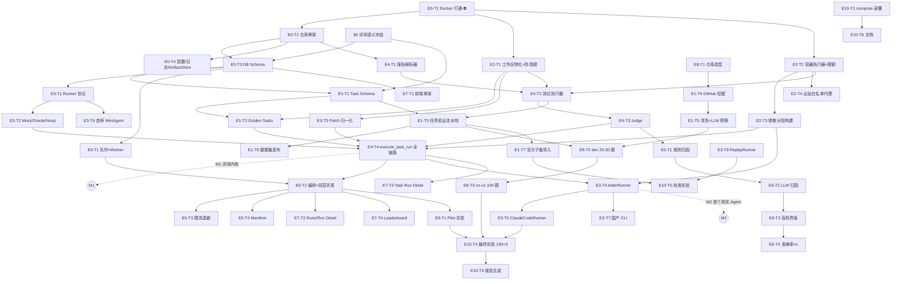

# 21 Initial Epic / Task Tree

**团队假设**：4 人（若实际人数不同，按 §24.6 调整）。
- **A 架构/内核**：sandbox、judge、evaluation 编排
- **B 后端/数据**：DB、API、task builder、挖掘与数据集生产
- **C 算法/Agent**：Runner 适配器、自研 MiniAgent、归因
- **D 前端/报告**：Next.js、排行榜、抽检界面、报告生成

**标注含义**：`P` 优先级 · `C` 复杂度 S/M/L/XL · `E` 估算人日 · `⚙DB` 需迁移 · `🐳` 需 Docker · `🔑` 需 Agent 账号/API · `🌐` 需外部依赖

---

## E0 — Project Foundation（基础设施）

### E0-T1 开发环境与 Docker 打通 ✅ **已完成 2026-09-01**
- **Goal**：本机可用 `docker run`，Python/Node 工具链就绪，确定机器方案
- **Req**：CON-05, CON-07, NFR-08 · **Why**：不解决则 E2 全部无法开工，Week 1 直接停摆
- **Deps**：无 · **Modules**：—
- **Output**：可用 Docker daemon；`docs/env-setup.md`；~~实验机申请单~~ → **结论：无需采购**
- **AC**：~~`docker run --cpus=1 --memory=512m` 成功；`docker info` 显示 cgroup v2；能拉取镜像~~ **全部达成**
- **实际交付**：Docker 29.7.2 / Compose v5.5.0，systemd 托管、开机自启、免 sudo；cgroup v2 + systemd driver、`docker info` 无 warning；`.wslconfig` → 16 vCPU / 11 GiB；dockerd 代理 + registry 镜像源 + 客户端容器代理三处配齐；镜像拉取速率实测 ≈4 MB/s
- **剩余待办**：把手工验证固化为 `scripts/check_env.py`（并入 E0-T2）
- **Risk**：~~中~~ → **已关闭** · **P0 · C:S · E:0.5d · 🐳**

### E0-T2 仓库骨架与工程规范 ✅ 已于 2026-09-02 完成
- **Goal**：monorepo 目录、依赖管理（uv/poetry）、ruff+mypy、pytest、pre-commit、CI、import-linter 边界规则，**以及 §32 的全部版本管理约定**
- **Req**：NFR-05, NFR-07, NFR-08 · **Deps**：E0-T1
- **Output**：可 `make dev` 起 API 与前端骨架；`CONTRIBUTING.md`（含中文注释规范）；`git init` + `.gitignore` + `.env.example`；`main` 分支保护 + 内嵌 DoD 的 PR 模板；commit 规范校验；密钥扫描钩子；`gh` 批量建 Issue 脚本 + Projects 看板
- **AC**：lint/type/test 三条命令全绿；import-linter 规则生效（故意越界的 import 会被拦下）；提交含密钥的测试文件会被钩子拦下；违反 Conventional Commits 的提交被拒
- **详见**：§32 工程流程与版本管理
- **P0 · C:M · E:1.5d**
- **实际交付**（2026-09-02）：`make dev` 同时起后端 :8000 与前端 :3000，前端首页调通 `/api/health`；
  前端类型由 `npm run gen:api` 从后端 OpenAPI 生成，用错字段直接编译不过；
  三条 AC 全部写成了自动化测试（`backend/tests/unit/test_repo_guards.py`，26 条）——
  故意越界的 import 被 import-linter 拦下、六种密钥格式被钩子识别、五种不合规提交信息被拒；
  `scripts/sync_issues.py` 从本任务表生成 GitHub Issue（默认只预览，`--apply` 才写）。
- **仍需人工操作**：GitHub 网页上设 `main` 分支保护；装 `gh` 后跑 `sync_issues.py --apply`；Projects 看板要手建

### E0-T3 数据库 Schema v1 与迁移 ✅ 已于 2026-09-02 完成
- **Goal**：§13 的 17 张表 + 枚举 + 索引落地
- **Req**：FR-03 · **Deps**：E0-T2、**§6 语义冻结**
- **Output**：Alembic 初版迁移；SQLAlchemy 模型；种子数据脚本（agents/agent_configs）
- **AC**：`alembic upgrade head` 在空库成功；`downgrade base` 可回滚；模型与枚举同 §6 完全一致（用一个"枚举一致性"单测锁死）
- **Risk**：低，但**改动代价随时间指数上升** → 必须在 Week 1 定稿
- **P0 · C:M · E:1.5d · ⚙DB**
- **实际交付**（2026-09-02）：17 张表、26 个原生枚举类型、迁移 `0001_initial_schema`；
  46 个测试全绿，其中 31 个是连真库跑的。三处协议约束落到了数据库层面：
  合法组合 CHECK（C-68、C-78）、认定结果部分唯一索引（C-57）、attempt 唯一约束（C-48）。

### E0-T4 配置、日志、制品存储抽象 ✅ 已于 2026-09-03 完成
- **Goal**：Settings（pydantic-settings）、structlog（含 run_id/task_run_id 上下文）、`ArtifactStore` + `LocalArtifactStore`
- **Req**：NFR-06, FR-19 · **Deps**：E0-T2
- **AC**：ArtifactStore 契约测试通过；日志带结构化上下文；敏感值（API Key）在日志中脱敏
- **P0 · C:S · E:1d**
- **实际交付**（2026-09-03）：`infrastructure/config.py`、`infrastructure/logging.py`、
  `storage/{base,local}.py`；新增 88 个测试（合计 165 个全绿）。三条 AC 各自有测试：
  契约测试 39 条（按接口写，E10-T2 接 MinIO 时加一行参数就能复用）、
  上下文测试验证 `bind_run_context` 可嵌套且退出即还原、
  脱敏测试覆盖三条泄漏路径（字段名、Agent 回显的明文、第三方密钥格式）。
  实测结论回填在 §17.4。

---

## E1 — Benchmark Domain & Task Builder

### E1-T1 Task Schema 冻结与校验器 ✅ 已于 2026-09-03 完成
- **Goal**：§7.1 Schema 的 Pydantic 模型 + JSON Schema 导出 + `content_hash` 规范化算法
- **Req**：FR-04 · **Deps**：E0-T3 · **Modules**：`benchmark/`
- **Output**：`TaskDefinition` 模型、`schemas/task.schema.json`、导入/导出 CLI
- **AC**：Golden Task 的 JSON 能双向序列化且 hash 稳定（同内容不同字段序 → 同 hash）；非法任务被明确拒绝并给出可读原因
- **P0 · C:M · E:1d**
- **实际交付**（2026-09-03）：`benchmark/{schema,hashing,patch_paths}.py`、
  `domain/protected_paths.py`（C-42 清单，放 domain 让 benchmark/runner/judge 共用）、
  `python -m cli.task {import,export,schema}`、`schemas/task.schema.json`（生成物，
  `make schema` 重出，CI 查漂移）。新增 131 个测试（合计 298 全绿）。
  拒收 16 类非法任务（DoD 要求 6 类），另有 3 类走人工复核。
  实现时暴露的三处 Schema/DB 不一致已全部处理（issue #60）：§7.1 补入 `p2p_sampling`、
  迁移 0002 给 `benchmark_tasks` 补 `sandbox_pids_limit` 列、`content_hash` 前缀维持两边格式各异；
  详见 `03-benchmark-spec.md` §7.9。

### E1-T2 Golden Tasks（3–5 道人工任务）✅ 已于 2026-09-04 完成
- **Goal**：不依赖挖掘、可在 60 秒内跑完的验证基石
- **Req**：FR-04, MET-05 · **Deps**：E1-T1、E2-T1
- **Output**：`fixtures/golden/` 下 3–5 道任务（含中文 Issue、test_patch、gold_patch），及其 env spec
- **AC**：每道题手工验证 6 步全通过；Oracle 解决率 100%、Noop 解决率 0%
- **Why**：**这是关键路径上唯一不依赖外部世界的输入**，Week 1 内核开发全靠它
- **P0 · C:M · E:1.5d**
- **实际交付**（2026-09-04）：四道题在 `datasets/golden/`，`python -m cli.golden {build,verify,list}`。
  六步验证全过，Oracle 解决率 100%、Noop 解决率 0%，全流程 4.5 秒。
  题目源码用 `base/` + `fix/` 两个目录手写，`build` 造出两提交的上游仓库再按受保护路径
  把修复 PR 的 diff 劈成 `test_patch` 和 `gold_patch` —— 和从真实 PR 派生任务是同一套做法。
  `base_commit` 确定性生成（提交人和时间写死），所以能进版本库；`build --check` 挡源码与 JSON 漂移。
  新增 20 个测试（合计 376 全绿），含两条反向用例证明验证器不是空转。
  落地方式记在 `03-benchmark-spec.md` §8.7。

### E1-T3 Task Validation Pipeline（8 步验证）
- **Goal**：§7.3 流水线实现 + 证据制品
- **Req**：FR-01, NFR-01 · **Deps**：E1-T1, E2-T2, E4-T2
- **AC**：对 Golden Task 全部判 VALID；对人为构造的 6 种坏任务全部判对应 INVALID reason_code
- **P0 · C:L · E:2d · 🐳**

### E1-T4 GitHub 挖掘器
- **Goal**：GraphQL 批量拉取 merged PR + 关联 Issue → `task_candidates`；缓存与断点续跑
- **Req**：FR-01 · **Deps**：E1-T1 · **Modules**：`benchmark/mining`
- **Output**：`bench mine --repo X --since Y` CLI；候选产出率报表
- **AC**：单仓库能产出 ≥30 条 CANDIDATE；限流下不崩、可续跑；重复运行不产生重复候选
- **Risk**：中（API 限流、关联关系不规范） · **P1 · C:L · E:2d · 🌐**

### E1-T5 候选清洗与 LLM 预筛
- **Goal**：脱敏（去 PR 链接/commit hash/修复代码块）、拆 test_patch/code_patch、抽候选 F2P、LLM 质量打分
- **Req**：FR-01, NFR-04 · **Deps**：E1-T4
- **AC**：脱敏后 Issue 中不含仓库 PR 链接与 40 位 hash（正则断言）；预筛分数分布合理；抽 20 条人工核对一致率 ≥80%
- **P1 · C:M · E:1.5d · 🔑**

### E1-T6 数据集版本化与发布
- **Goal**：`benchmark_sets` + `benchmark_set_items` 快照发布、Oracle/Noop 自检门禁
- **Req**：NFR-02, MET-05 · **Deps**：E1-T3, E4-T4
- **AC**：发布前自动跑 Oracle（要求 100%）与 Noop（要求 0%），不达标拒绝发布
- **P0 · C:M · E:1d · ⚙DB**

### E1-T7 SWE-bench Verified 子集导入
- **Goal**：官方数据集字段映射 + 官方镜像复用 + 固定种子分层抽样
- **Req**：MET-01 · **Deps**：E1-T1, E2-T2
- **AC**：导入 50 题，Oracle 解决率 = 100%（证明我们的 harness 对官方任务判定正确）
- **P1 · C:L · E:2d · 🌐🐳**

---

## E2 — Sandbox Execution Engine

### E2-T1 工作区物化与防泄题 ✅ 已于 2026-09-04 完成
- **Goal**：bare mirror 管理、`git archive` 物化、历史剥离、`.gitignore` 基线
- **Req**：NFR-02, NFR-04 · **Deps**：E0-T1 · **Modules**：`sandbox/workspace`
- **AC**：物化后 `git log --oneline | wc -l == 1`；`git log --all` 看不到 base 之后的提交；两次物化同一 commit 的目录树哈希一致
- **P0 · C:M · E:1d · 🐳**
- **实际交付**（2026-09-04）：`sandbox/{git_cli,mirror,workspace}.py`。三条 AC 全部达成，
  并且拿到了比 AC 更强的结论：**工作区的树哈希等于上游 commit 的树哈希**（内容、路径、
  权限位一处不差），连 base 提交的 SHA 都是确定的（提交人和时间写死为常量）。
  新增 58 个测试（合计 356 全绿），不需要 Docker，跑完 2 秒。
  三处实现决策记在 `05-sandbox.md` §10.7：基线忽略清单写 `.git/info/exclude` 而不是
  工作区根的 `.gitignore`；base 提交用 `git add -A --force`；物化后自查树哈希，
  `export-ignore` 导致的静默缺文件会被当场拦下。

### E2-T2 容器执行器与资源限额 ✅ 已于 2026-09-04 完成
- **Goal**：`run_in_container()`：CPU/内存/pids/超时/网络策略/env 白名单/非 root/清理
- **Req**：FR-05, FR-06, FR-07, NFR-03 · **Deps**：E0-T1
- **AC**：四条负例测试全过 —— ① 内存炸弹 → OOM_KILLED（**判据用 `docker inspect .State.OOMKilled`，不能用 exit 137——超时强杀的退出码同样是 137**）；② fork 炸弹 → 被 pids 限制拒绝；③ 死循环 → 按时被杀且无残留容器；④ `--network none` 下连接失败
- **前置风险已消除**：四条负例已于 2026-09-01 在本机手工验证全部通过（见 §10.3 实测结论），本任务只需将其固化为 pytest 用例并封装 API，**不再有环境可行性风险**
- **P0 · C:L · E:2d · 🐳**
- **实际交付**（2026-09-04）：`sandbox/container.py`，单一入口 `run_in_container()`。
  四条负例全部固化成 pytest（`tests/sandbox/test_container.py`，带 `docker` 标记，
  `make test-docker` 跑，16 条 12 秒）。除 AC 之外还钉死了三件事：**限额从容器内部读
  cgroup 文件核对**（只验"参数传出去了"挡不住字段名拼错）；**宿主机环境变量不进容器**
  （含 `GITHUB_TOKEN`，进去了就等于把翻原 PR 的钥匙给了被测 AI）；**镜像不在本地直接
  报错不自动拉**（ADR-008）。不需要 Docker 的那一半（白名单、结果分类、日志截断）
  另有 37 条纯函数测试进 `make test`。实现决策记在 `05-sandbox.md` §10.8。

### E2-T3 镜像分层与构建器
- **Goal**：`bench-base` / `bench-env:{environment_id}` / `bench-agent:{env}-{agent}` 三层；digest 记录；`bench images build/gc`
- **Req**：FR-05, MET-02 · **Deps**：E2-T2
- **AC**：同一 env 重复构建命中缓存；digest 写入 `environment_specs`；构建日志落制品；磁盘水位检查生效
- **Why**：**MET-02 的必要条件**（§18.2）
- **P0 · C:L · E:2d · 🐳**

### E2-T4 出站网络白名单代理
- **Goal**：Agent 阶段只放行 LLM API 域名，禁止 github.com
- **Req**：FR-07, NFR-04 · **Deps**：E2-T2
- **AC**：容器内 `curl https://github.com` 失败、`curl <LLM API>` 成功
- **Risk**：中（HTTPS 代理配置）→ 降级方案见 §10.5
- **P1 · C:M · E:1d · 🐳**

---

## E3 — Agent Runner Framework

### E3-T1 Runner 协议与契约测试套件 ✅ 已于 2026-09-04 完成
- **Goal**：`AgentRunner` Protocol、`AgentTaskInput`/`AgentRunResult` 模型、6 条契约测试
- **Req**：FR-08, NFR-05 · **Deps**：E0-T3
- **AC**：契约测试可对任意适配器复用运行；协议 JSON Schema 导出
- **P0 · C:M · E:1d**
- **实际交付**（2026-09-04）：`app/runner/protocol.py` + `cli/runner.py`，两份 JSON Schema
  落在 `schemas/`（`make schema` 一起生成，有漂移测试盯着）。契约套件是一个给人继承的
  基类 `tests/contract/runner_contract.py::AgentRunnerContract`——接新适配器只要写一个
  `runner` fixture，六条自动跑。**配了六个坏适配器做反向验证**：没有这一半，
  一个永远返回"通过"的套件也能让正向全绿。
  两个和直觉相反的结论写进了代码注释：第 4 条要求适配器**保留**受保护路径的改动
  （自己过滤掉的话，`protected_path_edit_attempted` 就没证据了，协议 C-08b），
  过滤是平台在 E3-T3 做的事；`build_image` 拆成单独的 `ImageBuildingRunner`，
  因为 Mock/Oracle/Noop 根本不需要镜像。
  另外修了 import-linter 的分层配置：原来 runner 和 sandbox 并排写，等于"互不可见"，
  和 `07-platform-architecture.md` §14.2 的"Runner 用 Sandbox"直接冲突，
  真实适配器一调 `run_in_container` 就会红。新增 87 个测试（合计 500 全绿）。

### E3-T2 Mock / Oracle / Noop Runner ✅ 已于 2026-09-05 完成
- **Goal**：可编程行为的假 Agent（正确补丁 / 错误补丁 / 空补丁 / 超时 / 非法补丁 / 改受保护文件）
- **Req**：NFR-01（可测性） · **Deps**：E3-T1
- **AC**：6 种行为可通过配置精确触发；Oracle 在 Golden 集上 100%，Noop 0%
- **Why**：**让整条评测链在完全不依赖外部 Agent 的情况下可测**
- **P0 · C:S · E:0.5d**
- **实际交付**（2026-09-05）：`app/runner/adapters/` 三个适配器 —— `OracleRunner`
  （交官方补丁）、`NoopRunner`（交空补丁）、`MockRunner`（六种行为）。**都不碰工作区**，
  直接在结果里交补丁字符串；真实适配器走"改文件 → git diff"那条路，两条路最后都汇到
  `AgentRunResult.patch`。
  官方补丁**由外部注入**（构造时喂 `task_id → gold_patch`），不自己去读题库：
  `app.runner` 在分层里压在 `app.benchmark` 下面，import 不到 `TaskDefinition`；
  而且编排层已经把题读出来了，再读一遍就是两份数据源。
  Mock 的六种行为通过构造参数或 `MockRunner.from_params()`（读
  `agent_configs.params` 那个 JSON）触发，还支持 `per_task` 逐题覆盖 —— 一次实验里
  凑"有的解决、有的超时"的混合结果要靠它。行为名拼错当场抛错，不静默退回默认值：
  静默退回的话一个写成 `timout` 的配置会让整批实验安静地跑成"正确补丁"。
  几条实测确认的结论：
  **① 假补丁一律造成"新建文件"的 diff**，因为它不引用仓库里任何一行现有内容，
  在任何工作区上都能干净地 `git apply`；造成"修改已有文件"就得为每道题挑真实文件、
  抄真实上下文。
  **② `malformed_patch` 用"hunk 头行数写错"来保证打不上**（`git apply` 报
  `corrupt patch at line 7`），这同样只取决于补丁自己。它必须仍是解析得出路径的 diff ——
  协议第 109 行把 `INVALID_PATCH` 定义成"补丁非空但打不上去"，拿一段自然语言冒充
  走的是别的判定分支。
  **③ 成本报 `reported` + `0.0` 而不是 `unavailable`**：哨兵不调模型，成本确实是 0，
  这是"报得出来的 0"。协议纪律 3 里"不要填 0"针对的是**拿不到**成本的情况。
  **④ Oracle 不看 deadline**，输出只由 task_id 决定 —— 让它随时钟变化的话，
  编排层哪天算错一次 deadline，"假阴性探针"就跟着失灵，而查的人会去翻判定引擎。
  验收证据：契约套件八个类全过（Oracle、Noop、Mock 六种行为各一个类 —— 契约第 2 条
  要求 `has_patch` 和 `produces_patch` 严格对上，合成一个类的话只能验一种行为）；
  `tests/sandbox/test_sentinel_golden.py` 真的物化工作区、真的打补丁、真的起 pytest，
  Oracle 在四道 Golden 题上 4/4 解决、Noop 0/4，六种行为的落点逐一验过。
  顺带把 `cli/golden.py` 的 `_apply_patch` / `_patch_applies` / `_run_pytest` 改成公开名 ——
  `run_pytest` 里那套确定性环境变量（`PYTHONHASHSEED` 等）各处自己抄一份的话，
  哪天漏了一个，同一个补丁两次判定可能得到不同结果。新增 92 条测试（合计 609，其中 16 条需 Docker、35 条需数据库）。
- **顺带把 `04-runner-protocol.md` §9.3 和实现对齐了**（2026-09-05，讨论后进行）。
  §9.2 的报文格式没动 —— 那才是 AGENTS.md §4.3 冻的东西；改的三处都在 §9.3
  描述适配器长什么样的散文里：
  ① 实现类清单里的 `MockAgentRunner` 改成 `MockRunner`，和 `cli/seed.py` 写进
  `agents.adapter_class` 的那份对上（数据库里的真值）；`01-requirements.md` P0-06
  同一个词一起改。
  ② 契约第 4 条原文是"改了 protected_path 时该改动被剔除"，**没说谁剔除** ——
  照字面写新适配器就会让它自己过滤，而那正是这一条要抓的 bug（过滤掉之后
  `protected_path_edit_attempted` 没证据了，协议 C-08b）。改成"留在原始补丁里，
  剔除由平台做"。
  ③ `AgentRunner` 草图里还挂着 `build_image`，拆成 `ImageBuildingRunner`（E3-T1 的
  改动，E3-T2 证实了 Mock/Oracle/Noop 三个都不需要镜像）。

### E3-T3 Patch 捕获与归一化 ✅ 已于 2026-09-05 完成
- **Goal**：`git diff` → 剔除受保护路径/噪声文件 → 统计 → NormalizedPatch
- **Req**：FR-08, NFR-04 · **Deps**：E2-T1
- **AC**：Agent 改测试文件时该改动被剔除；`__pycache__`/`.aider*` 被忽略；输出可 `git apply --3way`
- **P0 · C:M · E:1d**
- **实际交付**（2026-09-05）：`app/runner/patch.py`。
  `capture_workspace_diff()` 抓补丁（`git add -A` → `git diff --cached <base_sha>`），
  `normalize_patch()` 按 §11.4 过滤，产出 `NormalizedPatch`（补丁正文 + 统计 +
  被丢弃改动的清单）。两份补丁都留：只留标准化的，"AI 试图改测试文件"就再也查不到了。
  **取舍的最小单位是文件段，不是行。** 删掉 hunk 里的几行之后，hunk 头声明的行数
  和实际行数就对不上，`git apply` 报 `corrupt patch` —— 一个打不上的"标准化补丁"
  会被判成 `INVALID_PATCH`，而责任其实在平台。这类 bug 最难查，因为它看起来
  像 AI 交了个坏补丁。为此给 `app.domain.patch_paths` 加了 `iter_diff_sections()`，
  留下来的段逐字节不动。
  几条实测确认的结论：
  **① 噪声只判新建文件。** 真有仓库跟踪着 `debug.log`、`*.so`，改它是合法修复，
  当噪声丢掉就是把 AI 的修复悄悄删了。这和工作区那边是同一套语义 ——
  `.git/info/exclude` 只管物化之后新出现的文件，base 提交用的是 `git add -A --force`。
  **② 行尾只归一化结构行，内容行原样保留。** `+foo\r` 有两种可能：补丁文件本身是
  CRLF 存的，或者这一行真的要写一个 CR。从补丁里分不出来，猜错第二种就是悄悄改掉了
  AI 的修改内容。结构行没有这个歧义。
  **③ 受保护路径排在分类顺序最前面。** `tests/` 下的二进制文件要报成 `protected_path`
  而不是 `binary` —— 报成 binary 就把"AI 动了测试目录"这条证据盖掉了，
  而那是要触发人工复核的信号（C-13d）。
  **④ `protected_patterns` 是必填的，没有默认值。** 完整清单要含该题的
  `test_patch_paths`（C-42 最后一条、C-74）；给个"通用规则"的默认值，等于让
  "忘了传该题清单"变成一个不报错的选项，而后果是解决率静悄悄偏高。
  **⑤ `git apply --3way` 对新建文件会打印 "Falling back to direct application..."
  然后正常应用**（blob 不在本地对象库里），退出码 0。实测确认，判 `--3way` 成功
  要看退出码，不能看有没有 stderr 输出。
  验收证据：三条 AC 各有对应用例，`tests/sandbox/test_patch_capture.py` 真的物化工作区、
  真的改文件、真的 `git apply --3way` 打回一份干净工作区，打完确认作弊的测试改动
  没落地、Agent 新建的源文件落地了。新增 60 条测试（合计 669，其中 16 条需 Docker）。
- **顺带把 `app/benchmark/patch_paths.py` 移到了 `app/domain/`**：`app.runner` 在
  分层里压在 `app.benchmark` 下面，import 不到它，而归一化要用同一套 diff 解析规则。
  各写一份的话两个 diff 解析器一定会漂，而"解析漏一个文件"的表现是那个文件不受保护、
  AI 改了也生效。这个模块本来就只依赖 `app.domain.protected_paths`，放 domain 合适。
  原有 14 条解析用例一行没改就全过，等于证明了搬家没改行为。

### E3-T4 AiderRunner（第一个真实 Agent）
- **Goal**：容器内非交互运行 Aider，采集 patch/token/cost/轨迹
- **Req**：FR-09, MET-06 · **Deps**：E3-T1, E3-T3, E2-T3 · **🔑**
- **AC**：在 Golden 集上产出非空补丁且至少解决 1 题；契约测试 6 条全过；token/cost 字段非空
- **P0 · C:M · E:1.5d · 🐳🔑**

### E3-T5 ClaudeCodeRunner
- **Goal**：headless `-p` + `stream-json` 解析 + 凭据注入 + `--max-turns` 预算控制
- **Req**：FR-09, MET-06 · **Deps**：E3-T4 · **🔑**
- **AC**：同上；轨迹能还原工具调用序列
- **Risk**：中（鉴权/并发额度） · **P1 · C:L · E:2d · 🐳🔑**

### E3-T6 自研 MiniAgent
- **Goal**：ReAct 循环 + 工具（read_file/list_dir/grep/apply_edit[/run_tests]）+ token 记账
- **Req**：FR-10, MET-06 · **Deps**：E3-T1 · **🔑**
- **AC**：Golden 集上至少解决 1 题；轨迹为原生结构化 JSONL；单题成本可核算
- **Why**：满足"自研 Agent"要求，且是**外部 Agent 全部失败时的保底参赛者**
- **P1 · C:L · E:2d · 🔑**

### E3-T7 国产 CLI Runner（Qwen Code 等）
- **Req**：FR-09（国产） · **Deps**：E3-T4 · **P1 · C:M · E:1.5d · 🐳🔑**

### E3-T8 ReplayRunner（服务 MET-01 Plan A）
- **Goal**：读取外部已发布的 `预测补丁` 文件，按 strict-patch 模式喂入判定链
- **Req**：MET-01 · **Deps**：E3-T1, E4-T4
- **AC**：能对官方子集完成 replay 并输出逐实例一致率
- **P1 · C:S · E:0.5d**

---

## E4 — Evaluation & Judge Engine

### E4-T1 测试报告解析器（pytest junitxml + 文本兜底）✅ 已于 2026-09-05 完成
- **Goal**：`{test_id: status}`；`normalize_test_id()` 覆盖 6+ 种 ID 形态
- **Req**：FR-12, NFR-01 · **Deps**：E0-T2
- **AC**：录制的 10 份真实报告 fixture 全部解析正确；ID 归一化单测覆盖相对/绝对路径、参数化、类方法、嵌套目录
- **Risk**：中（**最易出静默 bug 的模块**，见 §11.3）
- **P0 · C:M · E:1.5d**
- **实际交付**（2026-09-05）：`app/judge/test_ids.py`（ID 归一化）+
  `app/judge/report_parser.py`（报告解析）。12 份 fixture 录在
  `backend/tests/fixtures/reports/`，139 条单测。
  **fixture 是真跑出来的，不是手写的 XML** —— `_record.py` 用真 pytest 生成，
  其中 4 份来自真实 Golden 题（textkit）。手写只会包含"我以为 pytest 会输出什么"，
  而漏掉的怪癖恰恰是出静默 bug 的地方。跑 `python -m tests.fixtures.reports._record --check`
  可以验证 fixture 还能被重新录出来。
  ID 归一化单测覆盖 9 种写法（超出 AC 要求的 6 种）：相对路径、`./` 前缀、绝对路径、
  反斜杠、重复斜杠、多层目录、类方法、参数化、转义的非 ASCII 参数。
  实测确认的结论全部回填进了 §11.3，三条最要紧的：
  **① junitxml 的 `classname` 是点分模块名，`a.b.C` 有歧义**，默认的 xunit2 没有
  `file` 属性可以裁决，所以两种 family 都要能解析，有 `file` 就优先用。
  **② 非 strict 的 XPASS 在 junitxml 里和 PASSED 一模一样**，协议 C-10 要求它是独立
  状态但 XML 表达不了 —— 解析器如实报 `PASSED` 并把盲区标出来，不装作能分。
  **③ 文本兜底天生残缺**：默认输出里 8 条通过的用例一条也看不见，所以一律记成
  "报告不完整"，免得把我们自己 `test_command` 少写参数的锅算到 AI 头上（C-13a）。
  顺手改掉了 `app/judge/__init__.py` 里"judge 负责补丁归一化"那句 —— 补丁归一化在
  E3-T3 放进了 `app/runner/patch.py`，而 import-linter 有一条"judge 不依赖 runner"。
- **决策**（2026-09-05）：`test_command` **不加** `-o junit_family=xunit1`。
  两种 family 解析结果已证明逐条相同（`test_both_junit_families_agree`），加了只省掉
  classname 的猜测环节；而真实仓库的 `test_command` 从上游推导，保不住这个参数——
  只给 Golden 题加，会让开发时走的路径和真实评测走的不是同一条。
  理由和改主意时要动哪几处，见 §11.3。

### E4-T2 测试执行器 ✅ 已于 2026-09-05 完成
- **Goal**：纯净工作区 → apply agent_patch → 强制还原受保护路径 → apply test_patch → 容器内跑子集 → 收报告
- **Req**：FR-06, FR-12, NFR-04 · **Deps**：E2-T1, E2-T2, E4-T1
- **AC**：Agent 改测试的用例被证明无效（防作弊集成测试）
- **P0 · C:L · E:2d · 🐳**
- **实际交付**（2026-09-05）：`app/evaluation/executor.py` 的 `execute_tests()`，
  跑协议 C-14 的第 1–6 步。22 条测试（16 条纯 git，6 条真起容器）。
  AC 用真实 Golden 题验：作弊补丁把 `tests/test_csvline.py` 整个换成 `assert True`，
  三条 F2P 照样全挂；新塞 `conftest.py` 把用例全跳过，也照样全挂。
  喂进去的是**没经过 E3-T3 过滤的原始补丁** —— 故意的，C-16 要求第二道防线单独成立。
  **它不在 `app/judge/`**：import-linter 里 `app.sandbox | app.judge` 并排＝互不可见，
  judge 看不到 sandbox，起不了容器。放 `app.evaluation`，它在 runner 之上，两边都看得见。
  同理执行器收的是 `app.domain.execution_plan.ExecutionPlan` 而不是 `TaskDefinition`
  （evaluation 也看不见 benchmark），转换口是 `TaskDefinition.execution_plan()`，
  **刻意不带 `gold_patch` 和 `issue_body`** —— 跑测试用不着答案，带上只是多一条泄漏路径。
  最要命的一个坑回填进了 §11.2：**`git apply --3way` 会把结果暂存进索引**，
  于是 AI 新建的 `conftest.py` 成了"已暂存的新增文件"，
  `git checkout HEAD -- conftest.py` 报 pathspec 不匹配，防作弊直接崩在这里。
  修法是打完补丁立刻 `git reset --quiet HEAD`。这个坑只在真走 `git apply` 时出现，
  直接把文件写进工作区测不出来。
- **临时方案**：测试镜像用 `images/golden/Dockerfile`（`python:3.11-slim` + pytest 9.1.1），
  `make images` 建。**这不是 E2-T3**——执行器只收 `image` 参数，不关心镜像哪来的，
  E2-T3 的分层构建器到位后换个来源就行，代码一行不用改。
  `scripts/check_env.py` 加了一条检查：镜像不在就提示跑 `make images`，
  否则那 6 条容器用例会**静默跳过**，看起来像全过了。

### E4-T3 Judge（F2P/P2P 判定）✅ 已于 2026-09-05 完成
- **Goal**：§11.2 判定逻辑 + `agent_outcome`/`infra_outcome` 映射表
- **Req**：FR-12, NFR-01, NFR-09 · **Deps**：E4-T2
- **AC**：真值表单测全过；同补丁重判 3 次结果与逐用例状态完全一致
- **P0 · C:M · E:1d**
- **实际交付**（2026-09-05）：`app/judge/decision.py` 的 `judge()`，纯函数，69 条单测。
  映射表**不用新建** —— `INFRA_TO_AGENT_MAPPING` 和 `LEGAL_COMBINATIONS` 在 E0-T3
  就随 `app/domain/protocol.py` 建好了，这里只查表（C-19 禁止把那张表的逻辑
  散落到 if 分支里）。
  真值表单测是**穷举**的：`InfraOutcome`（13 个）× "AI 启没启动"（2 种）全跑一遍，
  每一格要么产出协议 §4.3 认可的合法组合，要么因为输入自相矛盾而拒绝。
  穷举当场抓到两个 bug：`CANCELLED` 被错判成 `FAILED`（终态该是 `CANCELLED`），
  以及 `lifecycle_status` 原本是硬写的、没法覆盖全部六行合法组合 ——
  改成从映射表的"责任方"那一列推导之后就都对上了。
  三条写进 §11.2 的结论：**① 责任在 AI 的故障判 `COMPLETED` 不是 `FAILED`**
  （否则 AI 把自己搞崩就能从解决率分母里消失）；
  **② `RESOLVED` 优先于 `EMPTY_PATCH`**（Noop 哨兵靠这个发现坏题）；
  **③ `TEST_TIMEOUT` 不传对照组结论就抛异常，不猜**（猜错的两个方向后果相反）。

### E4-T4 端到端评测单元 `execute_task_run()` ✅ 已于 2026-09-05 完成（**M1 达成**）
- **Goal**：把 PREPARING→…→COMPLETED 串起来，含状态持久化、制品落盘、异常映射、清理
- **Req**：FR-06, NFR-06, NFR-09 · **Deps**：E2-*, E3-T2/T3, E4-T3
- **AC**：**Golden Task × MockAgent 全链路跑通并落库**（= M1 里程碑）
- **P0 · C:L · E:2d · 🐳**
- **实际交付**（2026-09-05）：`app/evaluation/task_run.py` 的 `execute_task_run()`
  跑编排，`app/evaluation/persistence.py` 的 `persist_task_run()` 落库。
  **两半刻意分开**：编排要 Docker 不要数据库，落库要数据库不要 Docker。
  合成一个的话，本地少起一样，整片测试就被跳过 —— 而跳过是不报错的，看起来像全过了。
  **哨兵结果**：Oracle 四道题 4/4 全 RESOLVED，Noop 四道题 0/4，都是真起容器跑出来的。
  确定性哨兵（同补丁跑 3 次逐条状态一致）也过了。
  另外补了 `TaskDefinition.agent_task_input()` —— 下发给被测 AI 的任务输入的正式
  构造口，**防泄题的规矩全在这一处**（受保护清单用 agent_visible 那份、
  gold_patch/test_patch/F2P 名单/test_command 一个都不进去、repo 不给 URL、
  组装完再过一遍 `assert_no_leak()`）。此前只有哨兵测试里一份"够用的最小实现"。
  两个实测踩到的坑：
  **① `patch_source` 不是"补丁从哪拿"的路由信号**，它是归因用的元数据
  （"这段 diff 是跑 git diff 得来的，还是 AI 自己打印的"）。Oracle 标的是 `git_diff`
  却根本不碰工作区，照它分流会抓到空 diff，**Oracle 哨兵会从 100% 变成 0%**。
  改成按内容判：适配器报了非空补丁就用它，否则去工作区 `git diff`。
  **② 适配器错误码不能按子串猜。** Mock 的超时报的是 `deadline_exceeded`，里面没有
  "timeout" 这个词，超时被错判成运行时错误。规范错误码收进了
  `app/runner/protocol.py`，评测单元查表，认不出的一律算 AI 侧。

---

## E5 — Evaluation Orchestration

### E5-T1 Postgres 队列与 Worker 框架 ✅ 已于 2026-09-05 完成
- **Goal**：SKIP LOCKED 领取、租约续期、僵尸回收、退避重试、优雅停机、孤儿容器回收
- **Req**：FR-11 · **Deps**：E0-T3
- **AC**：杀死 Worker 后作业能被另一 Worker 接管；重试次数与退避符合配置；SIGTERM 后无残留容器
- **P0 · C:L · E:2d · ⚙DB**
- **实际交付**（2026-09-05）：`app/infrastructure/queue.py`（通用队列，不认识"评测"，
  ADR-003 说的"换 RQ 只改一个文件"由它保证）、`app/domain/retry.py`（C-24/C-71 的纯函数）、
  `app/worker/`（主循环 + 心跳 + 优雅停机 + 容器回收 + `EVAL_TASK` 处理函数）、
  `app/runner/adapters/stored.py`（C-54 的补丁重放）、`cli/queue.py`（投作业/看队列）。
  验收证据：Oracle 跑四道 Golden 题 4/4 全 RESOLVED 且全部 `is_canonical`，
  作业全部 DONE，SIGTERM 之后 `docker ps -a --filter label=bench.owner=...` 为空。

**三个设计决定，每个都是为了挡一类具体的错：**

**① 两种重试严格分开。** `job_queue.attempts`（Worker 崩了 / 处理函数抛异常，
按 `max_attempts` 和 `2^n×base` 退避）和 `evaluation_task_runs.attempt_no`
（协议 C-18 按故障类型规定次数）是两件事。`execute_task_run()` **不抛异常**，
每种失败都返回一个 `infra_outcome` —— 所以"跑出 `ENV_BUILD_FAILED`"对队列来说是一次
**成功的作业**（DONE），评测层面的重试是**另投一条作业**（C-32 要求重试新建记录）。
混用的话，`ENV_BUILD_FAILED` 的重试次数会从 C-18 规定的 1 次变成 `max_attempts` 的 3 次。

**② `evaluation_task_runs` 行跑完才建，不在领取时建。** 领取时就建的话，
Worker 被 `kill -9` 会留下一条卡在 `AGENT_RUNNING` 的记录，接手的 Worker 只有两条路
且都不通：复用它要把状态退回 `PREPARING`（C-32 禁止），新建一条会撞
`uq_task_run_attempt`。跑完才建就没这问题，代价是跑的过程中要去
`job_queue`（`state='LEASED'`）看"现在哪道题在跑"——这正是 ADR-003 选 Postgres
队列的第四条理由。

**③ 事务边界是三段短的，不是一段长的。** 领取一段、干活不在事务里（十几分钟）、
落库+决定重试+收尾一段。第三段那几件事必须一起提交：结果写了但没人接着重试，
这道题永远停在一个可重试的故障上；作业标了完成但结果没写，这道题凭空消失。

**四个实测踩到的坑：**

**① `update(...).returning(JobQueue)` 会命中 session 的身份映射。** 同一个 session
里刚 `enqueue` 完再 `lease`，RETURNING 回来的是那份**旧**属性（`state` 还写着
`PENDING`、`attempts` 还是 0），而数据库里其实已经改了。加
`execution_options(populate_existing=True)` 才对。Worker 每次都开新 session 所以
碰不到，但测试和以后的编排层会。

**② 租约归属必须在 SQL 的 WHERE 里校验，不能只在 Python 里判。** `renew_lease` 和
`finish` 都带 `lease_owner = :worker_id`，改不到行就抛 `LeaseLostError`。挡的是
"Worker 卡住超过租约 → 被回收器交给别人 → 它醒过来接着写结果"，不拦的话同一道题
会落两条 attempt、成本重复计一次。

**③ 时间一律用数据库的 `now()`。** 租约是否过期由回收器按数据库时钟判断，
Worker 用自己的时钟写、数据库用自己的时钟读，差几秒就会出现"没到期就被回收"。

**④ 回收之后有退避窗口，不是立刻可领。** 写测试时以为回收完马上能领到，
实际要等 `2^attempts × base`。这是有意的：立刻可领的话，一个必然把 Worker 搞崩的
作业会在几毫秒内把重试次数烧光。

**明确没做（留给后续任务）**：C-20 的对照组执行（`needs_control_run` 只落库不消费，
C-72 规定它不算一次 attempt，够单开一个任务）；双层并发信号量、进度聚合、取消
（E5-T2）；限流令牌桶（E5-T3）。`cli/queue.py` 的 `seed-golden` 只是把题原样写进库，
**不是** E1-T3 的验证流水线，`validation_state` 停在 `DISCOVERED`。

### E5-T2 EvaluationRun 编排与双层并发
- **Goal**：展开 N 个 task_run、双层信号量、进度聚合、取消、失败重跑
- **Req**：FR-11, MET-03 · **Deps**：E5-T1, E4-T4
- **AC**：8 并发下内存峰值 <80%；取消能在 30s 内停住；有效并发时间序列可导出
- **P0 · C:L · E:2d**

### E5-T3 限流与自适应退避
- **Goal**：按 agent_config 分桶令牌桶；429 自动降并发；`external_wait_ms` 记账
- **Req**：MET-02 · **Deps**：E5-T2 · **P1 · C:M · E:1d · 🔑**

### E5-T4 运行 Manifest 与可复现性
- **Goal**：记录镜像 digest 表、数据集哈希、harness git sha、Agent 版本/模型/参数、种子、环境
- **Req**：NFR-02 · **Deps**：E5-T2
- **AC**：由 manifest 可重建一次等价运行；两次运行的 manifest diff 只在时间戳上不同
- **P0 · C:S · E:0.5d**

---

## E6 — Failure Attribution & Human Review

### E6-T1 规则前置分类器 · **P0 · C:M · E:1d**（F6/F7/F8/N1 确定性归类 + Stage2 特征提取）
### E6-T2 LLM-as-Judge 归因 · **P1 · C:L · E:2d · 🔑**（结构化输出、evidence 强制、缓存、低置信投票）
### E6-T3 抽检队列与盲检界面 · **P1 · C:M · E:1.5d**（分层抽样、双人标注、仲裁）
### E6-T4 准确率与 κ 统计 · **P1 · C:S · E:0.5d**（MET-04 的报表）

## E7 — Frontend & Leaderboard

### E7-T1 前端骨架 + API 类型生成 + 布局导航 · **P0 · C:M · E:1d**
### E7-T2 Runs / Run Detail（进度、分组网格、取消重试） · **P0 · C:M · E:1.5d**
### E7-T3 Task Run Detail（Patch Viewer + 测试结果表 + 日志 + 轨迹） · **P0 · C:L · E:2d**
### E7-T4 Leaderboard（多指标排序 + 成本-解决率散点 + 分面） · **P0 · C:M · E:1.5d**
### E7-T5 Benchmarks / Benchmark Detail / Task Detail · **P1 · C:M · E:1.5d**
### E7-T6 Failure Analysis（分布图/热力图/Top 案例） · **P1 · C:M · E:1.5d**
### E7-T7 Human Review 页 · **P1 · C:M · E:1.5d**
### E7-T8 Dashboard · **P1 · C:S · E:0.5d**

## E8 — Benchmark Dataset Production

### E8-T1 仓库选型实测与打分表 · **P0 · C:M · E:1d · 🌐**（安装/测试耗时、候选深度、中文比例 → 定档 8–15 仓库）
### E8-T2 L1 `benchmark-dev` 20–30 题 · **P1 · C:L · E:3d（跨天，含机时）· 🐳**
### E8-T3 L2 `benchmark-cn-v1` 60–100 题 · **P1 · C:XL · E:4d（跨天，含机时）· 🐳**
### E8-T4 校准集 50 题 · **P1 · C:M · E:1d · 🌐🐳**
### E8-T5 数据集质量报告（来源构成/语言分布/难度分布/漏斗数据） · **P1 · C:S · E:0.5d**

## E9 — Performance & Reliability

### E9-T1 Pilot 实验（30 题 × 3 Agent）与容量模型回代 · **P0 · C:M · E:1d**
### E9-T2 并发压测与调优（找到本机最优 P_agent/P_sandbox） · **P1 · C:M · E:1d**
### E9-T3 稳定性加固（孤儿回收、磁盘水位、失败重跑、断点续跑） · **P1 · C:M · E:1d**
### E9-T4 性能报告生成 · **P1 · C:M · E:1d**

## E10 — Deployment / Documentation / Demo

### E10-T1 docker compose 一键部署（api/worker/pg/minio/frontend） · **P0 · C:M · E:1.5d · 🐳**
### E10-T2 MinioArtifactStore 接入与切换验证 · **P1 · C:S · E:0.5d**
### E10-T3 报告生成器（HTML + Markdown + JSON，含每题轨迹链接） · **P1 · C:L · E:2d**
### E10-T4 最终实验（100×3）与对比报告 · **P1 · C:L · E:2d**
### E10-T5 Harness Replay 校准实验（MET-01） · **P1 · C:M · E:1d**
### E10-T6 部署文档 / 使用文档 / 架构文档 · **P0 · C:M · E:1.5d**
### E10-T7 答辩演示脚本与录屏兜底 · **P0 · C:S · E:0.5d**

---

# 22 Dependency Graph



---

# 23 Critical Path（关键路径）

```
E0-T1 Docker 打通
  → E0-T3 DB Schema（依赖 §6 语义冻结）
  → E1-T1 Task Schema  ──┐
  → E2-T1 工作区物化      ├→ E1-T2 Golden Tasks
  → E2-T2 容器执行器      │
  → E2-T3 镜像构建 ───────┘
  → E4-T1 报告解析器 → E4-T2 测试执行器 → E4-T3 Judge
  → E3-T1 Runner 协议 → E3-T2 Mock Runner → E3-T3 Patch 归一化
  → E4-T4 execute_task_run 全链路                    ★ M1
  → E5-T1 队列/Worker → E5-T2 编排与并发
  → E3-T4 AiderRunner                                 ★ M2
  → E1-T3 任务验证流水线 → E8-T2/E8-T3 数据集生产      ★ M5
  → E10-T4 最终实验 → E10-T3 报告                      ★ M6
```

## 若进度落后，**绝对不能砍**的任务
| 任务 | 砍掉的后果 |
|:---|:---|
| E0-T1 Docker | 什么都跑不了 |
| E0-T3 DB Schema | 后期改表代价指数上升 |
| E1-T1 Task Schema | 协议不冻结 → 全员返工 |
| E1-T2 Golden Tasks | 内核开发失去可测输入，只能等挖掘 |
| E2-T1/T2 工作区+容器 | 无沙箱 = 无隔离 = 无基准 |
| E2-T3 镜像构建 | MET-02 直接出局 |
| E3-T1/T2/T3 协议+Mock+补丁 | 无法脱离外部 Agent 开发与测试 |
| E4-T1/T2/T3 解析+执行+判定 | 无判定 = 无评测 |
| E4-T4 全链路 | M1 不成立，整个项目没有内核 |
| E5-T1/T2 队列与并发 | MET-03 不成立，且 300 次跑不完 |
| E3-T4 至少一个真实 Agent | 变成"只会跑 Mock 的玩具" |
| E1-T3 验证流水线 | 数据集不可信，基准无效 |
| E10-T1 部署 + E10-T6 文档 | DEL-06 缺失，直接影响验收 |

## **可以砍**（按砍除顺序）
1. E2-T4 出站代理（降级为轨迹检测泄漏）
2. E7-T8 Dashboard、E7-T5 部分页面
3. E3-T7 国产 CLI（用 MiniAgent + 国产模型顶替）
4. E6-T2 LLM 归因降级为纯规则 + 人工（MET-04 用规则覆盖率说明）
5. E10-T2 MinIO（保留 Local，说明抽象层已就绪）
6. E8-T3 题量 100 → 60 自建 + 40 官方子集
7. E10-T4 全量实验 100×3 → 100×2 + 30×1

---

# 24 4-Week Plan

> 与学校路线图的差异及理由见 §24.5。总体思路：**Week 1 造内核（不碰真实 Agent），数据生产从 Week 1 后半并行常驻后台。**

## Week 1 —— Minimum Evaluation Kernel（M0 → M1）

| 日 | A 内核 | B 数据/后端 | C Agent | D 前端 |
|:--|:--|:--|:--|:--|
| D1 | ~~E0-T1 Docker 打通~~ ✅ **已提前完成**；**§6 语义评审冻结**（本日最高优先） | E0-T2 骨架 | 协助 E0-T2；调研各 CLI 非交互参数 | 前端脚手架 |
| D2 | E2-T1 工作区物化+防泄题 | **E0-T3 DB Schema** | E3-T1 Runner 协议 | E7-T1 骨架+类型生成 |
| D3 | E2-T2 容器执行器（负例测试） | E0-T4 配置/日志/ArtifactStore；**E8-T1 仓库选型实测** | E3-T2 Mock/Oracle/Noop | E7-T1 续 |
| D4 | E2-T3 镜像分层构建 | **E1-T1 Task Schema 冻结** | E3-T3 Patch 归一化 | E7-T2 Runs 列表（对 Mock 数据） |
| D5 | **E4-T1 解析器 + E4-T2 测试执行器** | **E1-T2 Golden Tasks ×3** | 协助 E4-T2；契约测试套件 | E7-T3 雏形 |
| D6/7（机动） | **E4-T3 Judge + E4-T4 全链路** | E1-T3 验证流水线起步 | — | — |

**Week 1 出口（M1）**：`Golden Task × MockAgent → 补丁 → Docker 测试 → RESOLVED` 全链路跑通并落库，前端能看到这条记录。
**Week 1 硬规定**：不接任何真实 Agent。真实 Agent 是 Week 2 的事；Week 1 的价值在于内核可测。

## Week 2 —— 真实 Agent + 并发 + dev 数据集（M2 → M3）

| 日 | A | B | C | D |
|:--|:--|:--|:--|:--|
| D1 | E5-T1 队列/Worker | E1-T3 验证流水线完成 | **E3-T4 AiderRunner** | E7-T2/T3 完善 |
| D2 | E5-T1 续（租约/回收/停机） | E1-T4 GitHub 挖掘器 | E3-T4 续 → **M2** | E7-T4 Leaderboard |
| D3 | **E5-T2 编排 + 双层并发** | E1-T5 清洗+LLM 预筛 | E3-T5 ClaudeCodeRunner | E7-T4 续 |
| D4 | E5-T2 续；E5-T4 Manifest | **E8-T2 dev 20–30 题（后台跑）** | E3-T5 续 | E7-T5 Benchmarks 页 |
| D5 | E9-T2 并发压测调优 | E1-T6 数据集发布 + Oracle/Noop 门禁 | E3-T5 收尾 → **M3** | E7-T3 Patch Viewer 完善 |

**Week 2 出口（M3）**：2 个真实 Agent × `benchmark-dev`(20–30 题) 并发跑完，排行榜出数。

## Week 3 —— 数据集扩容 + 归因 + 抽检 + 校准（M4 → M5）

| 日 | A | B | C | D |
|:--|:--|:--|:--|:--|
| D1 | E9-T3 稳定性加固 | **E8-T3 cn-v1 生产（常驻后台）** | **E3-T6 自研 MiniAgent** | E7-T6 Failure Analysis |
| D2 | E5-T3 限流退避 | E8-T3 续；REVIEW_REQUIRED 人工过审 | E3-T6 续 | E7-T6 续 |
| D3 | **E9-T1 Pilot 30×3 + 容量回代** | **E1-T7 官方子集导入** | **E6-T1 规则归因** | E7-T7 Human Review 页 |
| D4 | E10-T1 compose 部署 | E8-T4 校准集 50 题 | **E6-T2 LLM 归因** | E7-T7 续；E7-T8 Dashboard |
| D5 | E10-T2 MinIO 接入 | E8-T5 数据集质量报告 | E3-T7 国产 CLI；E3-T8 Replay | E10-T3 报告模板 |

**Week 3 出口（M4/M5）**：平台 Beta 全功能可用；`benchmark-cn-v1` 发布（Oracle 100%/Noop 0% 门禁通过）；Pilot 实测数据回代容量模型，据此决定 Week 4 是否降级。

## Week 4 —— 最终实验 + 报告 + 交付（M6 → M7）

| 日 | 全员 |
|:--|:--|
| D1 | **镜像全量预热（提前一晚启动）**；E10-T5 Harness Replay 校准实验（MET-01）；E6-T3 抽检批次生成 |
| D2 | **E10-T4 最终实验 100×3 启动**（监控 makespan / external_wait / infra 失败率）；抽检双人标注 |
| D3 | 实验收尾与失败项重跑；E6-T4 准确率+κ 统计；E9-T4 性能报告 |
| D4 | E10-T3 完整报告生成（对比报告 + 失败归因 + 性能）；E10-T6 文档（部署/使用/架构） |
| D5 | 回归测试全绿；E10-T7 演示脚本 + 录屏兜底；答辩排练 |

**Week 4 出口（M7）**：全部交付物就绪，演示可在 5 分钟内完成一次完整闭环。

## 24.5 与学校路线图的差异（必须向老师说明）

| 学校计划 | 本规划 | 理由 |
|:---|:---|:---|
| 第 1 周"任务构建器爬取 30+ 题" | 第 1 周只做**仓库选型 + 3–5 道 Golden Task**，挖掘从 W1D3 起后台常驻，dev 20–30 题在 **W2D4** | 挖掘产出率仅 1–8%，且验证需要沙箱先就绪；先造内核后造数据才不返工 |
| 第 2 周"任务集扩至 100 题" | **第 3 周**完成 100 题 | 100 题需 15+ 小时验证机时 + 人工过审，W2 同时要接 2 个 Agent，不可能并行完成 |
| 第 2 周"2 种 Agent 适配" | 一致（Aider + Claude Code） | — |
| 第 3 周"归因+排行榜+并行调度" | 并行调度**提前到 W2**，归因/抽检留 W3 | 并行是最终实验的前置条件，越早越好；且它在关键路径上 |
| 第 4 周"完整实验+报告+答辩" | 一致，但**镜像预热提前到 W3 末夜间** | 避免实验日被镜像构建吃掉几小时 |

## 24.6 团队人数不同的调整
- **3 人**：合并 A+C（内核与 Agent 同人），砍 E7-T6/T7/T8 到 P2，题量目标降为 60 自建 + 40 官方。
- **5 人**：第 5 人专职 E8 数据生产与人工过审（这是最吃人力且最容易拖期的一环），题量可冲 100 自建。

---

# 25 Milestones

| ID | 名称 | Entry Criteria | Exit Criteria | 目标日期 |
|:--|:---|:---|:---|:---|
| **M0** | Architecture Frozen | 本规划评审通过 | §6 评测语义、§7 Task Schema、§9 Runner 协议三项**签字冻结**；DB Schema v1 定稿；Docker 可用；实验机方案确定 | W1D2 |
| **M1** | Evaluation Kernel Works | M0 完成；Golden Task ≥3 | `Golden × Mock` 全链路 COMPLETED 落库；Oracle=100%、Noop=0%；防作弊两条负例测试通过；沙箱四条负例测试通过 | **W1D5** |
| **M2** | First Real Agent Works | M1；Aider 镜像就绪；API Key 可用 | AiderRunner 在 Golden 集产出真实补丁且至少解决 1 题；契约测试 6/6；token/cost 采集正常 | W2D2 |
| **M3** | Multi-Agent Benchmark Works | M2；`benchmark-dev` ≥20 题；队列与并发就绪 | 2 个真实 Agent × dev 集并发跑完，infra 失败率 <10%，排行榜出数 | W2D5 |
| **M4** | Platform Beta | M3；归因与抽检页可用 | 全部 P0 页面可用；归因流水线产出分类；一键 compose 部署成功；MinIO 可切换 | W3D4 |
| **M5** | 100-Task Dataset Ready | M4；挖掘与验证流水线稳定 | `benchmark-cn-v1` 发布（总量 ≥100，或至少达到 §4.1 定的底线），Oracle 测试 100%、Noop 测试 0% 两道门槛通过；数据集质量报告出具 | W3D5 |
| **M6** | Final Experiment Complete | M5；镜像全量预热完成；Pilot 数据回代通过 | 100×3 实验完成（或降级方案完成），makespan 与 external_wait 有实测数据；校准实验完成；抽检准确率与 κ 出具 | W4D3 |
| **M7** | Submission Ready | M6 | 六项交付物齐备；回归测试全绿；部署文档经"干净机器"验证；演示脚本 + 录屏兜底就绪 | W4D5 |

**里程碑纪律**：M1 是唯一不可延期的里程碑。若 W1D5 未达 M1，立即触发范围收缩（先砍 §23"可以砍"清单的 1–3 项），而不是顺延——因为 M1 之后的所有工作都建立在它之上。
